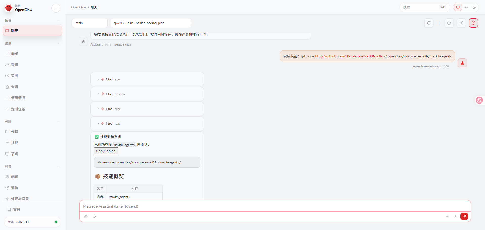
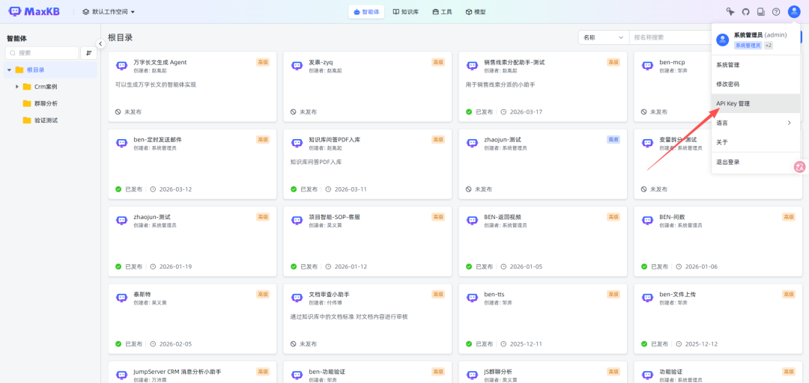
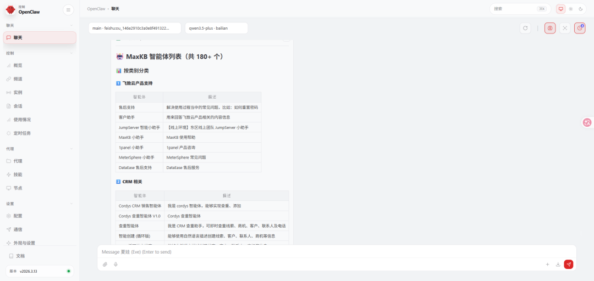
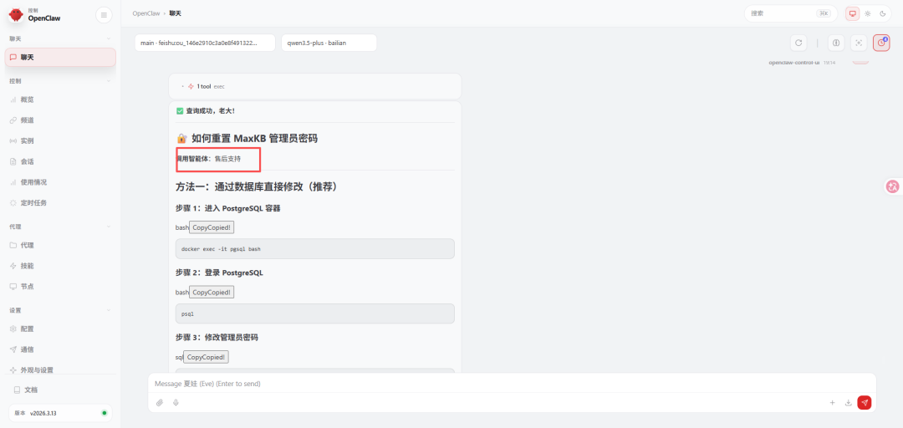
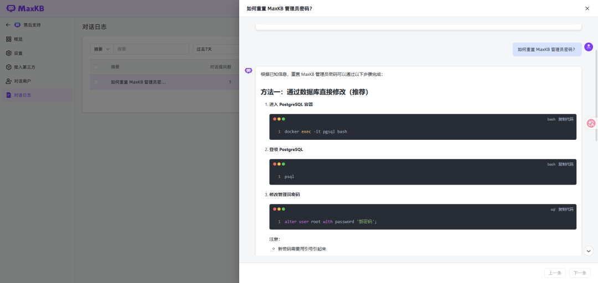

# 速来体验 | MaxKB Skills 技能正式发布

!!! Abstract ""
    2026年，伴随着 OpenClaw 的快速窜红，AI助理完成了从“对话式问答”到“生产力实干”的跨越。企业用户逐渐意识到，单纯拥有一个静态的软件系统还远远不够，能够被 AI 助理随时调用的 Skills 技能将在企业数智化转型的进程中发挥重要作用。2026年3月，MaxKB 开源项目组正式发布 MaxKB Skills 技能。
    
    MaxKB Skills 能够赋予 OpenClaw 强大的企业知识库调用能力。通常情况下，AI 助理的知识查询受限于通用知识库，无法触达企业内部私有资产。借助 MaxKB Skills，用户可以将企业内部文档、技术手册、业务流程等封装为 AI 可直接调用的知识检索技能，让 OpenClaw 能够精准调用这些懂业务的“外挂大脑”，员工通过自然语言查询即可快速获取企业的专有知识。

## 一、MaxKB Skills 的功能

!!! Abstract ""
    MaxKB Skills 严格遵循官方规范设计，专注于为大模型提供高质量、强语义的知识调用接口。其主要的功能包括：

    - 多智能体协同与答案整合：打破单一智能体的局限。AI助理可以根据复杂指令，依次调用多个不同的智能体（例如先查询产品手册，再查询售后案例库），并且自主完成关联与深度整合分析；
    - 智能体全量感知与专家路由：支持实时获取平台内所有已发布的知识库智能体。AI 助理能够精准判断哪个或者哪几个智能体最适合解答当前问题，并且实现自动化的任务分发；
    - 企业级权限与安全隔离（X-Pack）：支持工作空间 ID 隔离和多认证方式（基于 Token 或用户名密码），权限管控依赖于 MaxKB 后端的 RBAC（基于角色的访问控制）进行配置，确保 AI 助理在整合多库信息时，严格遵循企业的权限管控边界。

## 二、MaxKB Skills 的安装方法

!!! Abstract ""
    MaxKB Skills 的部署非常简便，支持开发者手动配置或者通过 AI 自动化引导完成。以下是以 OpenClaw 为例的安装、配置与测试流程示例：

    1.MaxKB Skills 访问地址：

    ```

    https://github.com/1Panel-dev/MaxKB-skills
    https://clawhub.ai/liuruibin/maxkb

    ```

!!! Abstract ""
    2.快速开始

    通过与 OpenClaw 对话，快速安装 MaxKB Skills：
    
    ```
    安装技能：git clone https://github.com/1Panel-dev/MaxKB-skills ~/.openclaw/workspace/skills/maxkb-agents
    ```


!!! Abstract ""
    3.安全配置与对接

    为了确保 OpenClaw 能够安全、稳定地连接到 MaxKB 服务，需要进行关键环境变量的配置。相关参数的具体说明如下：
    
    | 变量 | 说明 | 默认值 | 必填 |
    |------|------|--------|------|
    | **MAXKB_DOMAIN** | MaxKB服务地址 | `<maxkb_domain>` | 是 |
    | **MAXKB_API_PREFIX** | API路径前缀，适用于子路径部署 | `/admin` | 否 |
    | **MAXKB_TOKEN** | Bearer Token（管理员API Key） | — | 二选一 |
    | **MAXKB_USERNAME** | 登录用户名 | — | 二选一 |
    | **MAXKB_PASSWORD** | 登录密码 | — | 二选一 |
    | **MAXKB_WORKSPACE_ID** | 工作空间ID | `default` | 否 |

    注意：如果同时配置了用户名密码和 Token，系统会优先使用用户名密码登录获取新 Token，以确保会话有效性。

    ① MaxKB 社区版配置

    对于 MaxKB 社区版，通常只需配置账号密码即可完成对接。

    ```
    MAXKB_DOMAIN=<你的 MaxKB 服务地址>
    MAXKB_USERNAME=<用户名>
    MAXKB_PASSWORD=<密码>
    MAXKB_WORKSPACE_ID=default
    ```

    ② MaxKB 专业版、企业版

    对于拥有 X-Pack 增强功能的 MaxKB 专业版或企业版用户，可以选择使用更为安全的 Token 认证方式。

    ```
    MAXKB_DOMAIN=<你的 MaxKB 服务地址>
    MAXKB_WORKSPACE_ID=default
    MAXKB_TOKEN=<Bearer Token>
    # 或使用账号密码
    MAXKB_USERNAME=<用户名>
    MAXKB_PASSWORD=<密码>
    ```


## 三、MaxKB Skills的使用场景

!!! Abstract ""
    在配置完成后，您可以使用自然语言与 OpenClaw 进行对话，让其进行罗列 MaxKB 中现有智能体、自主选择智能体对话等操作。

    1.列出现有智能体

    提问：请罗列出现有的智能体。



!!! Abstract ""
    2.自主选择智能体并对话

    提问：如何重制 MaxKB 管理员密码?




## 四、总结

!!! Abstract ""
    MaxKB Skills 的价值，远不止于为 AI 助理添加了“知识库查询”按钮。它的深层意义在于，通过标准化、智能化的接口封装，将静态的企业私有知识库体系升级为动态、可被AI协同调用的“数字仓库”，从而实现知识获取方式的变革。MaxKB Skills 的长期优势体现在：

    - 打破跨库搜索壁垒：通过多智能体协同调用，AI 助理能够瞬间汇总散落在不同手册、规范中的数据信息，无需人工反复切换页面搜索，让私有数据形成更为强大的生产力；
    - 精准的自动化分发：利用智能体的查询技能，AI 助理可以自主识别最匹配的知识源，将“人找知识”转变为“知识主动支撑业务”，确保专业响应的准确度；
    - 简化 AI 化改造成本：用户不需要对现有的 MaxKB 平台进行调整，通过 Skills 接口即可让 AI 助理进行快速调用，是企业快速落地 AI 应用的更优路径。