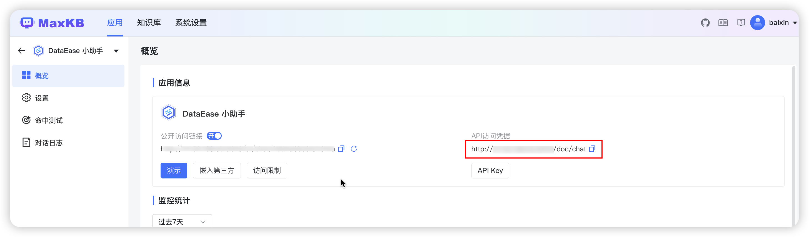
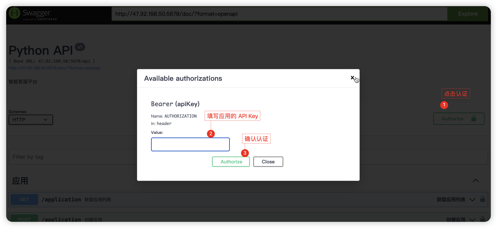
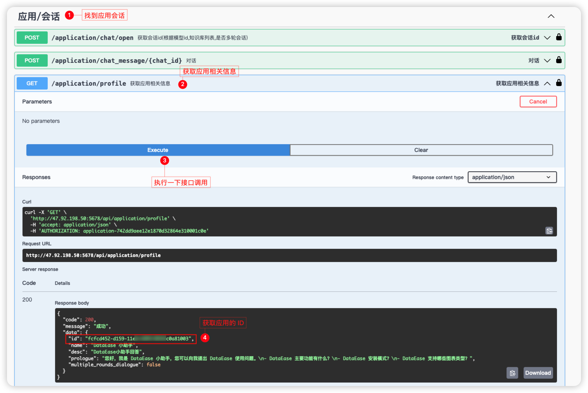
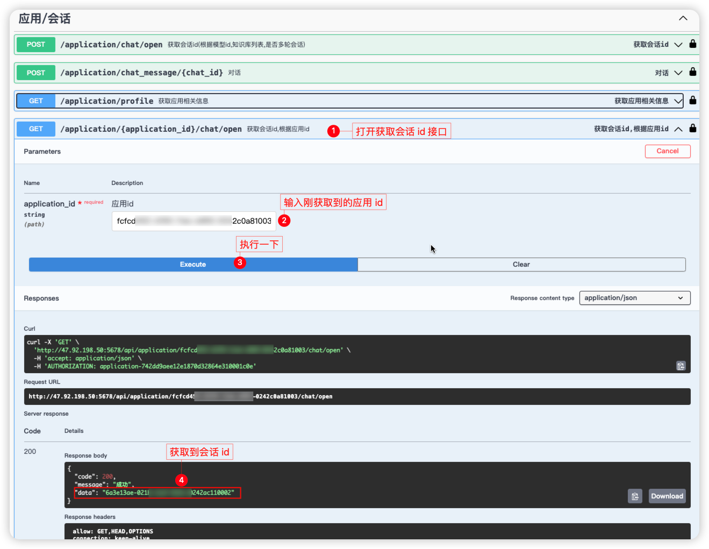
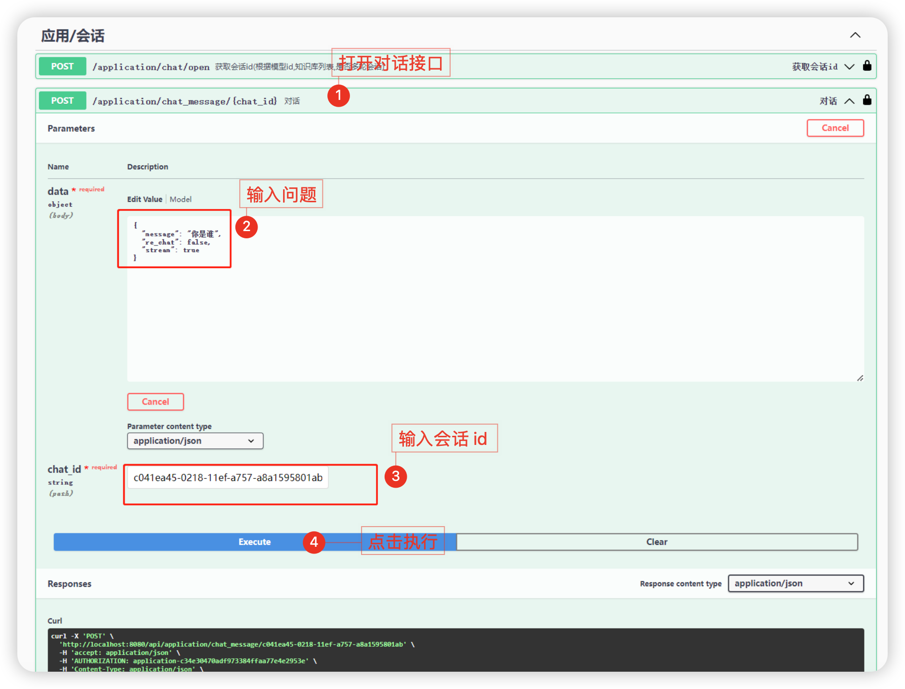

## 1 打开swagger文档

!!! Abstract ""
    在应用-概况-应用信息中复制并访问 swagger 地址。

## 2 使用 api-key 进行认证
  

## 3 获取应用信息

!!! Abstract ""
    调用 profile 接口，获取应用信息（应用 id、name等）。
  

## 4 打开会话

!!! Abstract ""
    根据应用 id，打开会话并获取会话 id。

## 5 进行对话

!!! Abstract ""
    根据会话 id 进行对话。

