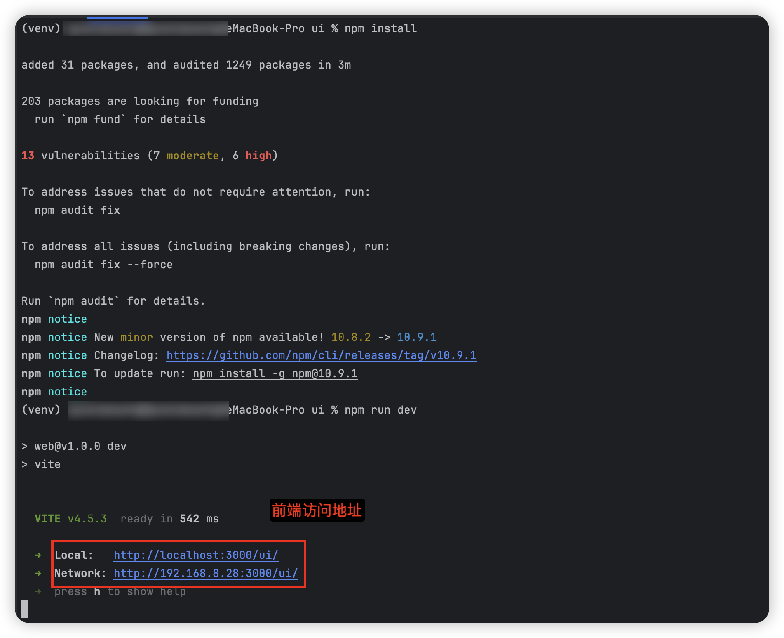
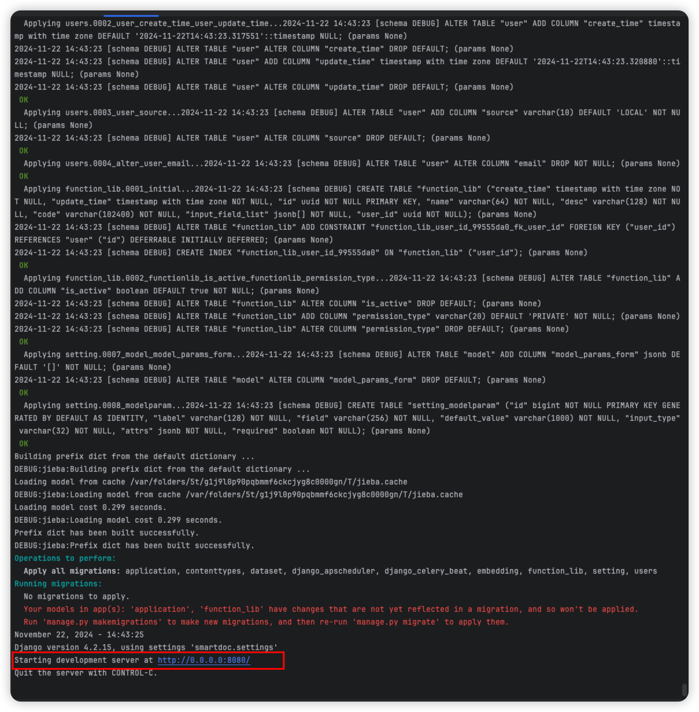
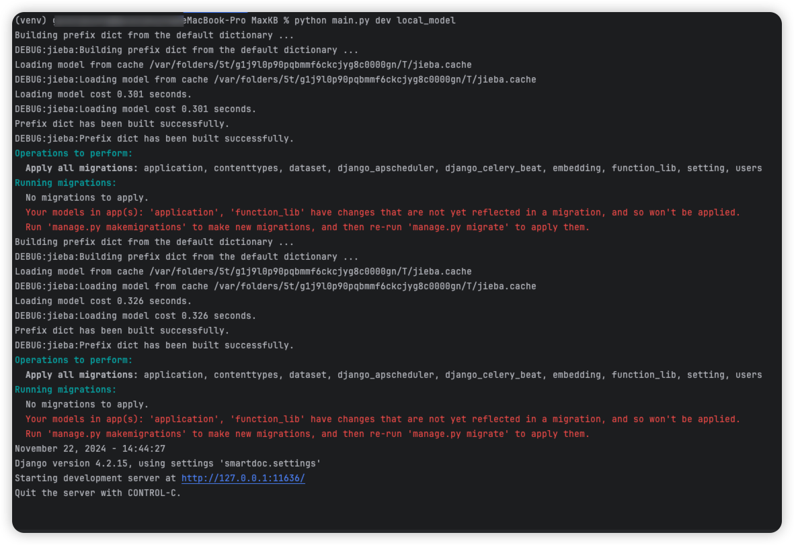
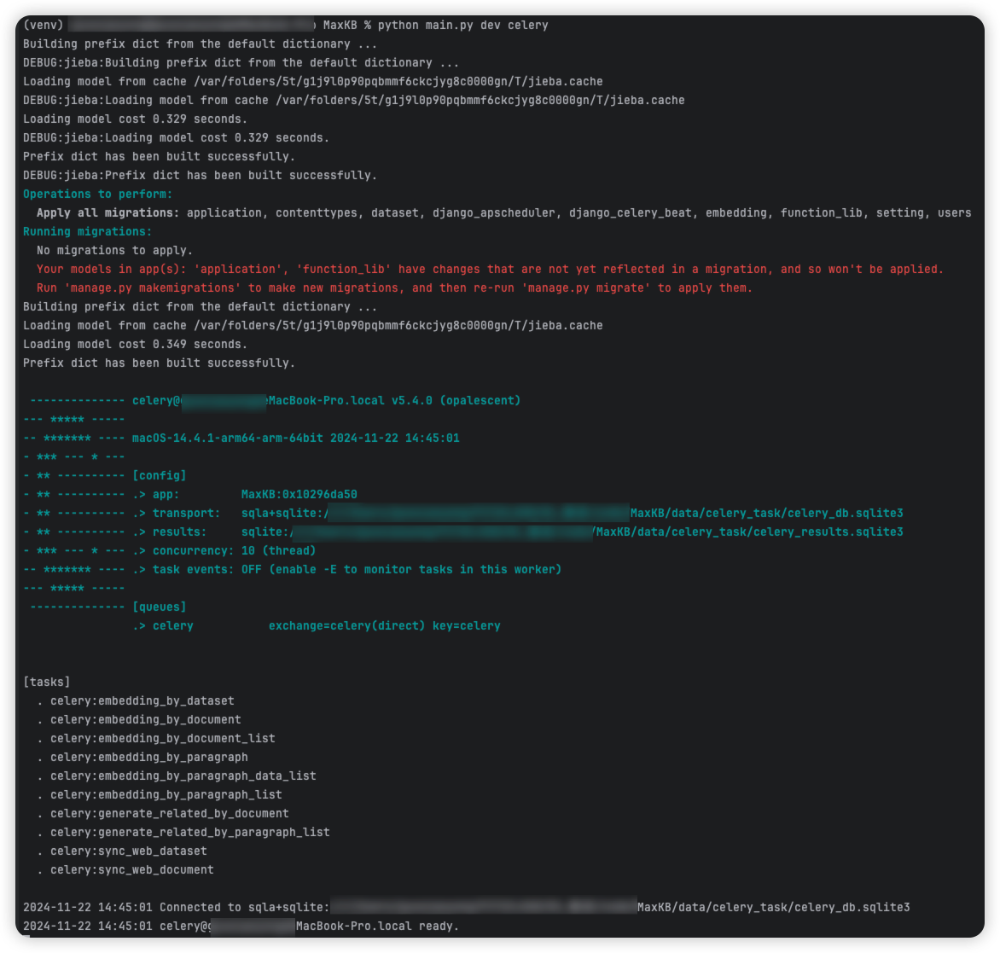
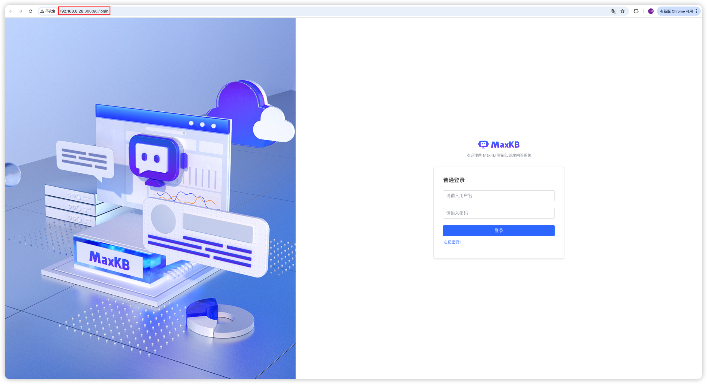

# 开发环境搭建

## 1 项目结构

!!! Abstract "" 

    ```
    .          
    ├── LICENSE                 # License 申明        
    ├── README.md           
    ├── apps                    # 后端项目根目录        
    │ ├── application           # 应用
    │ ├── common                # 项目公共资源目录
    │ ├── dataset               # 知识库
    │ ├── embedding             # 向量化
    │ ├── function_lib          # 函数库
    │ ├── ops                   # 
    │ ├── setting               # 设置
    │ ├── smartdoc              # 项目主目录          
    │ ├── users                 # 用户相关          
    │ └── manage.py             # django项目入口         
    ├── installer               # 安装相关  
    ├── pyproject.toml          # 后端依赖 配置文件         
    └── ui                      # 前端项目根目录          
    ├── config_example.yml      # 项目配置示例             
    ├── main.py                 # 项目入口文件              
    ```     

## 2 环境准备          

!!! Abstract "" 
    - **前端环境准备**       
      安装 [node](https://nodejs.org/) ，v16及以上版本     
    - **后端环境准备**        
      安装 [python](https://www.python.org/downloads/release/python-3115/) ，版本 v3.11.x  
      安装 [pycharm](https://www.jetbrains.com/pycharm/download/)
    - **数据库**   
      安装 [PostgreSql](https://www.postgresql.org/) ，版本 v15.x

## 3 本地配置

### 3.1 创建数据库

!!! Abstract "" 
    在 PostgreSql 中手动创建MaxKB 应用数据库，名称为`maxkb`。
    ```
    # 创建数据库
    CREATE DATABASE "maxkb"; 
    # 切换使用数据库
    \c "maxkb"; 
    # 创建vector 扩展
    CREATE EXTENSION "vector";
    ```

### 3.2 配置文件

!!! Abstract "" 
      项目启动之前，需要准备配置文件及目录

      - 准备配置文件

      ```bash
      # 将config_example.yml配置文件拷贝至 /opt/maxkb/conf目录下
      cp config_example.yml /opt/maxkb/conf
      ```

      - 配置 /opt/maxkb/conf/config_example.yml 

      ```
      # 数据库配置（将以下信息替换为实际环境信息）
      DB_NAME: maxkb
      DB_HOST: localhost
      DB_PORT: 5432
      DB_USER: root
      DB_PASSWORD: xxx
      DB_ENGINE: django.db.backends.postgresql_psycopg2
      
      # 模型相关配置
      # 模型路径:如果EMBEDDING_MODEL_NAME是绝对路径则无效,反之则会从https://huggingface.co/下载模型到当前目录
      EMBEDDING_MODEL_PATH: /opt/maxkb/model/
      # 模型名称:如果模型名称是路径,则会加载目录下的模型,如果是模型名称,则会在https://huggingface.co/下载模型 模型的下载位置为EMBEDDING_MODEL_PATH
      EMBEDDING_MODEL_NAME: /opt/maxkb/model/shibing624_text2vec-base-chinese
      ```

## 4 开发调试

### 4.1 启动前端

!!! Abstract "" 

    ```bash
    # 在 `ui`目录 执行安装前端需要的依赖
    npm install
    
    # 然后启动项目
    npm run dev
    ```

    启动成功后，如下图显示。

{width="500px"}


### 4.2 启动后端

!!! Abstract "" 
    后端系统，需要启动 web服务、本地模型服务、和异步任务队列服务。
    注意: 在项目根目录执行

!!! Abstract ""
    在 MaxKB 项目根目录下依次执行以下命令，启动 Web 服务。

    ```
    # 安装 poetry 包管理器
    pip install poetry
    
    # 安装后端需要的依赖
    poetry install
    
    # 启动项目
    python main.py start
    ```

{width="500px"}

!!! Abstract ""
    在 MaxKB 项目根目录下依次执行以下命令，启动本地模型服务。

    ```
    # 启动项目
    python main.py dev local_model
    ```

{width="500px"}

!!! Abstract ""
    在 MaxKB 项目根目录下依次执行以下命令，启动异步任务服务。

    ```
    # 启动项目
    python main.py dev celery
    ```

{width="500px"}

## 5 访问项目

!!! Abstract ""
    前后端都启动成功后，就可以通过前端路由（前端启动出现的访问地址）在浏览器中进行访问。


