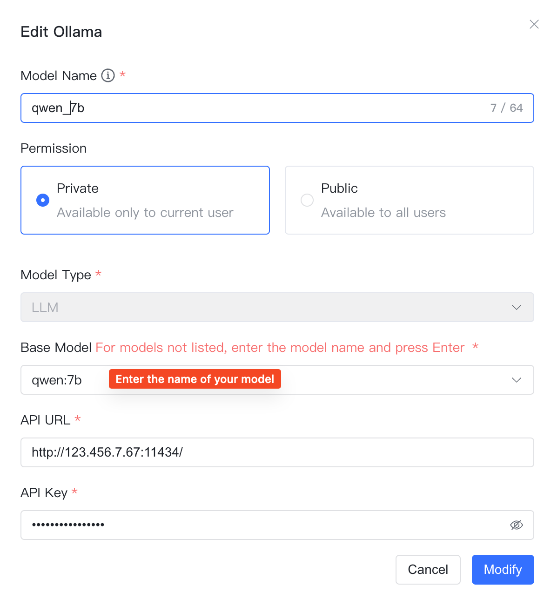

# 如何让Ollama使用GPU运行LLM模型

!!! Abstract ""
    以 NVIDIA 为例，说明 Ollama GPU 模式运行大模型的具体操作。


## 1 安装英伟达容器安装包

!!! Abstract ""
    以 Ubuntu 22.04 为例（其它系统请参考：[英伟达官方文档](https://docs.nvidia.com/datacenter/cloud-native/container-toolkit/latest/arch-overview.html)）

    - 配置 apt 源
    ```
    curl -fsSL https://nvidia.github.io/libnvidia-container/gpgkey | sudo gpg --dearmor -o /usr/share/keyrings/nvidia-container-toolkit-keyring.gpg \
    && curl -s -L https://nvidia.github.io/libnvidia-container/stable/deb/nvidia-container-toolkit.list | \
        sed 's#deb https://#deb [signed-by=/usr/share/keyrings/nvidia-container-toolkit-keyring.gpg] https://#g' | \
        sudo tee /etc/apt/sources.list.d/nvidia-container-toolkit.list
    ```
    - 更新源
    ```
    sudo apt-get update
    ```
    - 安装工具包
    ```
    sudo apt-get install -y nvidia-container-toolkit
    ```

## 2 使用 GPU 运行 Ollama

!!! Abstract ""
    ```
    # 以后台模式运行 ollama 容器，并允许容器访问主机上所有可用的 NVIDIA GPU
    docker run --gpus all -d -v /opt/ai/ollama:/root/.ollama -p 11434:11434 --name ollama ollama/ollama
    ```

## 3 使用 Ollama 下载模型

!!! Abstract ""
    ```
    # 在线下载并运行模型
    docker exec -it ollama ollama run qwen:7b
    ```

## 4 在 MaxKB 中添加 Ollama 模型

!!! Abstract ""
    下载完成并运行模型服务后，即可在 MaxKB 中添加对应的模型并使用。
