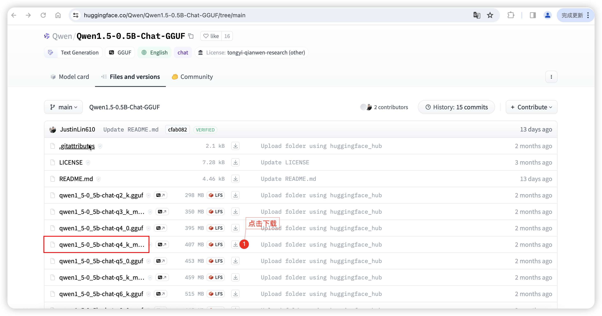
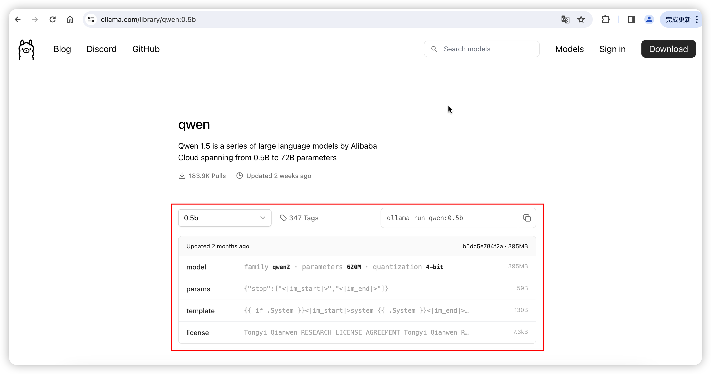
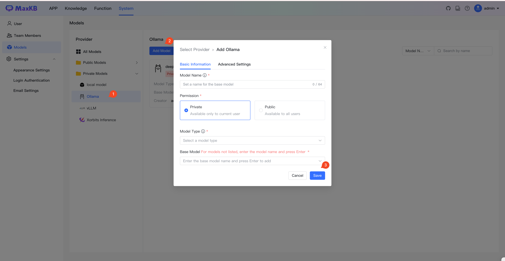

# 如何使用Ollama离线部署LLM大语言模型


!!! Abstract ""
    **说明：** 如果你没有离线部署 LLM 模型的需求，请直接查看[如何添加模型](https://maxkb.cn/docs/user_manual/model/model/)。      
    本文以在 Ollama 中 **离线部署**  qwen:0.5b 模型为例。

### 1 下载模型
!!! Abstract ""
    访问 huggingface 下载 qwen1_5-0_5b-chat-q5_k_m.gguf 模型。
    ```
    https://huggingface.co/Qwen/Qwen1.5-0.5B-Chat-GGUF/tree/main
    ```


### 2 上传模型
!!! Abstract ""
    将下载好的 Qwen1.5-0.5B-Chat-GGUF 模型文件上传到 Ollama 所在服务器。

### 3 创建Ollama Modelfile

!!! Abstract ""
    创建一个名为 Modelfile 的文件，内容如下：
    ```
    FROM ./qwen1_5-0_5b-chat-q5_k_m.gguf

    TEMPLATE """{{ if .System }}<|im_start|>system
    {{ .System }}<|im_end|>{{ end }}<|im_start|>user
    {{ .Prompt }}<|im_end|>
    <|im_start|>assistant
    """

    PARAMETER stop "<|im_start|>"
    PARAMETER stop "<|im_end|>"
    ```
    说明：不同模型的 Modelfile 内容不同，可参考 Ollama 官网 [参数设置](https://ollama.com/library/qwen:0.5b) 。




## 4 在Ollama中创建模型

!!! Abstract ""
    执行以下命令，创建模型：
    ```
    ollama create qwen:0.5b -f Modelfile
    ```
    执行以下命令，确认模型存在：
    ```
    ollama list
    ```


## 5 在 MaxKB中 添加 Ollama 模型 对接上面创建的 qwen:0.5b 模型

