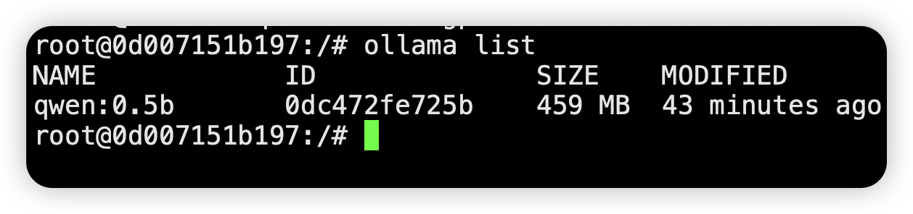

# How to Deploy LLM Large Language Models Offline Using Ollama

!!! Abstract ""
    Using the qwen:0.5b model as an example, this guide details the process and steps for deploying LLM large language models offline with Ollama.

### 1 Download the Model

!!! Abstract ""
    Visit Hugging Face and download the qwen1_5-0_5b-chat-q5_k_m.gguf model file.
    ```
    https://huggingface.co/Qwen/Qwen1.5-0.5B-Chat-GGUF/tree/main
    ```


### 2 Upload the Model

!!! Abstract ""
    Upload the downloaded Qwen1.5-0.5B-Chat-GGUF model file to the server where Ollama is located.

### 3 Create Ollama Modelfile

!!! Abstract ""
    Create a file named Modelfile with the following content:
    ```
    FROM ./qwen1_5-0_5b-chat-q5_k_m.gguf

    TEMPLATE """{{ if .System }}<|im_start|>system
    {{ .System }}<|im_end|>{{ end }}<|im_start|>user
    {{ .Prompt }}<|im_end|>
    <|im_start|>assistant
    """

    PARAMETER stop "<|im_start|>"
    PARAMETER stop "<|im_end|>"
    ```
    Note: The content of the Modelfile varies for different models. You can refer to the Ollama official website for [parameter settings](https://ollama.com/library/qwen:0.5b).


## 4 Create the Model in Ollama

!!! Abstract ""
    Execute the following command to create the model:
    ```
    ollama create qwen:0.5b -f Modelfile
    ```
    Execute the following command to confirm successful model creation:
    ```
    ollama list
    ```



## 5 Add the Created Private Model in MaxKB


