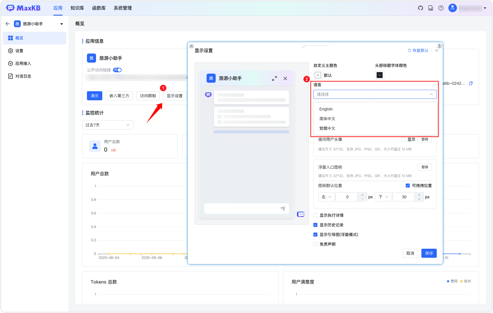

# 应用相关问题

## 1 应用高级编排设置页面画布显示问题

!!! Abstract ""
    浏览器内核版本过低（如谷歌浏览器 93.0.4577.63），需要进行浏览器升级。  
    **注意**：工作流编排不支持 Safari 浏览器，建议使用最新版本的谷歌的浏览器。

## 2 使用换个答案后检索不到知识库

!!! Abstract ""
    当使用【换个答案】功能时，检索机制会排除上一次检索到的所有分段，然后重新进行检索。如果上一次检索结果中只有一个匹配项，那么重新检索时可能会出现结果为空的情况。

## 3 同一个应用，显示不同语言界面

!!! Abstract ""
    应用显示设置中的语言选择未统一。 需要在应用显示设置中选择所需语言并保存。

## 4 应用文档内容提取报错“File is not a zip file”

!!! Abstract ""
    上传的文件实际是 doc 类型文件，而非 zip 文件，需要确保上传文件格式正确。

## 5 应用添加 MCP 组件报错“unhandled errors in a TaskGroup(1 sub-exception)”

!!! Abstract ""
    MCP 服务启动失败，数据库连接密码包含特殊字符 `@`，与 dbhub 启动命令冲突。

## 6 应用添加 MCP 组件报错“transport”

!!! Abstract ""
    MCP Server Config 配置格式不正确，缺少 "transport": "sse" ， 需在配置中添加  "transport": "sse"。

## 7 请求 Swagger API 报错“URL scheme must be 'http' or 'https' for CORS request.”

!!! Abstract ""
    Swagger 文档的 schemes 格式未正确选择，IP 地址使用了 http，而域名使用了 https。 确保 IP 和域名的协议需匹配。