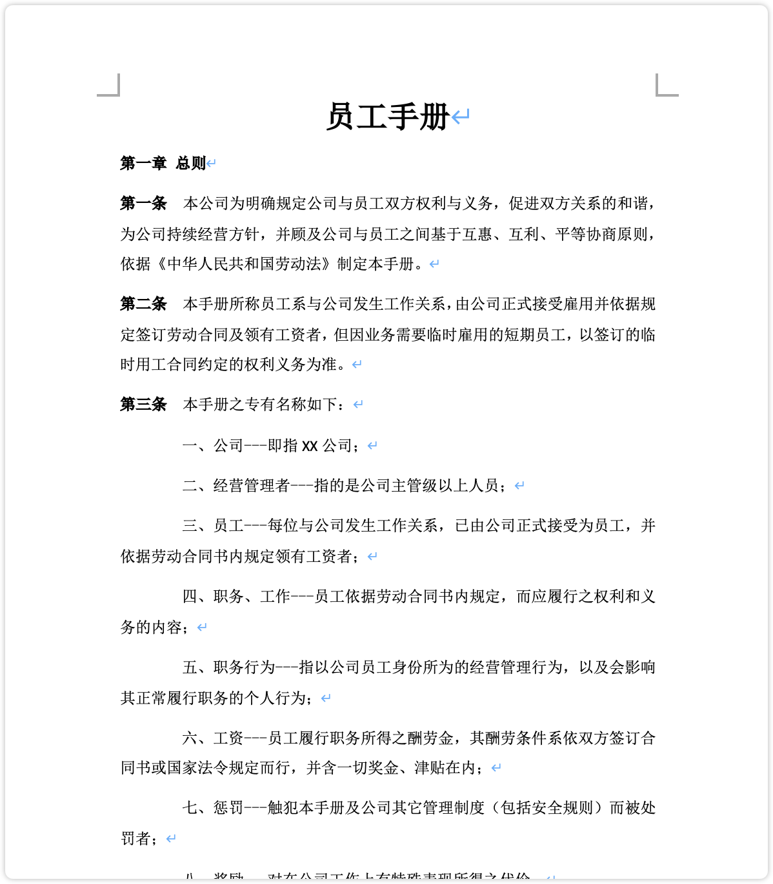

!!! Abstract ""

    根据文档结构，如何把内容进行合理分段对于后续的知识库检索匹配十分重要，按照标题进行切分是最常见的方式。
    MaxKB 默认按照智能分段以及高级分段这两种规则上传的文档进行切分，这两种规则本质都是根据分段标识以及字符数进行截取，对于样式规范(指的是使用了多级标题的样式)的文档，可以获得预期的效果。 

    那么对于看起来有规律但又没有采用规范的标题样式的文档，如下图展示的文档，应该如何进行合理地分段？

{width="500px"}

!!! Abstract ""

    MaxKB默认的切分规则，本质上是按照特定的正则表达式进行切分，除此之外在高级分段规则中还支持手动输入正则表达式进行切分，这样就可以根据文档规律的表达方式进行合理地分段。

## 1 常见分段标识及其正则表达

!!! Abstract ""
    
     |    场景   | 样例     |  表达式  | 
     |----------|:--------|:---------|
     |章标题 |   `第一章 RAG与大模型应用`  | `[第][一二三四五六七八九十]+[章]` |
     |节标题 |   `第一节 大模型应用的方向：RAG` | `[第][一二三四五六七八九十]+[节]` |
     |数字标题|`一、 RAG与大模型应用`   `1.1 大模型应用的方向：RAG`| `[一二三四五六七八九十|1-9]+[、|.][1-9]*[.]*[1-9]*` |
     |条目  |  `第一条：本公司员工均应遵守以下规定。` |`[第][一二三四五六七八九十]+[条]`|

## 2 操作及效果
    
!!! Abstract ""

    将上传文档后，如果选择默认的分段规则，无法都无法获得立项的效果。

!!! Abstract ""

    为了有效分段，需要在分段标识手动输入分段标识的正则表达式 `[第][一二三四五六七八九十]+[条]`（注意：输入后需要回车才生效），长度设置为单个段落的最大长度，然后点击生成预览。
    从预览结果可以看到，每一条都完整地切分为一个段落，保证了语义的完整性。

    
    
    
    

