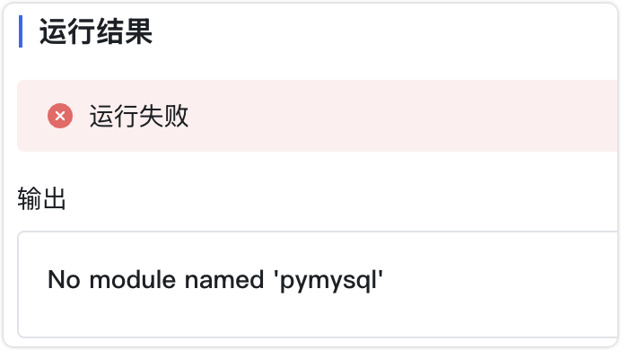
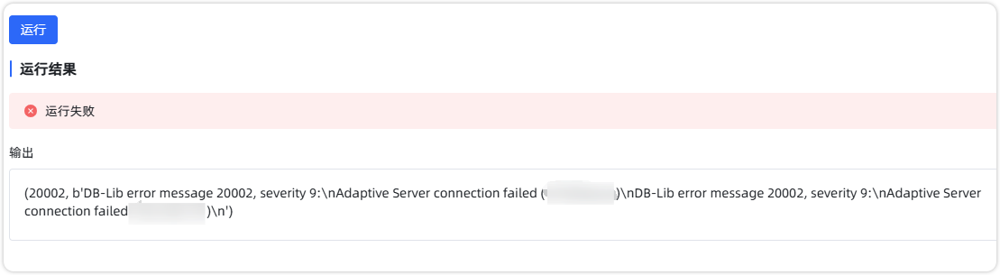

# 函数库

## 1 函数库运行后提示缺少依赖

{width="900px"}

!!! Abstract ""
    函数库运行时提示缺少依赖，是因为某些函数库在运行时需要调用其他第三方库来完成特定功能。如果这些第三方库未安装，函数库就无法正常运行，从而提示缺少依赖。  
    进入 maxkb 容器 ：
    ```
    docker exec -it maxkb bash 
    ```
    使用 pip 安装第三方依赖，如 pymysql ： 
    ```    
    pip install pymysql
    ```

## 2 函数库连接 SQL Server 数据库报错



!!! Abstract ""
    连接 SQL Server 数据库时，报错提示： pymssql 连接失败 20002, b'DB-Lib error message 20002, severity 9: Adaptive Server connection failed。  
    可能原因：

    - 网络问题：容器无法访问目标服务器 IP（如 192.168.0.23）。
    - 依赖问题：pymssql 版本不兼容或安装失败。
    - 连接配置问题：未指定正确的 TDS 版本。
    
    解决方法:

    - 确保网络连通:检查容器与目标服务器之间的网络连接是否正常，以及 SQL Server 的配置，确保其允许远程连接，并检查防火墙设置是否允许访问目标端口。
    - 重新安装兼容版本的 pymssql。在容器中安装依赖库后，确保后续在函数库中正确使用这些依赖库连接数据库。
    - 指定 TDS 版本：在连接语句中明确指定 TDS 版本（如 7.0）。