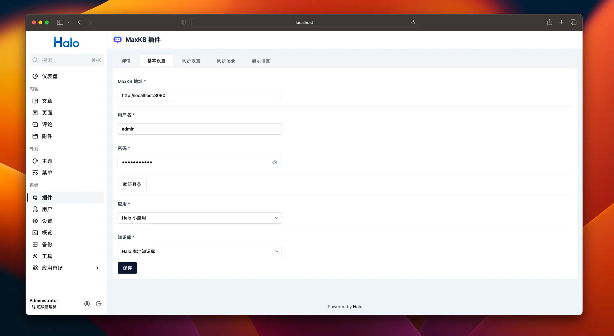

# 将 MaxKB 小助手集成到 Halo 中

!!! Abstract ""
    [Halo](https://github.com/halo-dev/halo) [ˈheɪloʊ]，强大易用的开源建站工具。支持将文章内容同步至 MaxKB 知识库，并开启网页小助手。
    如何将 MaxKB 小助手集成到 Halo 中，请查看[官方文档](https://www.halo.run/store/apps/app-aWHcE)。

