# 将 MaxKB 小助手集成到 Halo 中

!!! Abstract ""
    [Halo](https://github.com/halo-dev/halo) [ˈheɪloʊ]，强大易用的开源建站工具。

    通过 MaxKB 小助手插件，Halo 平台已原生提供 MaxKB 应用的集成门户页面，支持通过 Halo 后台系统实现 MaxKB 应用的同步管理，并可基于 Halo 站点内置的用户体系与角色权限模型，精细化配置不同用户、角色对特定 MaxKB 应用的使用权限，实现权限的统一管控与精准分配。

[//]: # (    有关 MaxKB 小助手插件的使用说明，请查看 [官方文档]&#40;https://www.halo.run/store/apps/app-aWHcE&#41;。)

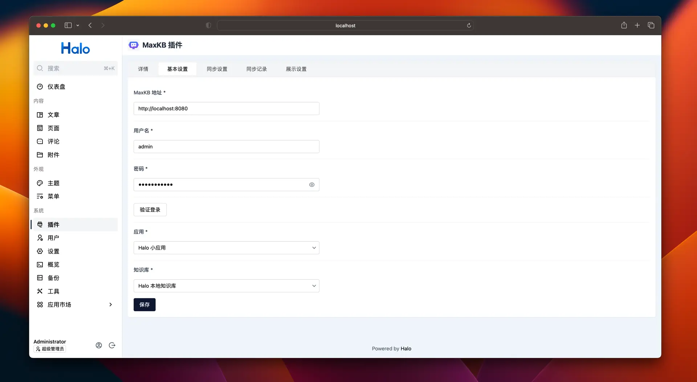

!!! Abstract ""
    **重要提示**：当前 Halo 暂未兼容 MaxKB v2 版本，为确保集成功能稳定运行，建议使用 MaxKB v2 之前的版本进行对接。

    **版本要求**：MaxKB >= 1.10.0 且 < 2.0.0  ， Halo >= 2.20.0 。

## 一、安装MaxKB插件
!!! Abstract ""
    登录 Halo 服务器后，通过系统内置的应用市场功能，检索并下载 MaxKB 插件即可。
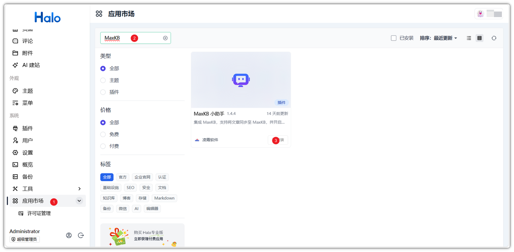

!!! Abstract ""
    当前提供了 MaxKB 插件的各版本资源，请根据实际需求选择并下载所需的对应版本。
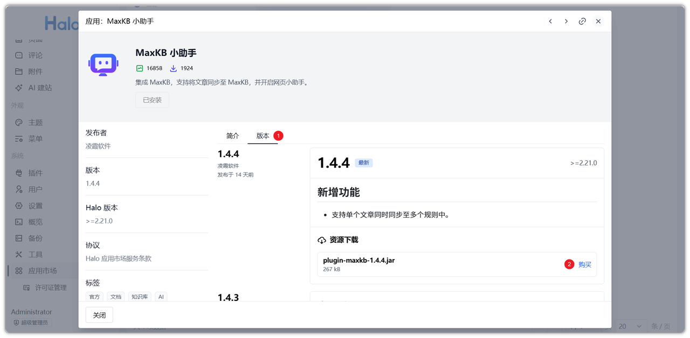

## 二、许可证激活
!!! Abstract ""
    针对 MaxKB 应用小助手的激活操作，可通过三种方式完成：一是直接使用已有的 Halo 专业版许可证进行激活；二是通过 Halo 官网账号提交申请，获取试用权限后启用；三是通过输入许可证进行激活。
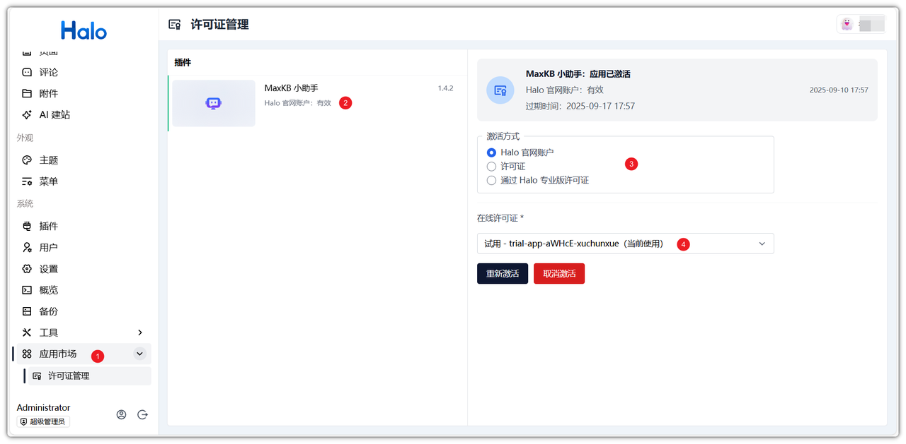

## 三、填写 MaxKB 的基础信息
!!! Abstract ""
    点击进入 MaxKB 小助手插件进行配置。
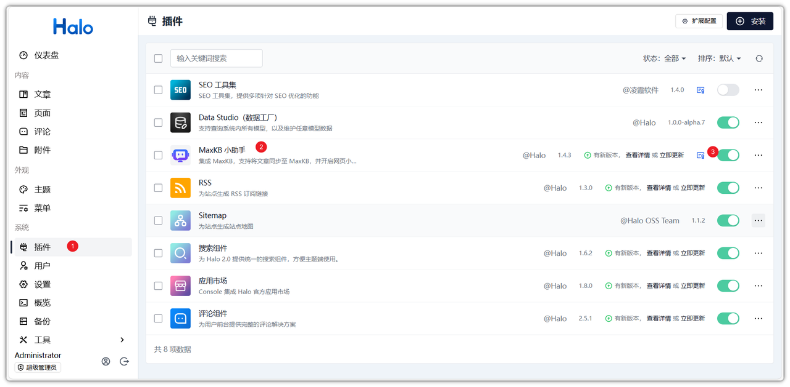

!!! Abstract ""
    在 MaxKB 基本设置中填写 MaxKB 地址以及认证方式，MaxKB V1 版本的地址及采用 API KEY 管理的认证方式配置完成之后，请点击 "验证登录"。

    注意：完成后务必保存相关设置。
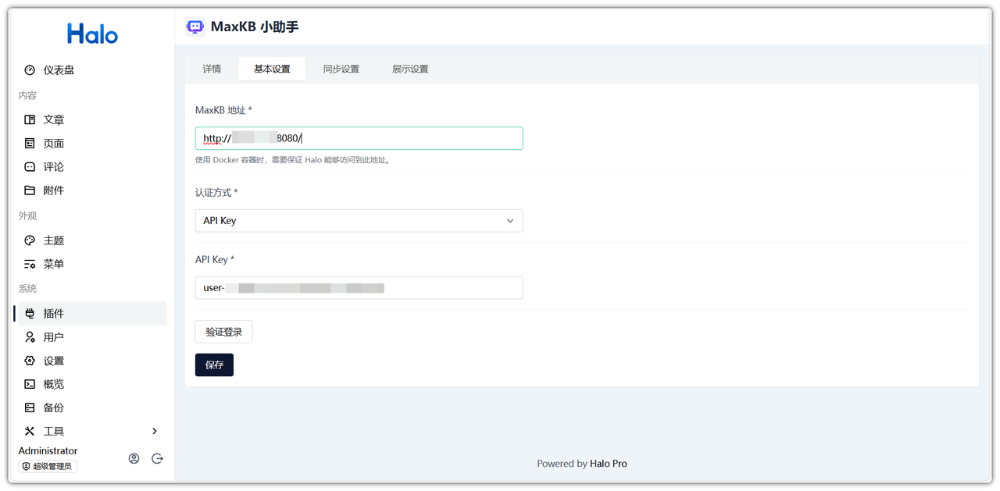

!!! Abstract ""
    根据实际需求，完成展示设置的信息填写与同步设置的选项勾选操作。
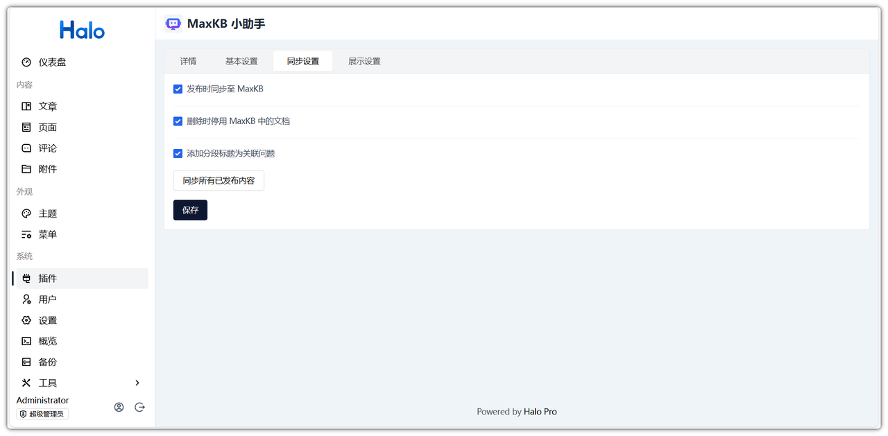

!!! Abstract ""
    在展示设置中，可将 MaxKB 应用配置为浮窗模式。该应用为同步获取的应用，可通过下拉框选择其在门户页面以浮窗模式展示。
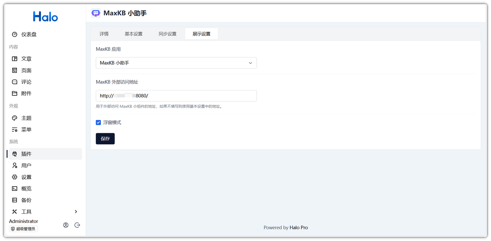

!!! Abstract ""
    在展示设置中选定的 MaxKB 应用，将以浮窗模式呈现在 Halo 系统的首页面。
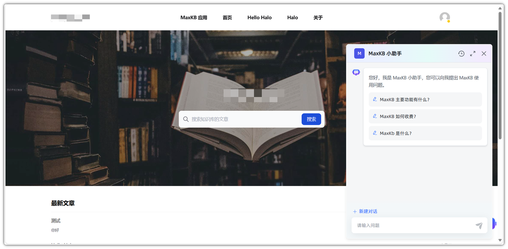

## 四、功能展示
### 1. 同步规则
!!! Abstract ""
    可依据新增的同步规则，将文章及页面同步至 MaxKB 知识库。
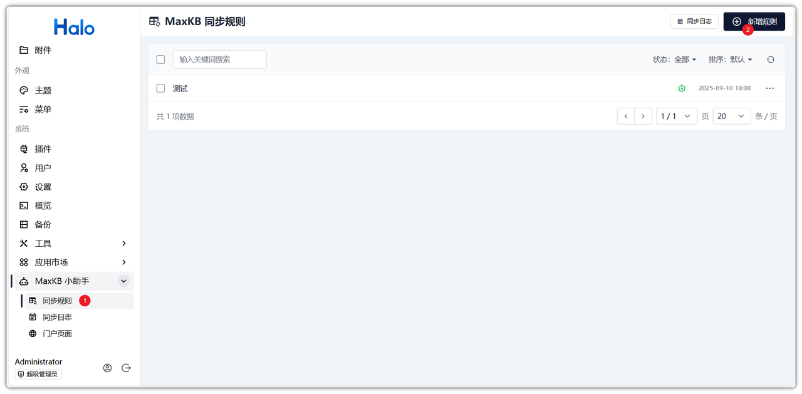

!!! Abstract ""
    点击「保存」按钮即可确认当前设置并生效。
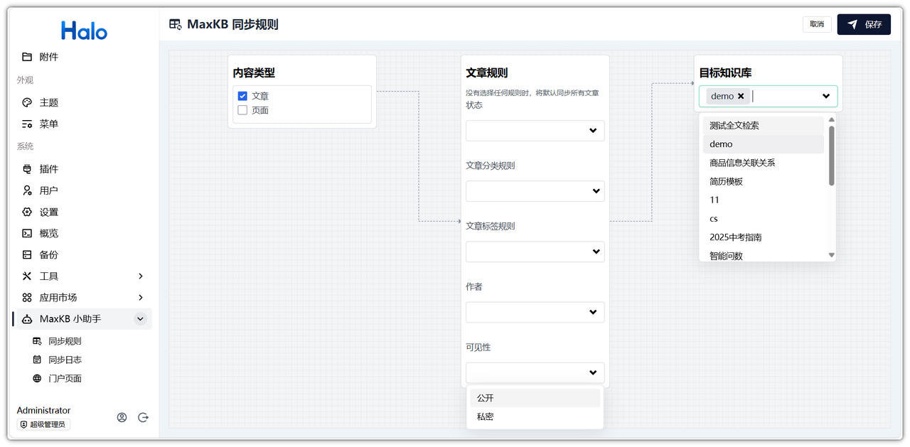

### 2. 同步日志
!!! Abstract ""
    访问同步任务管理相关界面，查看同步任务的完整日志信息。
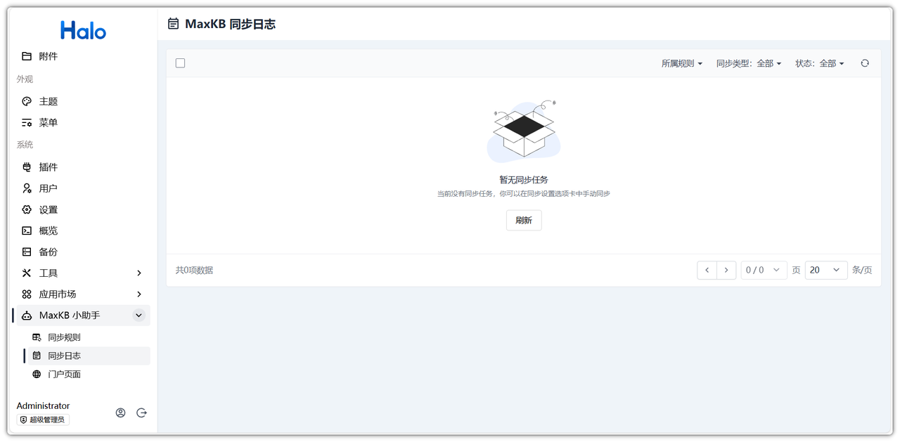

### 3. 门户页面
!!! Abstract ""
    点击「同步」按钮触发同步操作，完成后将展示从 MaxKB 同步而来的全部应用。
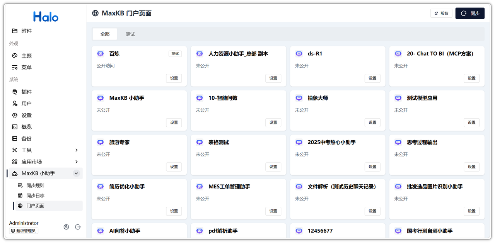

!!! Abstract ""
    点击对应应用的「设置」选项，可在配置界面中完成该应用的分组管理及权限控制操作。
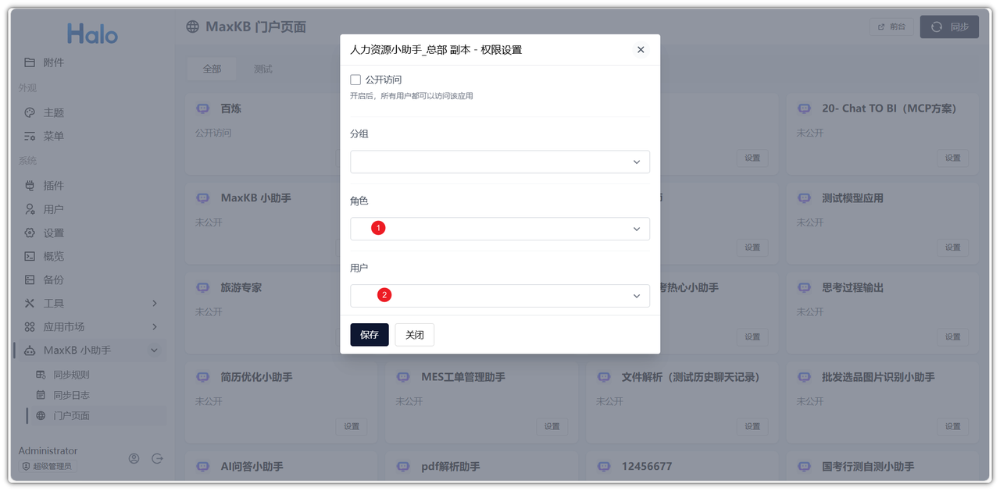

!!! Abstract ""
    点击页面右上角的「前台」选项，进入后可查看并访问 MaxKB 应用生态中的全部可用应用资源。
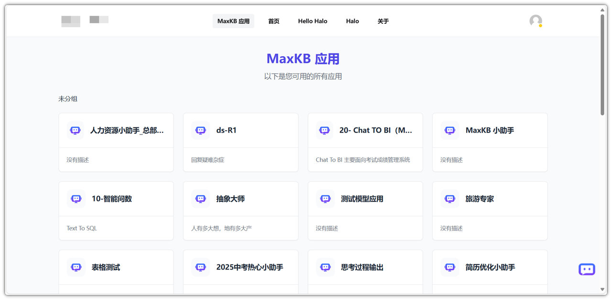

## 五、权限控制
!!! Abstract ""
    支持以 “用户权限设定 + 角色权限配置” 的组合方式，对用户的权限范围进行规范化控制。
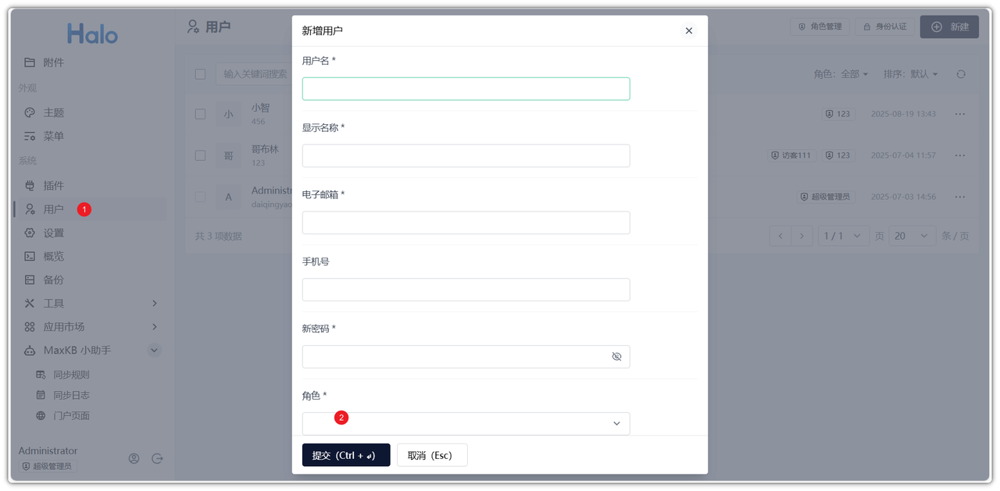

!!! Abstract ""
    点击页面右上角的「角色管理」模块，在该模块内完成新角色的创建流程，随后为其分配所需权限。
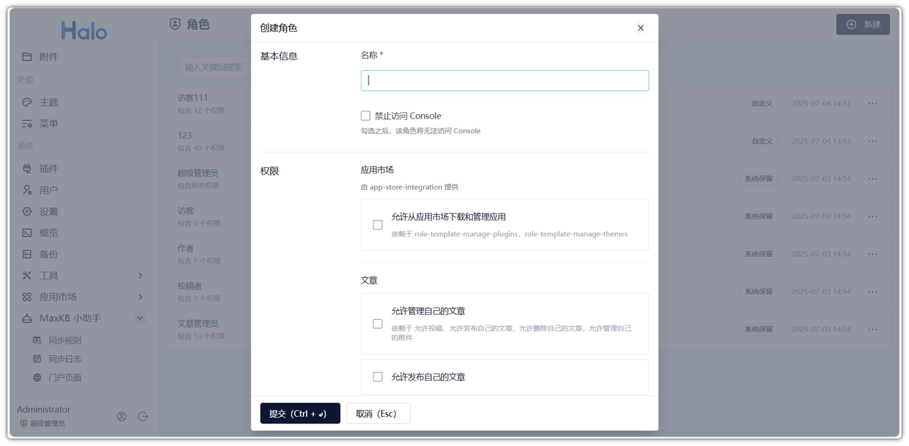

!!! Abstract ""
    点击「门户页面」模块，进入后对 MaxKB 应用的权限进行配置管理；请注意，配置过程中涉及的分组下拉框无预置默认选项，需根据实际业务需求手动填写分组内容，以完成权限配置流程。

