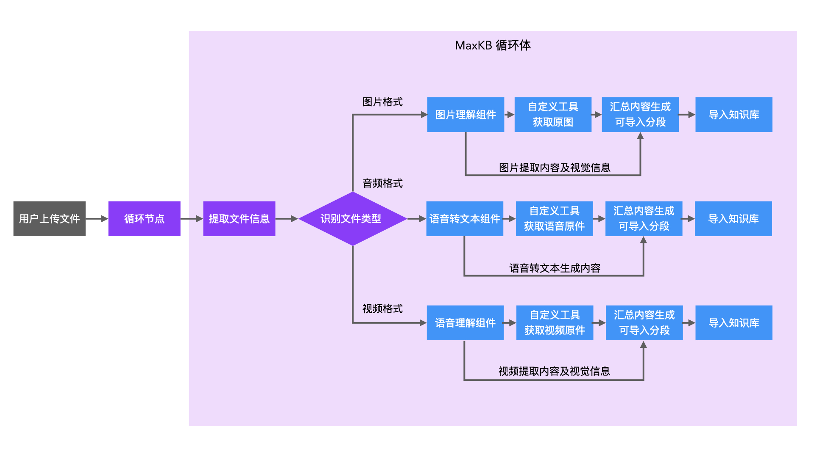
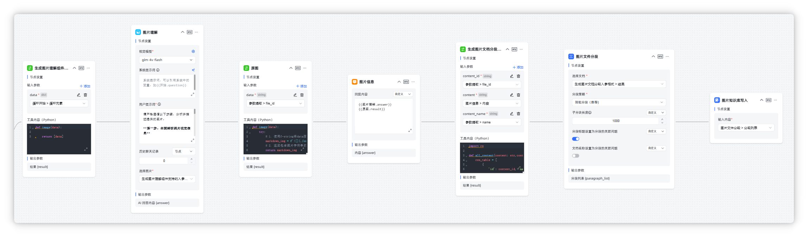
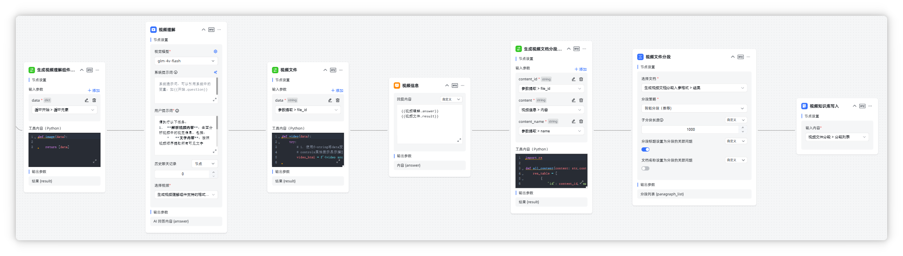
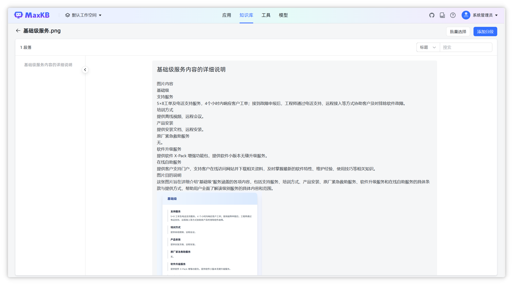
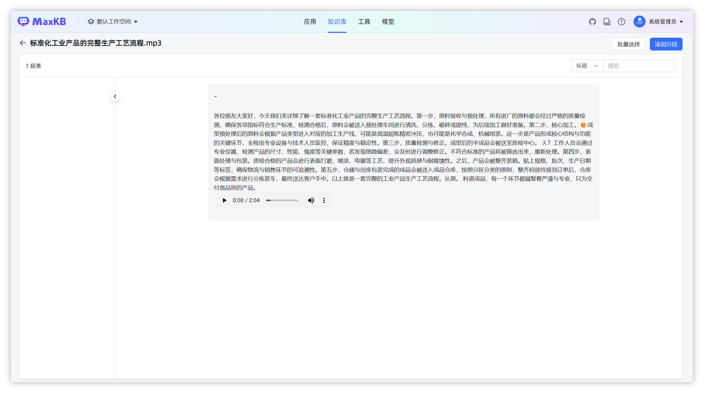
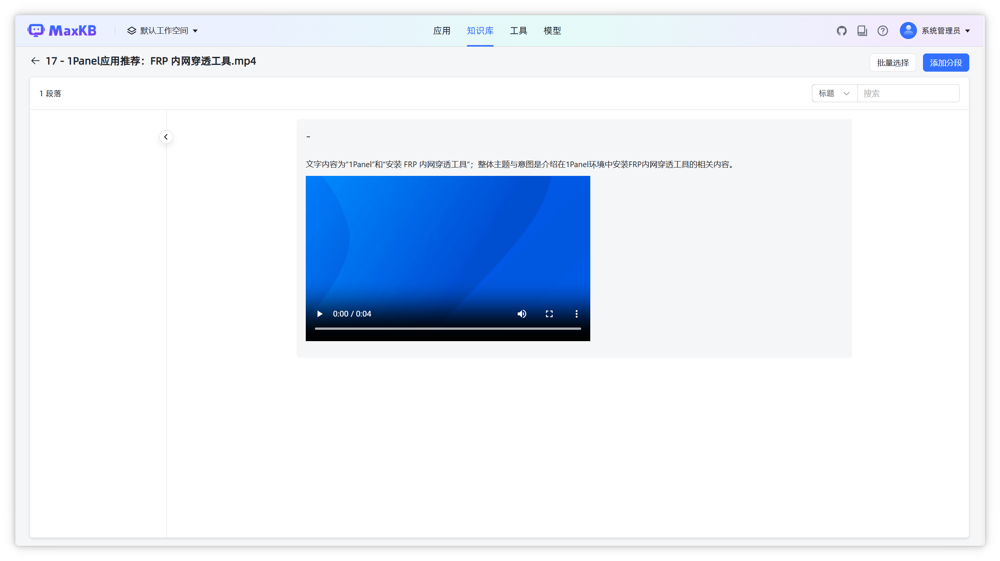
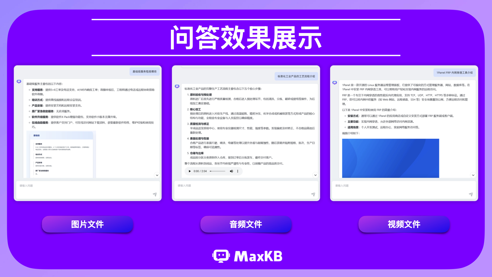

# 通过工作流知识库构建 MaxKB 图、音、视多模态知识库

!!! Abstract ""
    借助 MaxKB 开源企业级智能体平台的工作流知识库功能，企业可以构建端到端的多模态知识处理流水线，让业务系统自动识别文件类型并调用相应的处理流程。

    系统从多模态文件中提取结构化信息，根据内容逻辑自动切分知识片段，进一步将文本及对应的图片、音频、视频源文件统一存储，最终实现跨模态的语义相似度检索，使非结构化的知识得以高效整合与复用。

## 1 方案设计
!!! Abstract ""
    图、音、视多模态工作流知识库的核心是实现用户上传多类型文件（图片/音频/视频）的循环处理、内容提取与知识库导入。

    整体流程说明如下：

     （1）文件上传与初始处理：通过 MaxKB 的文件上传节点，接收用户上传的图片、音频、视频等多类型文件，输入循环节点（适配多文件批量处理场景）。

     （2）文件信息提取与类型识别：通过参数提取组件提取文件的元数据信息，包括 file_id 和 file_name。

     （3）文件类型分流处理：根据意图识别节点的结果，对不同类型文件执行对应的专属处理逻辑，为后续内容提取与知识库导入做好准备。

     （4）文件内容解析：根据文件类型依次执行以下操作：

     ① 若为图片文件：调用图片理解组件节点，返回图片的视觉内容与文本信息描述。然后调用自定义工具节点，获取图片原图资源；

     ② 若为音频文件：调用语音转文本组件节点，将音频内容转换为文本。然后调用自定义工具节点，获取音频原件资源；

     ③ 若为视频文件：调用视频理解组件节点，提取视频的画面与音频融合的文本信息。然后调用自定义工具节点，获取视频原件资源；

     ④ 编写 Python 函数，将上述内容提取结果、原件资源信息传入函数，汇总生成符合知识库导入规范的分段文本/数据结构。

    （5）知识库导入：调用MaxKB知识库导入节点，将数据导入知识库，完成文件的最终处理任务。



## 2 实现逻辑

!!! Abstract ""
    MaxKB 图、音、视多模态工作流知识库完整逻辑如图所示：


### 2.1 图片工作流内部逻辑

!!! Abstract ""
    在循环体中，通过函数获得提取图片文件的 data 参数，用图片理解节点理解图片内容，并用函数为该文件生成可直接渲染的图片路径标签。用指定回复节点将二者拼接，通过函数将提取结果与 file_id、name 整合为标准化的结构，在分段节点中按需求分段后写入知识库。



!!! Abstract ""
    原图路径生成及渲染函数：

    ``` 
    def image(data):
        try:
            # 1. 使用f-string将data变量嵌入到图片路径中，生成完整的Markdown图片语法字符串
            markdown_img = f''
            # 2. 返回包含图片字符串的列表
            return markdown_img
        except Exception as e:
            # 3. 异常处理，返回错误信息
            return [f"【错误】处理图片URL失败：{str(e)}"]
    ```

!!! Abstract ""
    图片理解组件提示词:
    ```
    请严格遵循以下步骤，分析并描述提供的图片：
    
    **第一步：全面解析图片视觉信息**
    *   **图片内容**：仔细识别并完整、一字不差地提取图片中的所有可见文字。不得进行任何概括、总结或删减，内容格式易读。

    **第二步：基于解析生成总结**
    *   **归纳核心主题**：根据提取的文字和视觉元素，用一句话精准概括图片的核心主题。此句话将作为你最终回复的标题。
    *   **说明图片目的**：结合文字与视觉内容，综合分析这张图片旨在传达的主要信息、目的或功能。

    **第三步：格式化输出**
    请将你的全部回答内容置于**一个Markdown分段**中，格式要求如下：
    *   将第二步中生成的“核心主题”句子，作为该分段的**一级标题**（使用一个 `#`）。
    *   在标题下方，依次呈现“图片内容”和“图片目的说明”作为正文内容。
    ```

!!! Abstract ""
    生成“文档分段”组件所能接收的格式:
    ``` 
    import re
    def all_content(content: str,content_name: str,content_id: str) -> str:
        result = [
            {
                'id': content_id, 'name': content_name, 'content': content
            }
        ]
        # 添加返回语句，将构造的列表返回
        return result
    ```

### 2.2 音频工作流内部逻辑

!!! Abstract ""
    在循环体中，通过函数获取语音文件的 data 参数，用语音转文本节点将语音转为文本，并用函数为该文件生成 Markdown 语法的路径字符串。用指定回复节点将二者进行拼接，通过函数将提取结果与元数据信息 file_id、name整合为标准化结构，在分段节点中按需求分段后写入知识库。


!!! Abstract ""
    语音源文件生成及渲染函数：
    ``` 
    def voice(data):
        try:
            # 1. 使用f-string将data变量嵌入到语音路径中，生成HTML的audio标签字符串
            # controls属性显示播放控件，可根据需要添加autoplay（自动播放，部分浏览器限制）等属性
            audio_html = f'<audio src="./oss/file/{data}" controls></audio>'
            return audio_html
        except Exception as e:
            # 2. 异常处理，返回错误信息
            return [f"【错误】处理语音URL失败：{str(e)}"]
    ```

### 2.3 视频工作流内部逻辑

!!! Abstract ""
    在循环体中，通过函数获取视频文件的 data 参数，用视频理解节点理解视频内容，并且用函数为该文件生成 Markdown 语法的路径字符串。用指定回复节点将二者进行拼接，通过函数将提取结果与元数据信息 file_id、name 整合为标准化结构，在分段节点中按需求分段后写入知识库。



!!! Abstract ""
    视频源文件生成及渲染函数：
    ```
    def video(data):
        try:
            # 1. 使用f-string将data变量嵌入到视频路径中，生成HTML的video标签字符串（支持本地/oss视频文件）
            # controls属性表示显示播放控件，width可以根据需要调整（如100%、600px等）
            video_html = f'<video src="./oss/file/{data}" controls width=500 height=300></video>'
    
            return video_html
        except Exception as e:
            # 2. 异常处理，返回错误信息
            return [f"【错误】处理视频URL失败：{str(e)}"]
    ```

## 3 效果展示

### 3.1 知识库导入效果展示

!!! Abstract ""
    在MaxKB图、音、视多模态知识库工作流搭建完成后，以上传图片、音频、视频三种格式文件为例，验证最终实现效果。

    任务执行完成后，进入 MaxKB 知识库后台进行查看，可以观察到三种类型文件均实现了“内容提取+源文件关联”的完整导入效果。

!!! Abstract ""
    图片文件：知识库中清晰呈现图片理解生成的图片内容解读，下方附带图片预览。



!!! Abstract ""
    音频文件：知识库中呈现完整的语音转文本结果，下方附有显示可直接播放的音频控件。



!!! Abstract ""
    视频文件：知识库中包含视频简介和展示固定尺寸的视频播放窗口，支持播放、暂停、进度调节等基础操作。



### 3.2 应用问答效果展示

!!! Abstract ""
    为进一步验证多模态知识库的实用价值，我们搭建简单的智能问答应用，并关联此多模态知识库，通过自然语言提问测试回答效果。

