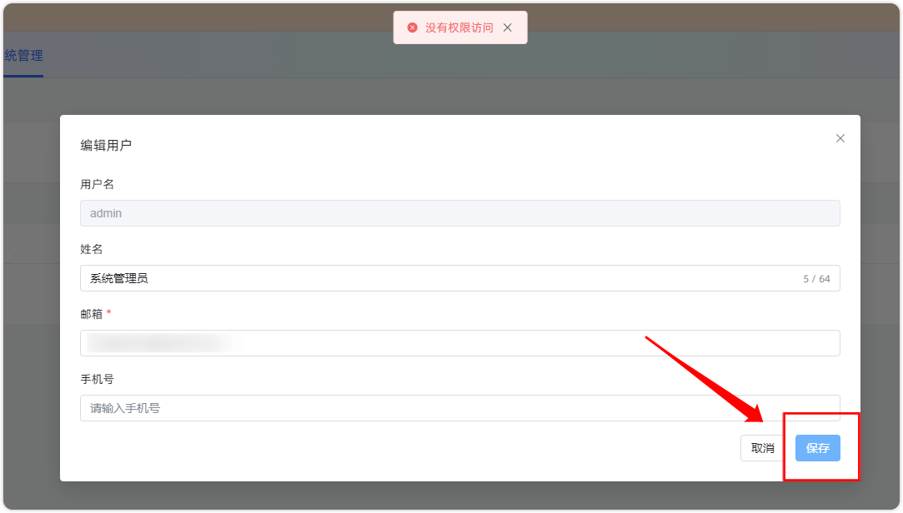
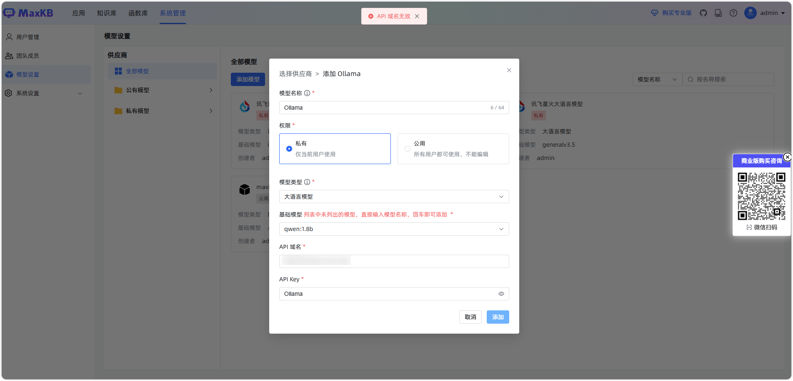
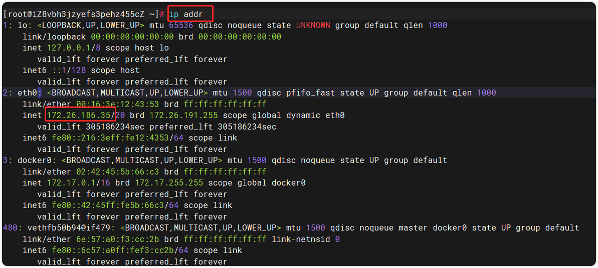
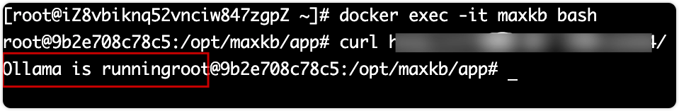
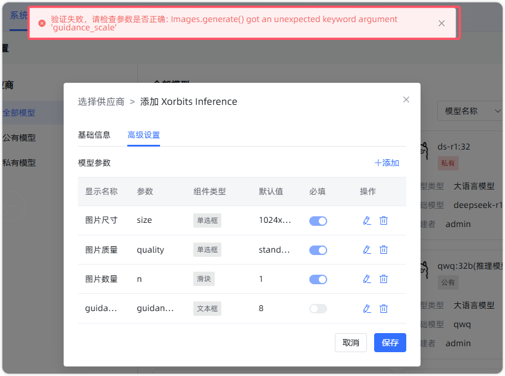
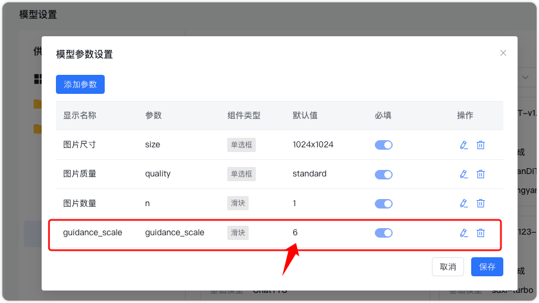
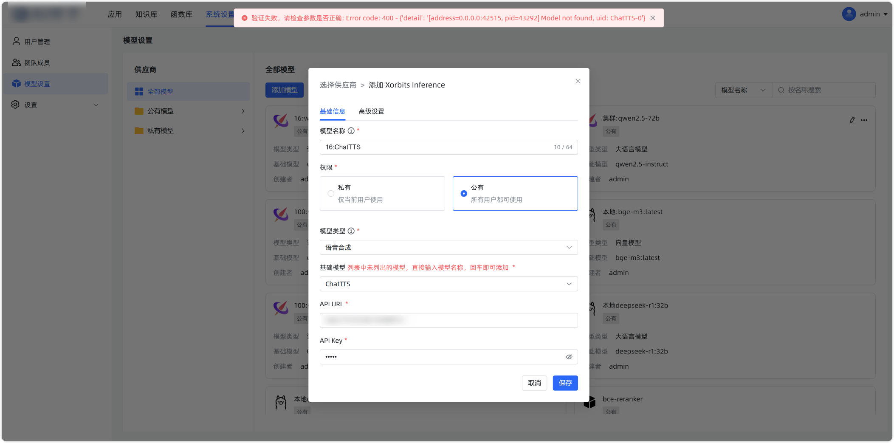

# 系统管理

## 1 用户管理

### 1.1 忘记了登录密码如何处理

!!! Abstract ""
    **非 admin 用户忘记密码**：

    - 已设置邮箱绑定：如果用户已设置邮箱并完成绑定，可在个人信息页面通过【修改密码】功能进行密码修改与找回。
    - 未设置邮箱绑定：若用户未设置邮箱绑定，可由 admin 管理人员登录系统，在【用户管理】页面中，找到对应用户并直接修改其密码，从而帮助用户找回密码。

!!! Abstract ""
    **admin 用户忘记密码**：  
    如果已配置邮箱设置，可在登录页面点击【忘记密码】进行密码找回。若未配置邮箱，则需通过修改数据库将密码恢复为默认密码。操作步骤如下：  
    在线安装进入 MaxKB 容器（若是离线安装包，请进入 pgsql 容器） 

    ```
    docker exec -it maxkb bash
    ```

    登录 PgSQL
    ```
    psql -Uroot
    ```
    进入 maxkb数据库
    ```
    \c maxkb;
    ```
    连接到数据库后，执行下面的 SQL 语句可以将用户 admin 的密码重置为 MaxKB@123..
    ```
    update  "public"."user" set password='d880e722c47a34d8e9fce789fc62389d' where username='admin';
    ```

    **注意：找回 admin 密码后优先配置邮箱设置，以便下次忘记密码时能直接使用【忘记密码】功能进行找回。**


### 1.2 编辑用户时没有权限访问

!!! Abstract ""
    网关配置中未对 PUT 方法进行放行，从而导致权限验证失败。

{width="900px"}
    

## 2 模型对接

### 2.1 对接 Ollama 时提示 API 域名无效



!!! Abstract ""
    **API 域名内容说明**： 

    - MaxKB 版本为 0.9.0，API 域名格式为：http://您ollama 所在服务的ip地址:您 ollama 的端口号 /v1 。 
    - MaxKB 版本为 0.9.1及之后的版本 API 域名格式：http://您ollama 所在服务的ip地址:您 ollama 的端口号 / 。 

    **注意：API 域名不可使用 127.0.0.1 或 localhost。**

!!! Abstract ""
    **获取 Ollama 服务的 IP 地址**：   
    在 Ollama 所在服务器上执行: ip addr , 获取到服务器的 IP 地址。 查询 Ollama 服务器 IP 地址为 172.26.186.35，则 API 域名为：http://172.26.186.53:11434

{width="900px"}

!!! Abstract ""
    **确保服务可访问：**   
    MaxKB 容器需要可正常访问 Ollama 服务。在 maxkb 容器中访问 Ollama 的 API 域名，确保返回 【Ollama is running 】的状态。

{width="900px"}

!!! Abstract ""
    **Ollama 配置文件修改：**  
    修改 /etc/systemd/system/ollama 文件，配置监听在 0.0.0.0 网段 增加 Environment=“OLLAMA_HOST=0.0.0.0” 。

!!! Abstract ""
    **以上确认无误后，再到 MaxKB 中 添加 Ollama 的模型。  
    对于 Window 环境安装 Ollama 可进一步参考：[Windows 系统本地部署 Ollama +MaxKB 安装教程](https://kb.fit2cloud.com/?p=349d848b-7a0a-421b-8029-38e0440f35d4)。**


### 2.2 对接图片生成模型时验证失败
{width="900px"}

!!! Abstract ""
    原因是参数组件类型错误。具体表现为“guidance_scale”组件类型设置错误。解决方法是将“guidance_scale”组件类型更改为滑块，并将步长设置为 1。

{width="900px"}

### 2.3 对接 XInference 语音合成模型验证失败


!!! Abstract ""
    错误信息如下： Error code: 400 - {'detail': '[address=0.0.0.0:4215, pid=41292] Model not found, uid: XXX'} 。  
    原因可能是模型名称或版本不正确。 解决步骤：  

    - 检查模型名称：在容器中通过 curl 请求查看是否有对应的模型名称返回
    - 检查 XInference 版本。当前使用的版本为 v1.3.0.post2，这是一个测试版本，可能存在不稳定的情况。建议切换到更稳定的版本，例如 XInference 的最新稳定版本。


### 2.4 检查参数是否正确：Connection error

!!! Abstract ""
    这通常是由网络连接问题引起的。排查思路：  
    
    - 检查防火墙设置：确认防火墙是否限制了相关端口。如果限制了，请开放该端口，确保容器可以正常访问网络。

    - 检查容器网络配置：确认容器内是否有网络连接。可以尝试在容器内执行网络测试命令（如 ping 或 curl）来检查网络连通性。