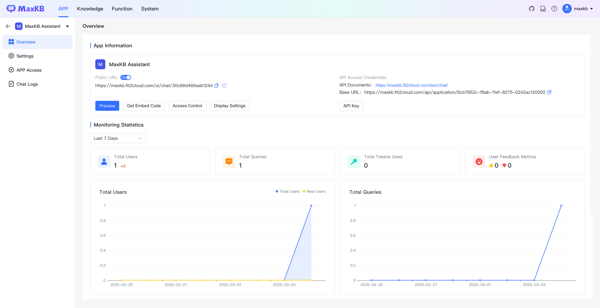

# 产品介绍

## 1 产品介绍

!!! Abstract ""

    生成式 AI（Artificial Intelligence Generated Content，AIGC）的兴起标志着信息技术行业进入了崭新的发展阶段，为社会进步和经济发展打开了巨大的想象空间。检索增强生成（Retrieval Augmented Generation，RAG）技术通过整合内部知识库的丰富信息赋能大语言模型（Large Language Model，简称 LLM），为生成式 AI 带来了革命性的改进。在生成答案或内容时，RAG 技术能够参照精确的知识源，为用户提供高度合理和准确的响应。

!!! Abstract ""

    RAG 技术与 LLM 模型相结合的应用方式，成功弥补了 LLM 模型在处理特定领域请求时存在幻觉、知识泛化、可解释性差等问题。基于 LLM 和 RAG 技术的知识库应用，可以帮助企业提升知识管理与服务水平，提高工作效率，实现业务的提质增效。

!!! Abstract ""

    MaxKB = Max Knowledge Base，是一款基于大语言模型和 RAG 的开源知识库问答系统，广泛应用于智能客服、企业内部知识库、学术研究与教育等场景。作为一款专注于知识库问答场景的软件产品，MaxKB 能够为企业的智能化进程注入新的动力，助力企业实现“提质增效”的目标。在知识库管理方面，MaxKB 帮助企业实现知识采集、知识入库、知识库构建的全流程自动化；在场景化智能搜索方面，MaxKB 能够解析用户输入的问题并匹配检索知识库；在回复准确性方面，MaxKB 采用了成熟的 LLM + RAG 技术，能够最大限度地降低大模型幻觉对知识搜索准确性的干扰，提高企业对业务数据的分类与召回能力；安全性方面，MaxKB 支持本地部署和调用本地大模型，有效管控企业使用知识库时越级访问的风险，以及公有模型在数据传输方面可能存在的安全隐患。借助 MaxKB，企业用户可以快速上线业务 AI 助手，将生成式 AI 能力应用于业务数据管理、内部资料查询、线上客户服务等领域，优化业务服务流程并切实提升用户体验。

## 2 产品优势 

!!! Abstract "" 

    - **开箱即用**      
      支持直接上传文档 / 自动爬取在线文档，支持文本自动拆分、向量化和 RAG（检索增强生成），有效减少大模型幻觉，智能问答交互体验好；   

    - **快速接入**    
      支持零编码嵌入到第三方业务系统，以及快速接入企业微信、钉钉、飞书、公众号等应用，让已有系统快速拥有智能问答能力，提高用户满意度；    

    - **灵活编排**      
      内置强大的工作流引擎和函数库，支持编排 AI 工作过程，满足复杂业务场景下的需求；     

    - **模型中立**     
      支持对接各种大模型，包括本地私有大模型（Llama 3 / Qwen 2 等）、国内公共大模型（通义千问 / 腾讯混元 / 字节豆包 / 百度千帆 / 智谱 AI / Kimi 等）和国外公共大模型（OpenAI / Claude / Gemini 等）。

## 3 案例展示

!!! Abstract ""

    MaxKB 自发布以来，日均安装下载超过 1000 次，被广泛应用于智能客服、企业内部知识库、学术研究与教育等场景。

    - [华莱士智能客服](https://ai.cnhls.com/ui/chat/1fc0f6a9b5a6fb27)
    - [JumpServer 小助手](https://maxkb.fit2cloud.com/ui/chat/b4e27a6e72d349a3)
    - [信用深圳](https://www.szcredit.org.cn/#/index)
    - [重庆交通大学教务在线](http://jwc.anyquestion.cn/ui/chat/b75496390f7d935d)

## 4 了解更多

!!! Abstract ""

    - **如何向团队介绍 MaxKB？：** https://fit2cloud.com/maxkb/download/introduce-maxkb_202409.pdf
    - **飞致云培训认证中心：** https://edu.fit2cloud.com/index 
    - **MaxKB 知识库：** https://kb.fit2cloud.com/categories/maxkb
