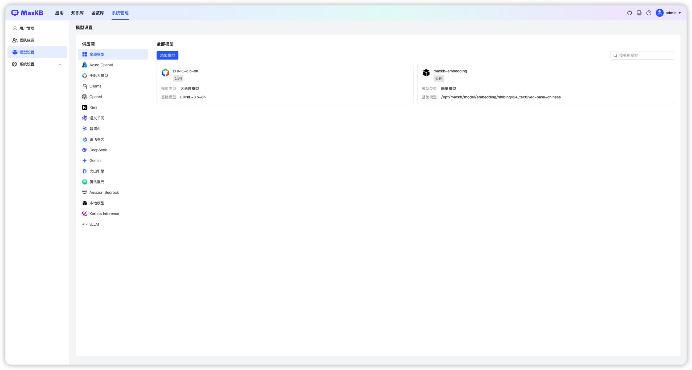

# 产品介绍

!!! Abstract ""
    MaxKB = Max Knowledge Base，是一款基于 LLM 大语言模型的开源知识库问答系统，旨在成为企业的最强大脑。 

# 1 产品优势 

!!! Abstract "" 

    - **开箱即用**      
      支持直接上传文档、自动爬取在线文档，支持文本自动拆分、向量化、RAG（检索增强生成），智能问答交互体验好；   

    - **无缝嵌入**    
      支持零编码快速嵌入到第三方业务系统，让已有系统快速拥有智能问答能力，提高用户满意度；    

    - **灵活编排**      
      内置强大的工作流引擎，支持编排 AI 工作流程，满足复杂业务场景下的需求；     

    - **模型中立**     
      支持对接各种大语言模型，包括本地私有大模型（Llama 3 / Qwen 2 等）、国内公共大模型（通义千问 / 智谱 AI / 百度千帆 / Kimi / DeepSeek 等）和国外公共大模型（OpenAI / Azure OpenAI / Gemini 等）。    

## 2 开箱即用

!!! Abstract ""  
    支持直接上传文档、自动爬取在线文档，支持文本自动拆分、向量化、RAG（检索增强生成），智能问答交互体验好。   

## 3 无缝嵌入

!!! Abstract ""  
    支持零编码快速嵌入到第三方业务系统，让已有系统快速拥有智能问答能力，提高用户满意度。   

## 4 灵活编排

!!! Abstract ""  
    内置强大的工作流引擎，支持编排 AI 工作流程，满足复杂业务场景下的需求。   

## 5 模型中立

!!! Abstract ""  
    支持对接各种大语言模型，包括本地私有大模型（Llama 3 / Qwen 2 等）、国内公共大模型（通义千问 / 智谱 AI / 百度千帆 / Kimi / DeepSeek 等）和国外公共大模型（OpenAI / Azure OpenAI / Gemini 等）。   

