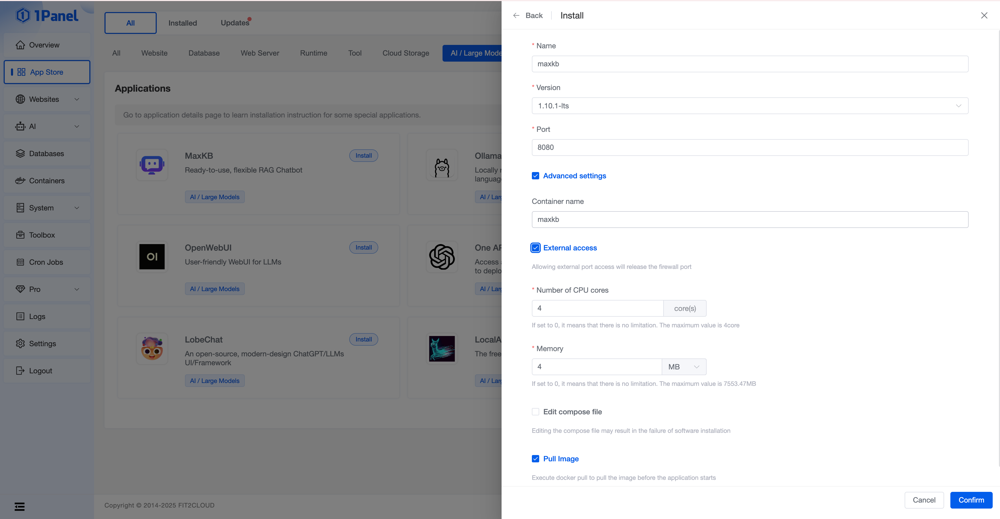

## 1 Install 1Panel

!!! Abstract ""

    For 1Panel installation, deployment and basic feature introduction, please refer to the [1Panel Official Documentation](https://1panel.cn/docs/). After completing 1Panel installation and deployment, open your browser with the provided URL to access 1Panel as shown below.


## 2 Install MaxKB

!!! Abstract ""
    Go to the App Store application list and find MaxKB under the [AI/Large Models] category to install.

    

!!! Abstract ""

    Configure MaxKB application parameters on the installation page:

    - Name: Name of the MaxKB application to be created.
    - Version: Select MaxKB version.
    - Port: Service port for the MaxKB application.
    - Container Name: Name of the MaxKB application container.
    - CPU Limit: Number of CPU cores available to the MaxKB application.
    - Memory Limit: Amount of memory available to the MaxKB application.
    - External Port Access: MaxKB application can be accessed via IP:PORT (external port access must be enabled for MaxKB).



!!! Abstract ""

    Click confirm to start installation. The page will automatically redirect to the installed applications list. Wait for the MaxKB application status to change to "Running".

    

## 3 Access MaxKB

!!! Abstract ""

    After successful installation, access MaxKB through your browser using the following credentials:

    ```
    Address: http://IP:service-port (default 8080)
    Username: admin
    Password: MaxKB@123..
    ```

    For security reasons, admin will be required to change the default password on first login. After changing the password, log in again to start using MaxKB.


