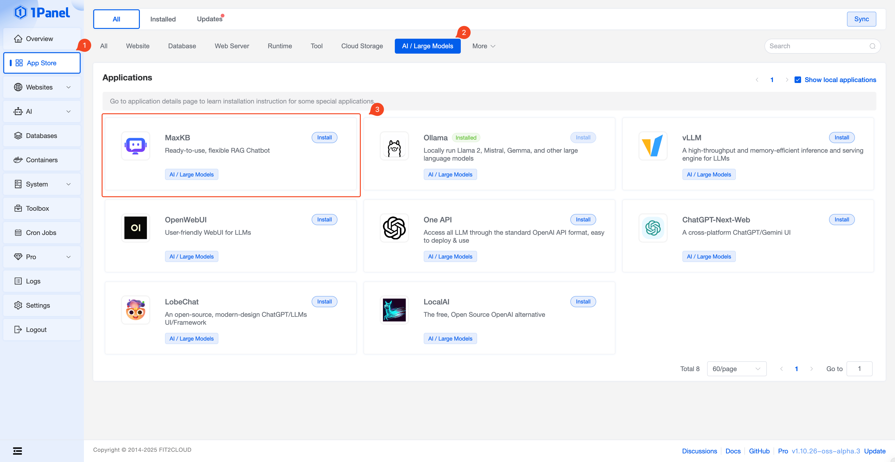

# 1Panel 安装

## 1 安装 1Panel
!!! Abstract "" 
    关于 1Panel 的安装部署与基础功能介绍，请参考 [1Panel 官方文档](https://1panel.cn/docs/) 。在完成了 1Panel 的安装部署后，根据提示网址打开浏览器进入 1Panel，界面如下。    


## 2 安装 MaxKB 

!!! Abstract "" 
    进入应用商店应用列表，在【AI/大模型】分类下找到 MaxKB 应用进行安装。    
    


!!! Abstract "" 
    在应用详情页选择最新的 MaxKB 版本进行安装，进行相关参数设置。   
    * 名称：要创建的 MaxKB 应用的名称。   
    * 版本：选择 MaxKB 最新版本。   
    * 端口：MaxKB 应用的服务端口。   
    * 容器名称：MaxKB 应用容器名称。    
    * CPU 限制：MaxKB 应用可以使用的 CPU 核心数。   
    * 内存限制：MaxKB 应用可以使用的内存大小。    
    * 端口外部访问：MaxKB 应用可以使用 IP:PORT 进行访问（MaxKB 应用必须打开外部端口访问）。    


!!! Abstract "" 
    点击确认开始安装，页面自将动跳转到已安装应用列表，等待 MaxKB 应用状态变为已启动。   
    

## 3 访问 MaxKB 


!!! Abstract "" 
    安装成功后，通过浏览器访问如下页面登录 MaxKB：   
    ```
    地址: http://目标服务器IP地址:服务运行端口（默认 8080）     
    用户名: admin    
    密码: MaxKB@123..
    ```

!!! Abstract ""     
    第一次登录需修改 admin 用户的密码，修改密码后，重新登录系统即可使用 MaxKB。   
