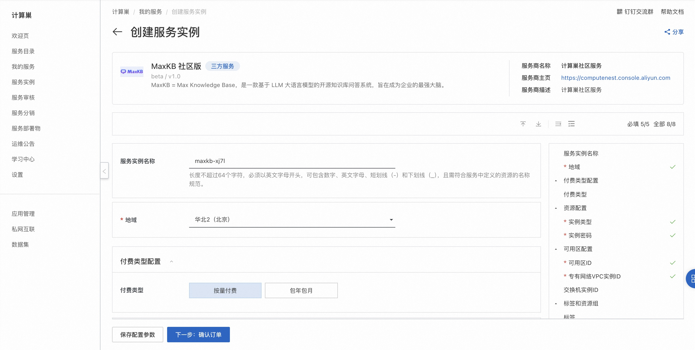
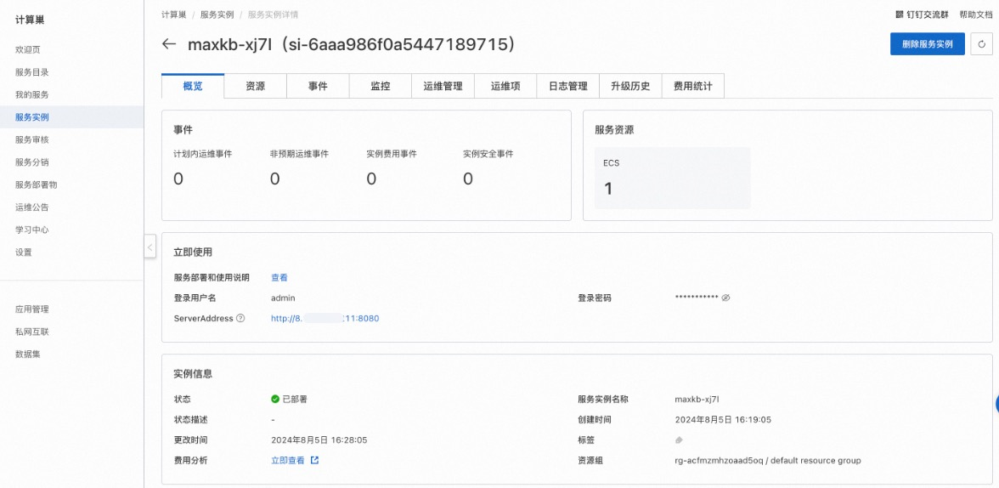
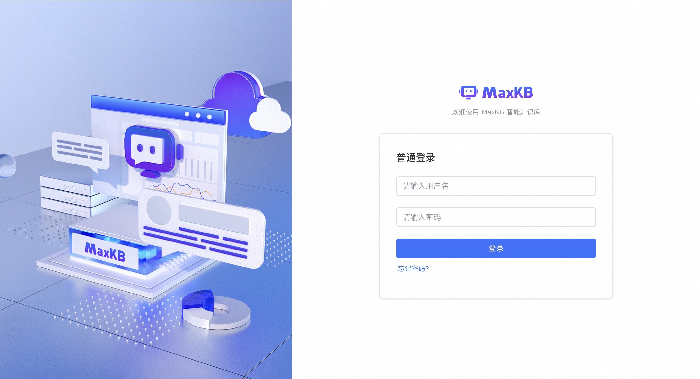

# 阿里云计算巢快速部署 MaxKB 社区版

## 计费说明
MaxKB 社区版上的费用主要涉及：

- 所选vCPU与内存规格
- 系统盘类型及容量
- 公网带宽

## RAM账号所需权限
部署MaxKB 社区版，需要对部分阿里云资源进行访问和创建操作。因此您的账号需要包含如下资源的权限。
  **说明**：当您的账号是RAM账号时，才需要添加此权限。

| 权限策略名称                          | 备注                                 |
|---------------------------------|------------------------------------|
| AliyunECSFullAccess             | 管理云服务器服务（ECS）的权限                   |
| AliyunVPCFullAccess             | 管理专有网络（VPC）的权限                     |
| AliyunROSFullAccess             | 管理资源编排服务（ROS）的权限                   |
| AliyunComputeNestUserFullAccess | 管理计算巢服务（ComputeNest）的用户侧权限         |

## 部署流程

1. 访问MaxKB 社区版服务[部署链接](https://computenest.console.aliyun.com/service/instance/create/cn-hangzhou?type=user&ServiceId=service-741a52c9154946bdbbd8)，按提示填写部署参数：
  

2. 参数填写完成后可以看到对应询价明细，确认参数后点击**下一步：确认订单**。确认订单完成后同意服务协议并点击**立即创建**进入部署阶段。 
3. 等待部署完成后进入服务实例管理, 在控制台找到MaxKB服务访问链接。
  
4. 单击链接访问服务。
  
