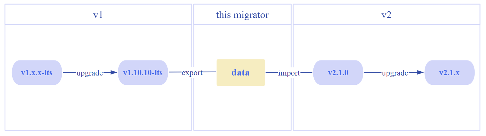
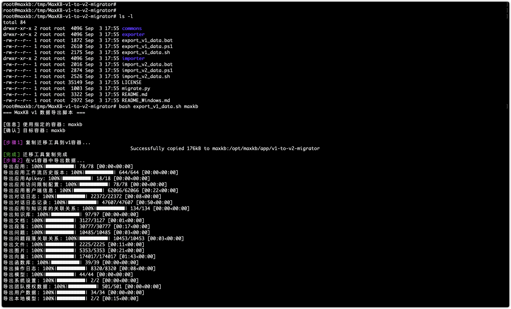
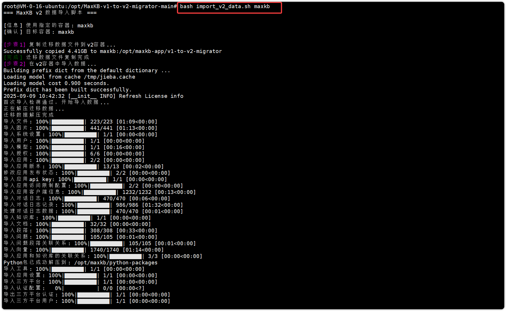
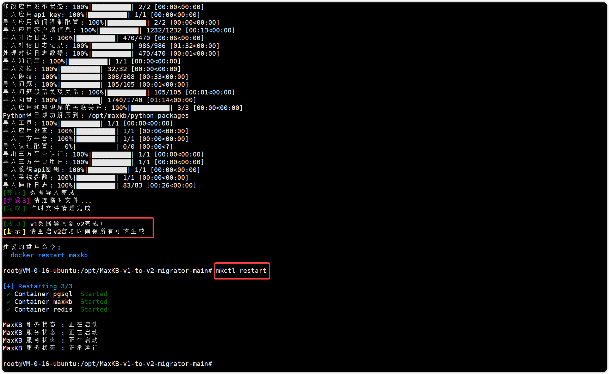
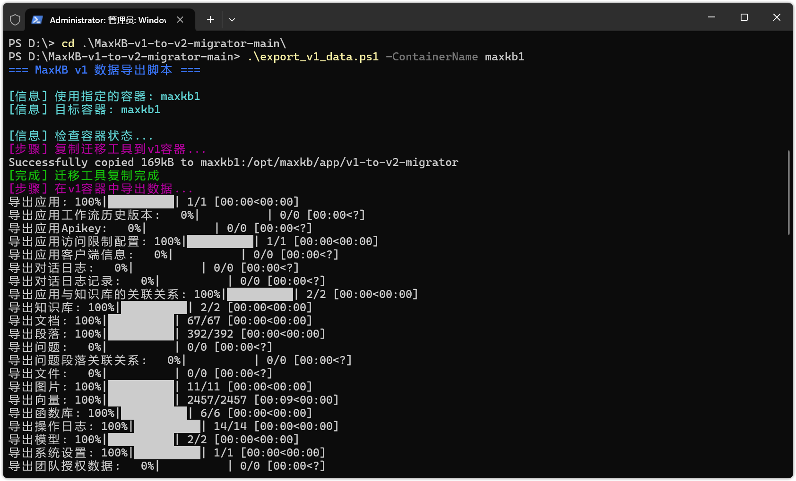
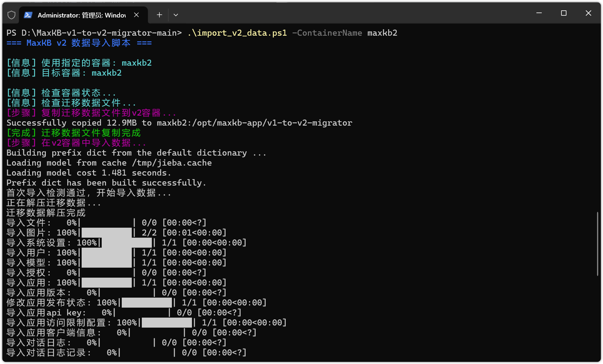

# 迁移工具

## 1 迁移说明 

### 1.1 迁移路线 
!!! Abstract ""
    **注意**：v1 版本需先升级至 **v1.10.10-lts** 版本及后续版本，再使用迁移工具迁移到 **v2.1.0**。迁移的 v2 版本为**v2.1.0** ，之后可升级到 v2 更高版本。



### 1.2 注意事项
!!! Abstract ""

    - 此工具是迁移工具，用以将 v1 1.10.10-lts 及后续版本的数据迁移到 v2.1.0，并不是直接的升级工具；
    - 此工具只支持 v1 1.10.10-lts及后续版本的数据迁移到 v2.1.0；
    - 数据迁移的目标环境必须是 v2.1.0，且没有任何数据（license 除外）；
    - 迁移前，请停止服务，避免数据迁移不完整；
    - 迁移前，请务必检查磁盘空间，并确保数据导出和导入前后有足够的存储空间；
    - 迁移时，保证 v1 和 v2 的容器都处于正常运行状态（不需要停止服务）。

## 2 迁移工具下载
!!! Abstract ""
    打开 [MaxKB 迁移工具下载](https://github.com/1Panel-dev/MaxKB-v1-to-v2-migrator)页面，下载最新版本工具，并上传至部署服务器。

## 3 迁移操作
### 3.1 Linux/macOS 系统
#### 3.1.1 导出数据
!!! Abstract ""
    在 ≥v1.10.10-lts 机器上下载 MaxKB-v1-to-v2-migrator-<version\>.zip，解压后进入目录，执行以下命令导出 v1 数据。

    - 如果 v1 的数据量较大，导出过程中需要一定的时间，请务必耐心等待。
    - 导出完成后，MaxKB-v1-to-v2-migrator-<version\> 中会生成一个 migrate.zip。

    ```
    unzip MaxKB-v1-to-v2-migrator-<version>.zip 

    cd  MaxKB-v1-to-v2-migrator-<version>

    bash export_v1_data.sh <v1_container_name>
    ```



!!! Abstract ""
    将 MaxKB-v1-to-v2-migrator-<version\> 复制到 v2.1.0 所在的机器上。


#### 3.1.2 导入数据
!!! Abstract ""
    在 v2.1.0 机器上，确保 v2.1.0 版本的容器已经启动且没有任何其它数据，**专业版需提前导入 license**。

    进入迁移工具目录，执行以下命令将数据导入 v2.1.0。
    ```
    cd MaxKB-v1-to-v2-migrator-<version>

    bash import_v2_data.sh <v2_container_name>
    
    ```
    **注意**：v1 社区版只能迁移到 v2 社区版，v1 专业版只能迁移到 v2 专业版，且 v1 和 v2 的专业版必须有有效的 license 许可。
    


!!! Abstract ""
    导入成功后，需要重启 MaxKB 服务。

    

### 3.2 Windows 系统
#### 3.2.1 操作要求
!!! Abstract ""
    支持的操作系统：

    - Windows 10
    - Windows 11
    - Windows Server 2016 及以上版本

!!! Abstract ""
    前置条件：

    - 已安装 Docker Desktop for Windows；
    - MaxKB v1 和 v2 容器正在运行；
    - 对于 PowerShell 脚本，需要 PowerShell 5.0 或更高版本。


#### 3.2.2 导出数据
!!! Abstract ""
    对于 Windows 系统，MaxKB 提供了 PowerShell 脚本（.ps1）来导出 v1 1.10.10-lts及后续版本的数据。下载迁移工具并解压，使用终端管理员进入迁移目录，执行命令导出 v1 数据。
    
    - 如果 v1 的数据量较大，导出过程中需要一定的时间，请务必耐心等待。
    - 导出完成后，MaxKB-v1-to-v2-migrator-<version\> 中会生成一个migrate.zip。
    ```
    # PowerShell 脚本
    .\export_v1_data.ps1 -ContainerName <v1_container_name>
    ```



#### 3.2.3 导入数据
!!! Abstract ""
    在 v2.1.0 机器上，确保 v2.1.0 版本的容器已经启动且没有任何其它数据，**专业版需提前导入 license**。
    ```
    #PowerShell 脚本
    .\import_v2_data.ps1 -ContainerName <v2_container_name>
    ```

    **注意**：v1 社区版只能迁移到 v2 社区版，v1 专业版只能迁移到 v2 专业版，且 v1 和 v2 的专业版必须有有效的 license 许可。


## 4 迁移变更说明
### 4.1 用户
!!! Abstract ""

    - 如果 v1 中用户的【姓名】为空，迁移后，自动将【用户名】作为【姓名】；
    - 工作空间内的资源查询依照【姓名】查询；
    - admin 账户默认授予系统管理员、工作空间管理员、普通用户权限（X-Pack）；
    - 除 admin 外，系统用户或其他用户类型迁移后，默认角色为普通用户（X-Pack）。

### 4.2 资源
!!! Abstract ""

    - v1 授权给其他成员的应用/知识库，迁移后授予相应的权限；
    - 资源创建者拥有管理资源的权限；
    - v1 函数库迁移后，在工具中，创建者有管理权限，其他用户默认是不授权状态；
    - 公有模型迁移后，默认资源授权所有普通用户为查看权限，创建者为管理权限。


### 4.3 接口
!!! Abstract ""

    - v1 与 v2 的接口文档不一致，如有接口调用，需重新配置；

### 4.4 应用接入
!!! Abstract ""

    - 应用接入到企业微信等的回调地址会发生变化，应用接入、登录认证（扫码登录）需重新配置（X-Pack）；

### 4.5 知识库
!!! Abstract ""

    - 由于 v1 上传知识库的文档并无保存原文档，迁移到 v2 后，对应知识库文档不支持【下载原文档】的功能。
