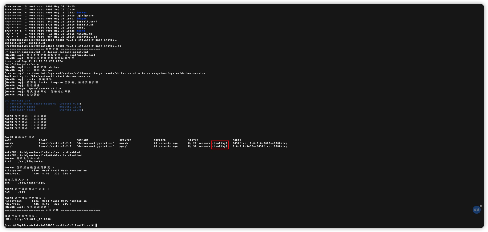

## 1 部署要求

如果用于生产环境，离线安装是官方推荐的安装方式。

### 1.1 服务器配置

!!! Abstract ""

    **部署服务器要求：**

    * 操作系统：Ubuntu 22.04 / CentOS 7.6 64 位系统
    * CPU/内存：4C/8GB 以上
    * 磁盘空间：100GB

### 1.2 端口要求

!!! Abstract ""
    离线部署 MaxKB 需要开通的访问端口说明如下：

| 端口     |    作用    |            说明            |
|--------|:--------:|:------------------------:|
| 22     |   SSH    |        安装、升级及管理使用        |
| 8080   | Web 服务端口 | 默认 Web 服务访问端口，根据实际情况进行更改 |

## 2 安装包下载

!!! Abstract ""
    打开 [飞致云开源社区 MaxKB 社区版下载](https://community.fit2cloud.com/#/products/maxkb/downloads) 页面下载最新版本安装包，并上传至部署服务器（以 v1.2.0 为例说明安装部署过程）。

## 3 安装部署

### 3.1 解压安装包

!!! Abstract ""

    以 root 用户使用 ssh 协议登录到部署服务器, 对安装包进行解压：
    ```
    tar -zxvf maxkb-v1.2.0-offline.tar.gz
    ```

### 3.2 安装配置（可选）

!!! Abstract ""

    MaxKB 安装目录、服务运行端口、数据库配置等信息可在安装包中的 install.conf 文件进行配置。

    ```
    ## 安装目录
    MAXKB_BASE=/opt
    ## Service 端口
    MAXKB_PORT=8080
    ## docker 网段设置
    MAXKB_DOCKER_SUBNET=172.19.0.0/16
    # 数据库配置
    ## 是否使用外部数据库
    MAXKB_EXTERNAL_PGSQL=false
    ## 数据库地址
    MAXKB_PGSQL_HOST=pgsql
    ## 数据库端口
    MAXKB_PGSQL_PORT=5432
    ## 数据库库名
    MAXKB_PGSQL_DB=maxkb
    ## 数据库用户名
    MAXKB_PGSQL_USER=root
    ## 数据库密码
    MAXKB_PGSQL_PASSWORD=Password123@postgres
    ```

    **注意**：首次安装之前可在 install.conf 文件中的修改参数，安装时则根据修改后的参数执行安装。完成安装后如需再次修改配置参数，则需要在 ${MAXKB_BASE}/maxkb/.env 文件中进行修改，并且在修改完后需执行 `mkctl reload` 命令重新加载配置文件。


### 3.3 执行安装脚本

!!! Abstract ""

    ```
    # 进入安装包解压缩后目录  
    cd maxkb-v1.2.0-offline

    # 执行安装命令
    bash install.sh
    ```



## 4 登录访问

!!! Abstract ""

    安装成功后，通过浏览器访问地址 `http://目标服务器 IP 地址:8080`，使用默认的管理员用户和密码登录MaxKB。

    ```
    用户名：admin
    默认密码：MaxKB@123..
    ```


## 5 离线升级 

!!! Abstract ""

    按照以上说明，下载新版本安装包并上传解压后，重新执行安装命令进行升级。

    ```
    # 进入新版本目录
    cd maxkb-v1.x.y-offline

    # 运行安装脚本
    /bin/bash install.sh

    # 查看 MaxKB 运行状态
    mkctl status
    ```

    **注意：** 升级前请先对数据库进行备份。
