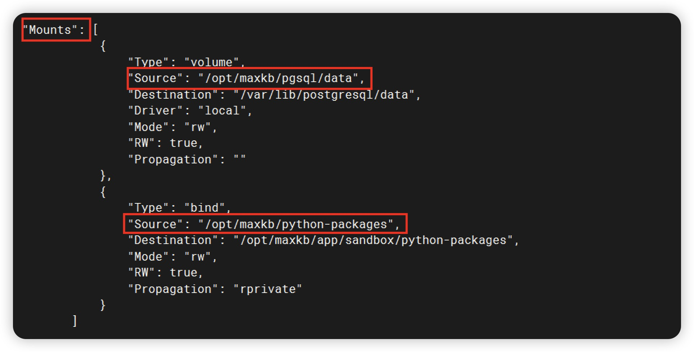

## 1 环境要求

!!! Abstract ""
    **安装前请确保您的系统符合安装条件：**

    * 操作系统：Ubuntu 22.04 / CentOS 7 64 位系统；
    * CPU/内存： 推荐 2C/4GB 以上；
    * 磁盘空间：100GB；
    * 浏览器要求：请使用 Chrome、FireFox、Edge等现代浏览器；
    * **可访问互联网**。


## 2 在线快速部署

!!! Abstract ""
    MaxKB 支持一键启动，仅需执行以下命令：
    ```
    docker run -d --name=maxkb -p 8080:8080 -v ~/.maxkb:/var/lib/postgresql/data cr2.fit2cloud.com/1panel/maxkb
    ```

    安装成功后，可通过浏览器访问 MaxKB：
    ```
    http://目标服务器 IP 地址:目标端口

    默认登录信息
    用户名：admin
    默认密码：MaxKB@123..
    ```

    **如果使用的是云服务器，请至安全组开放目标端口。**

## 3 在线升级

!!! Abstract ""
    **注意：升级前确认数据持久化目录（-v后的目录），创建新容器时要跟上一次数据持久化目录保持一致，否则启动后数据为空。**     
    执行以下命令：

    1 下载最新镜像
    ```
    docker pull cr2.fit2cloud.com/1panel/maxkb
    ```
    2 确认上一次数据持久化目录，复制保存，第4步使用
    ```
    docker inspect maxkb
    ```



!!! Abstract ""
    3 删除正在运行的 MaxKB 容器
    ```
    docker rm -f maxkb 
    ```
    4 创建并启动 MaxKB 容器
    ```
    docker run -d --name=maxkb -p 8080:8080 -v /opt/maxkb/pgsql/data:/var/lib/postgresql/data cr2.fit2cloud.com/1panel/maxkb

    # 注意：确认数据持久化目录（-v后的目录）要跟【第 2 步】的目录保持一致，否则启动后数据为空。
    ```
