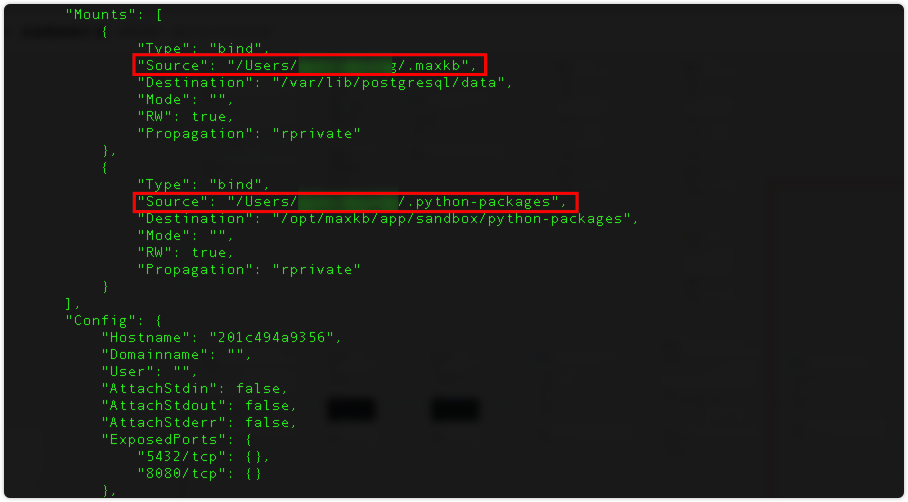

## 1 部署要求

### 1.1 服务器配置

!!! Abstract ""

    **部署服务器要求：**

    * 操作系统：Ubuntu 22.04 / CentOS 7.6 64 位系统
    * CPU/内存：4C/8GB 以上
    * 磁盘空间：100GB

### 1.2 端口要求

!!! Abstract ""

    在线部署 MaxKB 需要开通的访问端口说明如下：

| 端口     | 作用       | 说明                        |
|--------|:---------|:--------------------------|
| 22     | SSH      | 安装、升级及管理使用                |
| 8080   | Web 服务端口 | 默认 Web 服务访问端口，可根据实际情况进行更改 |    


## 2 在线快速部署

!!! Abstract ""

    MaxKB 支持一键启动，仅需执行以下命令：
    ```
    # Linux 操作系统
    docker run -d --name=maxkb --restart=always -p 8080:8080 -v ~/.maxkb:/var/lib/postgresql/data -v ~/.python-packages:/opt/maxkb/app/sandbox/python-packages cr2.fit2cloud.com/1panel/maxkb

    # Windows 操作系统
    docker run -d --name=maxkb --restart=always -p 8080:8080 -v C:/maxkb:/var/lib/postgresql/data -v C:/python-packages:/opt/maxkb/app/sandbox/python-packages cr2.fit2cloud.com/1panel/maxkb
    ```
     
    待所有容器状态显示为`healthy`后，可通过浏览器访问 MaxKB：
    ```
    http://目标服务器 IP 地址:8080

    默认登录信息
    用户名：admin
    默认密码：MaxKB@123..
    ```

## 3 在线升级

!!! Abstract ""

    根据以下步骤依次执行进行升级：

    （1） 下载最新镜像
    ```
    docker pull cr2.fit2cloud.com/1panel/maxkb
    ```
    （2）查看并确认上一次数据持久化目录，复制保存
    ```
    docker inspect maxkb
    ```



!!! Abstract ""

    （3）删除正在运行的、旧版本的 MaxKB 容器

    ```
    docker rm -f maxkb 
    ```

    （4）启动并运行新版本的 MaxKB 容器

    **注意：** 务必确认数据持久化目录（即命令行中 -v后的目录）要跟第 (2) 步查看目录保持一致，否则启动后整个系统的数据为空。

    ```
    docker run -d --name=maxkb --restart=always -p 8080:8080 -v ~/.maxkb:/var/lib/postgresql/data -v ~/.python-packages:/opt/maxkb/app/sandbox/python-packages cr2.fit2cloud.com/1panel/maxkb
    ```
