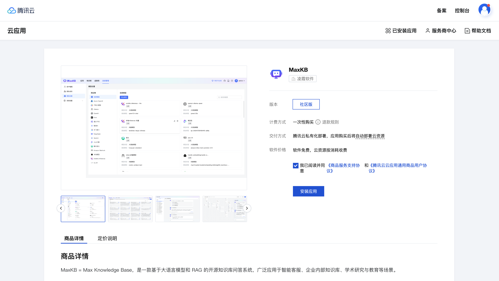
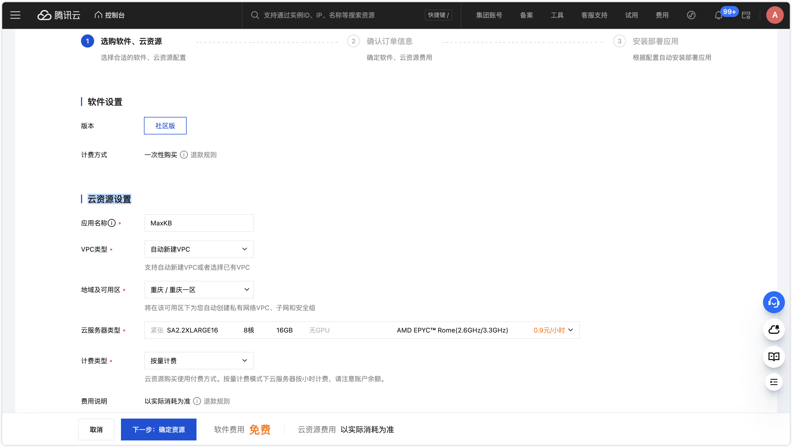
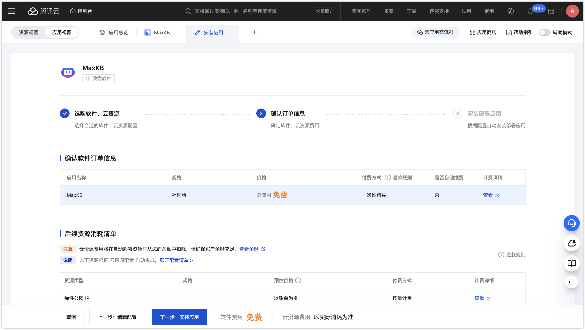
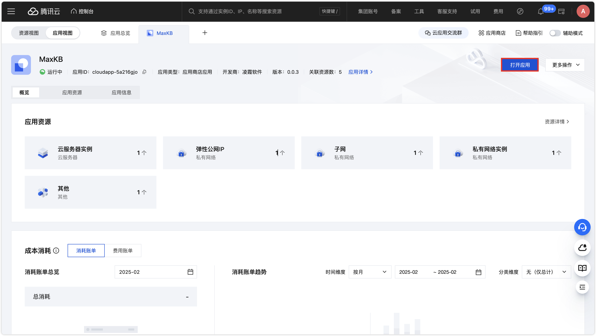

# 云应用部署指南

!!! Abstract ""

    本指南将介绍如何通过腾讯云中快速安装 **MaxKB** 云应用。

## 1 安装应用

!!! Abstract ""
    MaxKB 社区版已上架腾讯云云应用，可直接在腾讯云服务器中快速部署。

    第一步：关联我们的腾讯云合作伙伴账户，享受更多优惠福利：[点击链接进行关联](https://partner.cloud.tencent.com/invitation/10002820907763620ace838b1?inviteType=2

    第二步：直接打开 [MaxKB 云应用](https://app.cloud.tencent.com/detail/SPU_BHDJDDBHBE5864) 。



!!! Abstract ""

    第三步：选择合适云资源配置。点击【安装应用】后，设置云资源设置，建议至少 4c8g 及以上规格。





!!! Abstract ""

    第四步：安装和启动。点击【安装应用】，等待后台安装以及服务启动。启动完成后，点击【打开应用】，即可使用默认的管理员用户和密码登录 MaxKB。

    ```
    用户名：admin
    默认密码：MaxKB@123..
    ```


