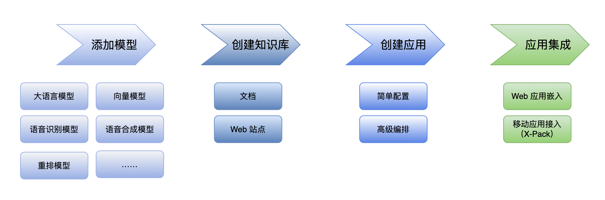
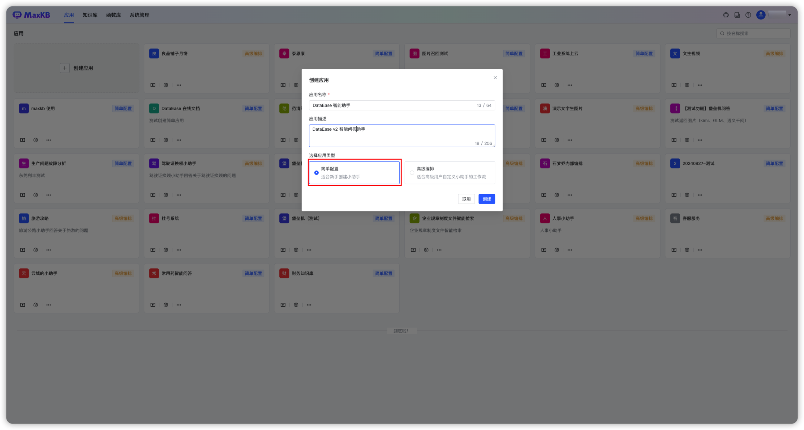
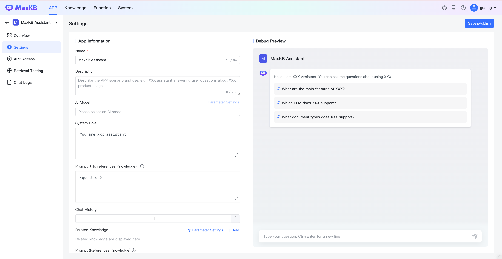
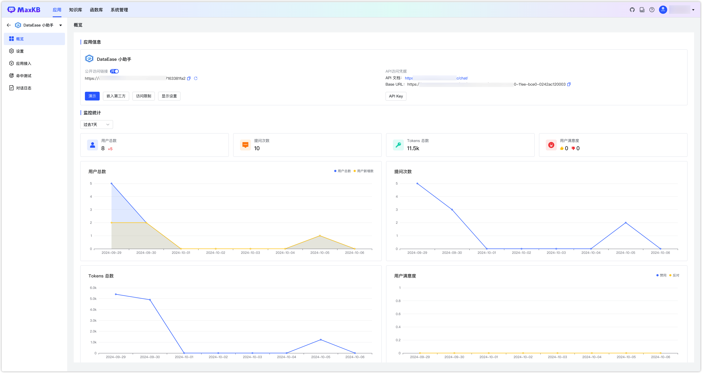

## 1 操作流程

!!! Abstract ""
    MaxKB 的使用操作流程一般可分为四步：添加模型、创建知识库、创建应用、发布应用。     
    在高级编排应用中还可以通过函数库的功能，创建数据处理、逻辑判断、信息提取或者其他满足工作场景的函数脚本，提供更加强大、灵活的能力。

!!! Abstract ""
    下面通过通义千问大语言模型，以通用知识库为例，快速创建智能问答应用并发布。

## 2 添加模型

!!! Abstract ""
    登录 MaxKB 系统后，在供应商列表中选择`通义千问`，然后点击【添加模型】，进入模型配置表单配置参数如下：

    * 模型名称：MaxKB 中自定义的模型名称。  
    * 权限：分为私有和公用两种权限，私有模型仅当前用户可用，公用模型即系统内所有用户均可使用，但其它用户不能编辑和删除。   
    * 模型类型：大语言模型。   
    * 基础模型：通义千问支持的 LLM 模型名称，下拉选项是常用的一些大语言模型名称，支持自定义输入。        
    * API Key：阿里云 DashScope灵积模型服务 API Key管理中创建和查看。

!!! Abstract ""
    不同的平台参数要求不同，其它供应商模型配置添加详情见各模型对接详细说明。

## 3 创建知识库

!!! Abstract ""

    打开【知识库】页面，点击【创建知识库】，输入知识库名称、知识库描述、选择通用型知识库类型，然后将离线文档通过拖拽方式或选择文件上传方式进行上传。 

### 3.1 上传文档

!!! Abstract ""
    上传文档要求：  

    * 文件格式：Markdown、TXT、PDF、DOCX、HTML；
    * 表格格式：Excel、CSV;
    * QA 问答对：Excel、CSV；  
    * 每次最多上传 50 个文件；   
    * 每个文件不超过 100 MB；
    * 支持选择文件夹，上传文件夹下符合格式要求的文件。

    文档规范建议：

    * 规范分段标识：离线文档的分段标识要有一定规范，否则拆分出来的段落会不规整。   
    * 段落要完整：一个分段中最好能描述一个完整的功能点或问题。

### 3.2 设置分段规则
    
!!! Abstract ""
    目前 MaxKB 支持智能分段和高级分段两种分段方式。

    **智能分段**

    （1）MarkDown 类型的文件智能分段规则： 

    * 根据标题逐级下钻式分段，最多支持 6 级标题，每段的字符数最大为 4096 个字符；   
    * 当最后一级的文本段落字符数超过设置的分段长度时，会查找分段长度以内的回车进行截取。

    （2）HTML、DOCX 类型的智能分段规则：

    * 识别标题格式转换成 markdown 的标题样式；
    * 逐级下钻进行分段，最多支持 6 级标题，每段的字符数最大为 4096 个字符。

    （3）TXT和 PDF 类型的文件智能分段规则：

    * 按照标题# 进行分段，若没有#标题的则按照字符数4096个字符进行分段；
    * 查找分段长度以内的回车进行截取。  
      

!!! Abstract ""
    **高级分段**  

    用户可以根据文档规范自定义设置分段标识符、分段长度及自动清洗。

    * 分段标识支持：#、##、###、####、#####、######、-、空行、回车、空格、分号、逗号、句号，还可以手动输入分段标识符。   
    * 分段长度：支持最小 50个字符，最大 4096 个字符。   
    * 自动清洗：开启后系统会自动去掉重复多余的符号如空格、空行、制表符等。     

!!! Abstract ""
    **导入时添加分段标题为关联问题**  

    勾选后会把所有分段的标题设置为分段的关联问题。

!!! Abstract ""
    **预览** 

    分段规则设置完成后，需要点击【生成预览】查看最新规则的分段效果。

!!! Abstract ""
    可在分段预览中对不合理的分段进行再次编辑。

 
!!! Abstract ""
    点击【创建并导入】后，系统后台会对文档进行自动分段 -> 存储 -> 向量化处理操作，执行完成后在知识库文档列表中各个文件状态显示为`成功`。

## 4 创建应用

!!! Abstract ""
    点击【创建应用】，输入应用名称，选择【简易配置应用】，点击【创建】

!!! Abstract ""
    应用创建完成，进入简易配置应用的设置页面，左侧为应用信息，右侧为调试预览界面。

    * 应用名称：用户提问时对话框的标题和名字。    
    * 应用描述：对应用场景及用途的描述。    
    * AI模型：在【系统设置】-【模型管理】中添加的大语言模型。    
    * 提示词：系统默认有智能知识库的提示词，用户可以自定义通过调整提示词内容，可以引导大模型聊天方向。可以对无引用知识库和引用知识库两种情况分别设置不同的提示词。
    * 历史聊天记录：大模型提交当前会话中最后 N 条对话内容，否则仅向大模型提交当前问题。
    * 关联知识库：用户提问后将在关联的知识库中检索分段。   
    * 开场白：用户打开对话时，系统弹出的问候语。支持 Markdown 格式；[-]后的内容为快捷问题，一行一个。 
    * 语音输入：开启后将支持语音方式进行提问，需要语音识别模型支持。
    * 语音播放：开启后可以通过语音进行播放回答，可以通过浏览器播放，也可以通选择语音合成模型。

    应用信息设置完成后，可以在右侧调试预览中进行提问预览，调试预览中提问内容不计入对话日志。

  
!!! Abstract "" 
    **知识库参数设置详细说明**

    （1）**检索模式**

    * 向量检索：使用向量模型通过向量距离计算与用户问题最相似的文本分段；        
    * 全文检索：通过关键词检索，返回包含关键词最多的文本分段；           
    * 混合检索：同时执行全文检索和向量检索，再进行重排序，从两类查询结果中选择匹配用户问题的最佳结果。    

    （2）**相似度：** 相似度越高代表问题和分段的相关性越强。 

    （3）**引用分段数：** 提问时按相似度携带 N 个分段生成提示词询问 LLM 模型。 

    （4）**引用最大字符数：** 引用分段内容设置最大字符数，超过时则截断。     

    （5）**无引用知识库处理**

    * 继续提问：可以自定义设置提示词，需要有`{question}`用户问题的占位符，才会把用户问题发送给模型。       
    * 指定回复内容：当没有命中知识库分段时可以指定回复内容。   
    
    （6）**问题优化：** 开启后对用户提出的问题先进行一次 LLM 优化处理，将优化后的问题在知识库中进行向量化检索，能提高检索知识库的准确度，但由于多一次询问大模型会增加回答问题的时长。

!!! Abstract "" 
    经过调试后，保存设置并发布。在应用列表页面，在概览页面点击演示或在浏览器中复制公开访问链接进入问答页面进行提问。

## 5 应用集成

!!! Abstract "" 
    MaxKB 应用支持零编码快速嵌入第三方 Web系统。

    在应用概览页面，点击【嵌入第三方】，可以复制全屏模式代码或浮窗模式代码嵌入到第三方系统中，嵌入完成后便可在第三方系统中进行问答。

!!! Abstract "" 
    在专业版中，也可以接入企业微信、公众号、钉钉和飞书等应用，详细说明见：[X-Pack功能-应用接入 ](./user_manual/X-Pack/app_integrate.md)。

    

