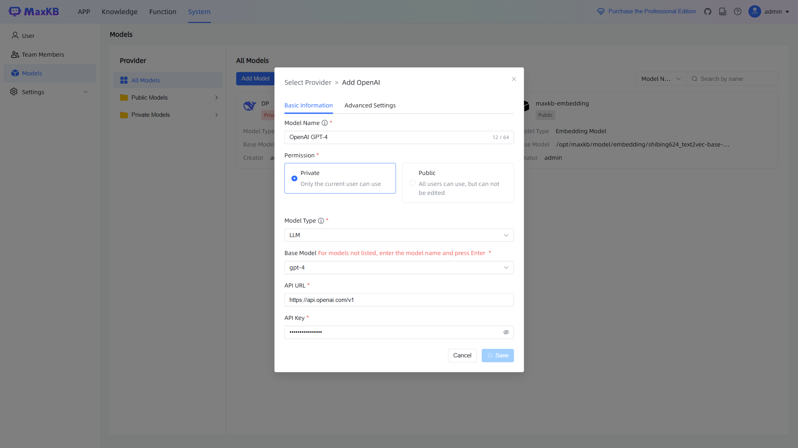
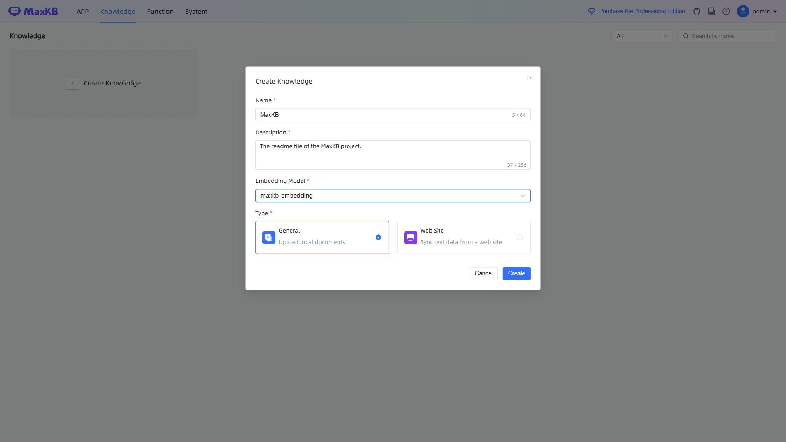
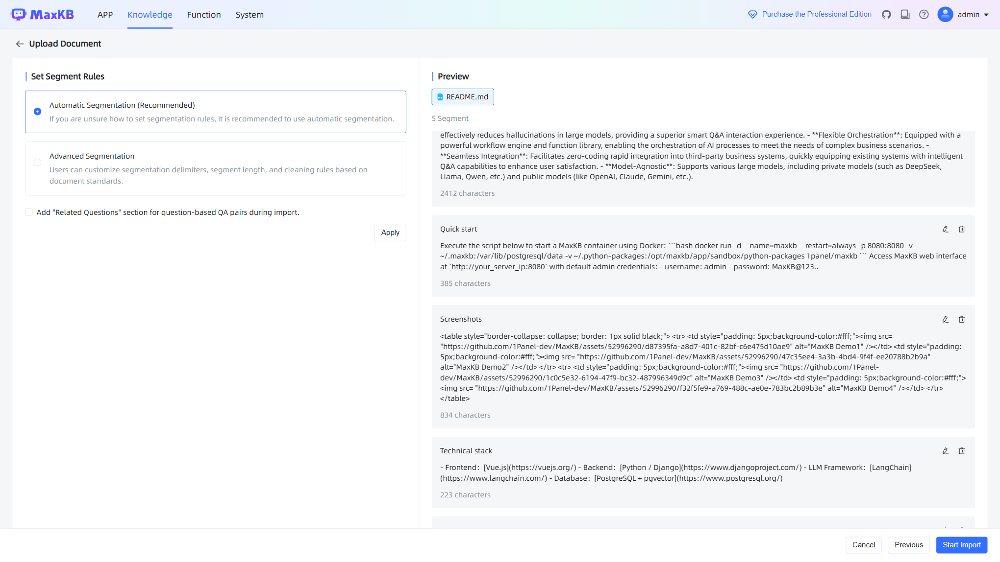
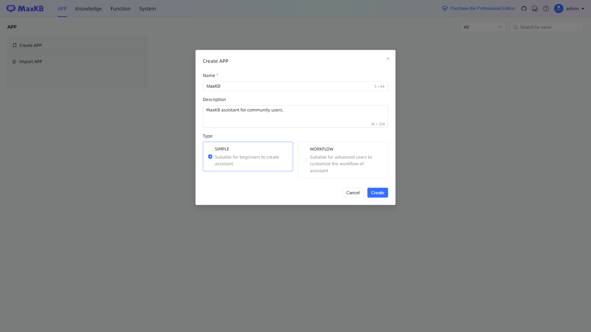
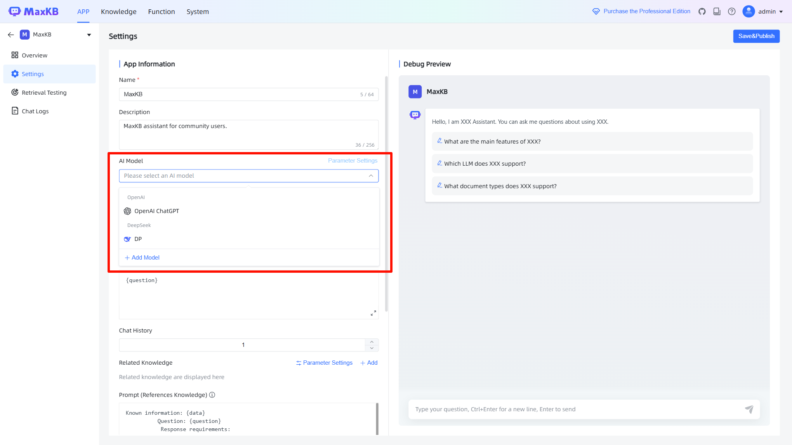
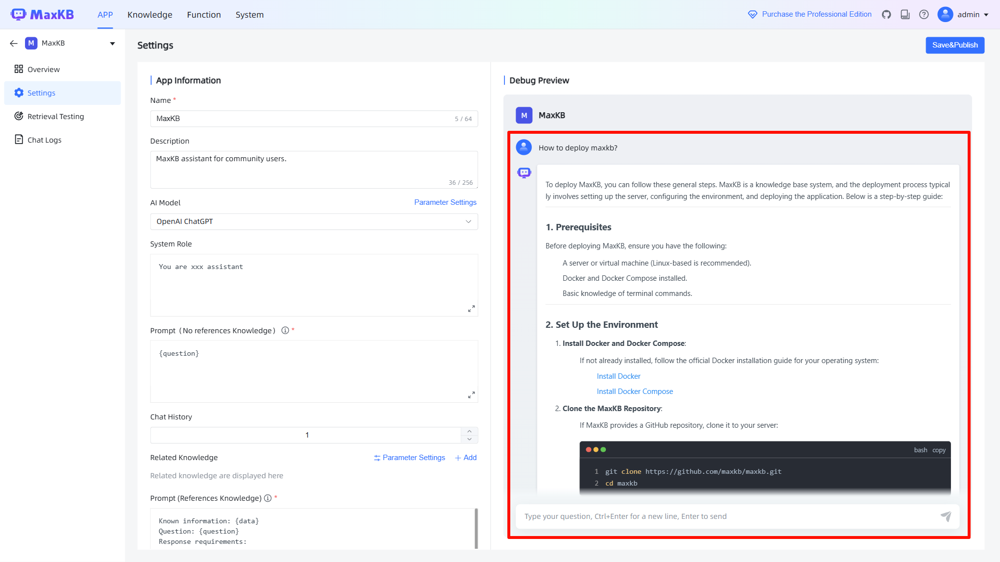
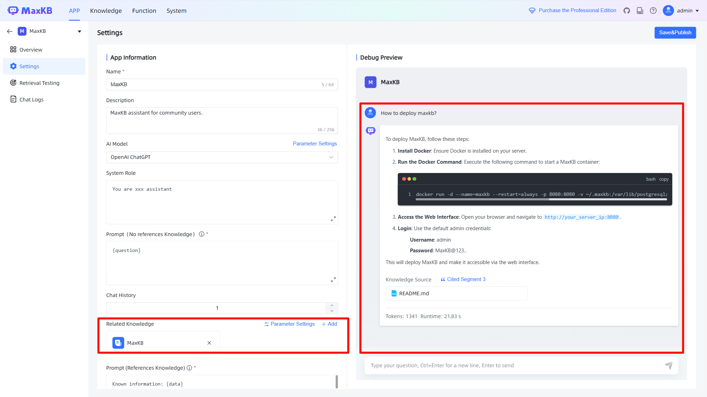
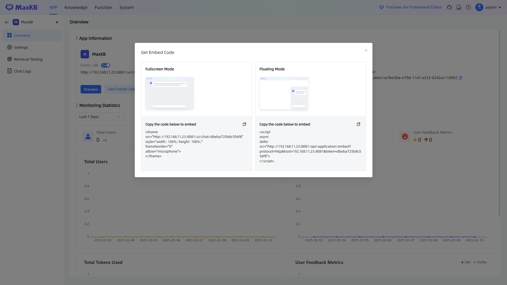

---
hide:
  - navigation
---

# Quick Start

## Installing MaxKB

!!! info "Prerequisites"
    Before installing MaxKB, make sure your machine meets the following minimum system requirements:

    - CPU >= 4 Cores
    - RAM >= 8 GiB
    - Disk Space >= 100 GiB

    And ensure Docker is installed ([install Docker](https://docs.docker.com/get-started/get-docker/)).

Execute the script below to start a MaxKB container using Docker:

```bash
docker run -d --name=maxkb --restart=always -p 8080:8080 -v ~/.maxkb:/var/lib/postgresql/data -v ~/.python-packages:/opt/maxkb/app/sandbox/python-packages 1panel/maxkb
```

Access MaxKB web interface at `http://your_server_ip:8080` with default admin credentials:

- username: admin
- password: MaxKB@123..


{: .browser-mockup }

Change the default password after logging in.

## Main Steps to Use MaxKB

The MaxKB operation process can be broadly categorized into four stages:

1. Adding models.
2. Creating knowledge bases.
3. Creating applications.
4. Publishing applications.

!!! info "Note"
    You can use custom functions for advanced orchestration applications, including data processing, logical judgment, information extraction, and more, providing enhanced capabilities and flexibility.

Now, let's swiftly build and release a smart Q&A app. We'll use ChatGPT from OpenAI and a general knowledge base as an example.

## Adding a Model

To add an AI model, navigate to the models management page by clicking `System`-`Models`-`Add Model`.

Select your model provider, we'll add an OpenAI gpt-4 LLM model here.


{: .browser-mockup }

## Creating a Knowledge Base

To add a knowledge base, click `Knowledge`-`Creating Knowledge`.


{: .browser-mockup }

### Uploading Documents

We use the MaxKB project's [README](https://github.com/1Panel-dev/MaxKB/blob/main/README.md) as an example document for uploading to the knowledge base.


{: .browser-mockup }

MaxKB will automatically segment uploaded documents.

## Creating an Application

To add an application, click `APP`-`Creating APP`.


{: .browser-mockup }

In this guide, we will create a `SIMPLE` type of application.

### AI Model Integration

To enable chat functionality with the application, you need to select an AI model that is integrated with the application.


{: .browser-mockup }

### Debugging the Application

We can now debug the application on the right side of the page.

Before linking to our own knowledge base, when asking about `How to deploy maxkb?`, the application's response is entirely based on the LLM's output, which does not align with our project's actual situation.


{: .browser-mockup }

After adding the knowledge base created in the previous steps to the application configuration on the left side, ask the same question again.


{: .browser-mockup }

It can be seen that the current response is in line with the actual situation.

## Publishing the Application

Once the application debugging is complete and most of the responses meet expectations, you can embed the current application into your website using the embed code.


{: .browser-mockup }
