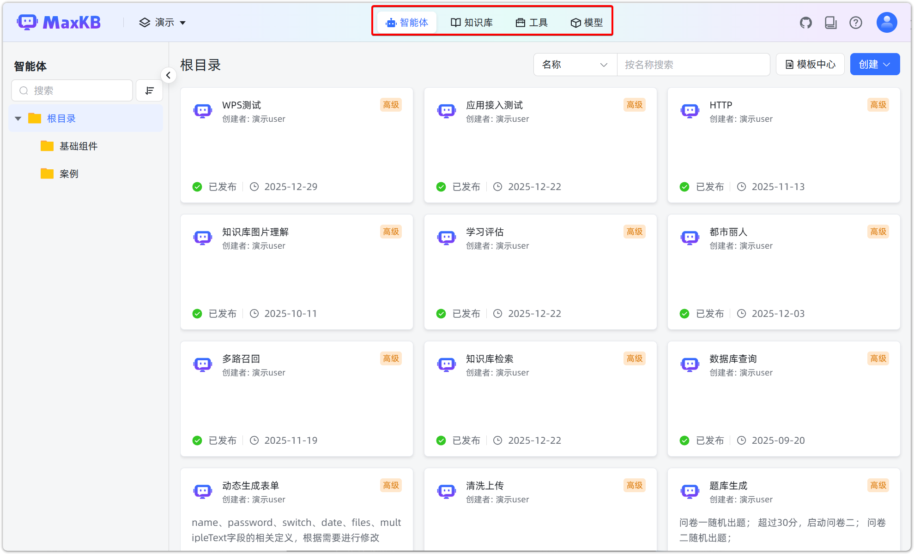
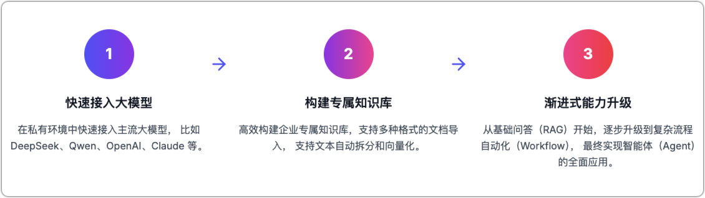
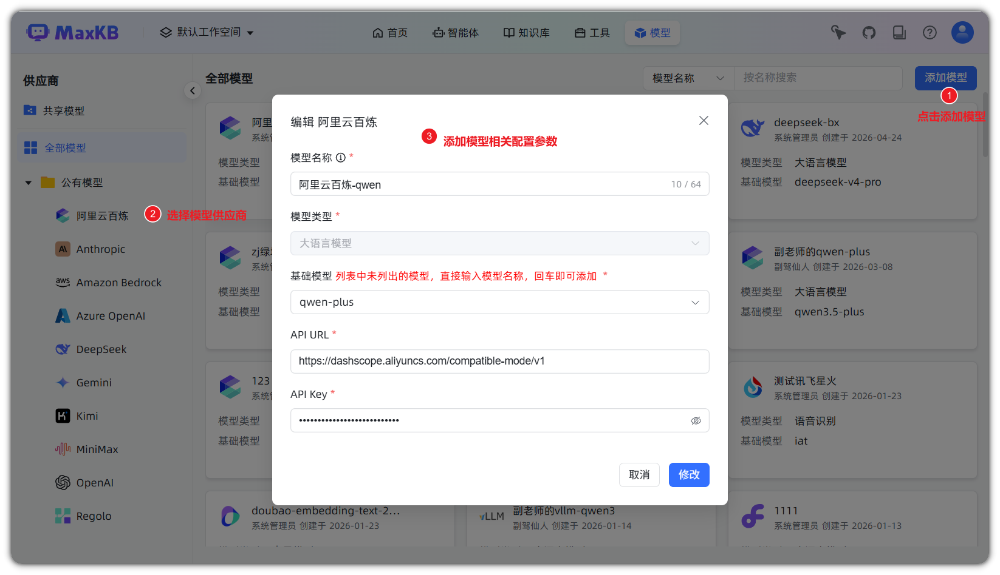
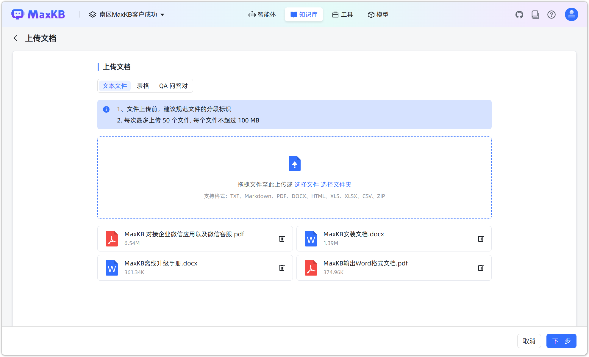
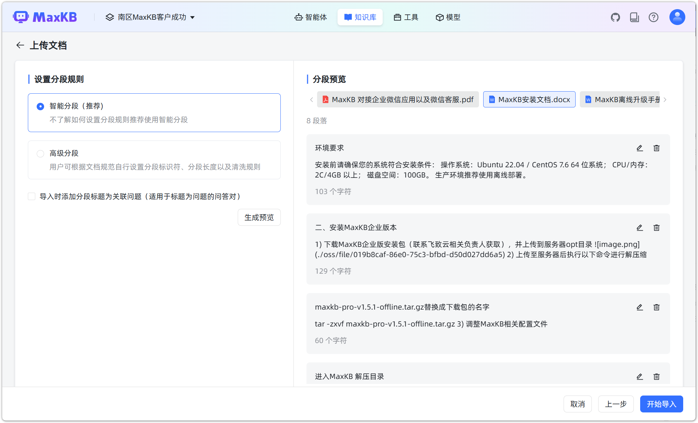
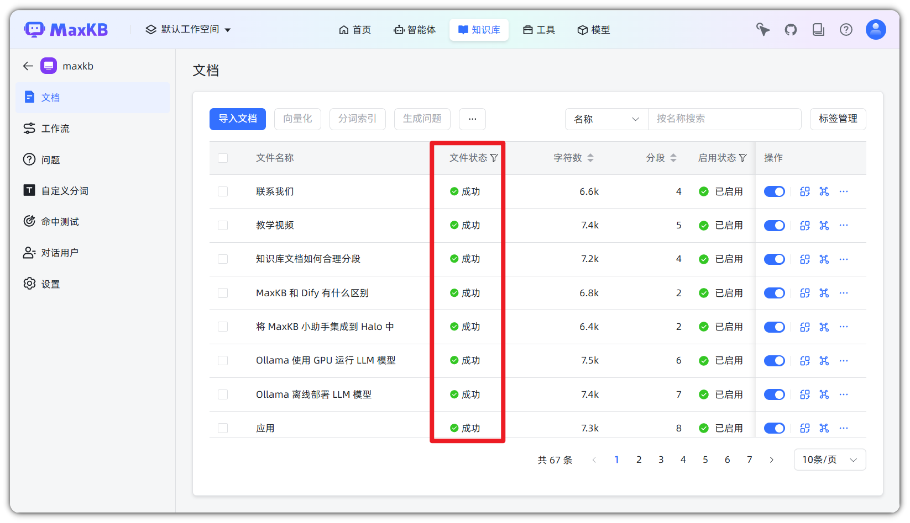
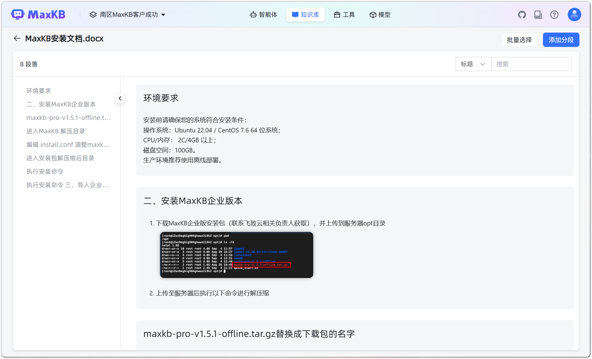
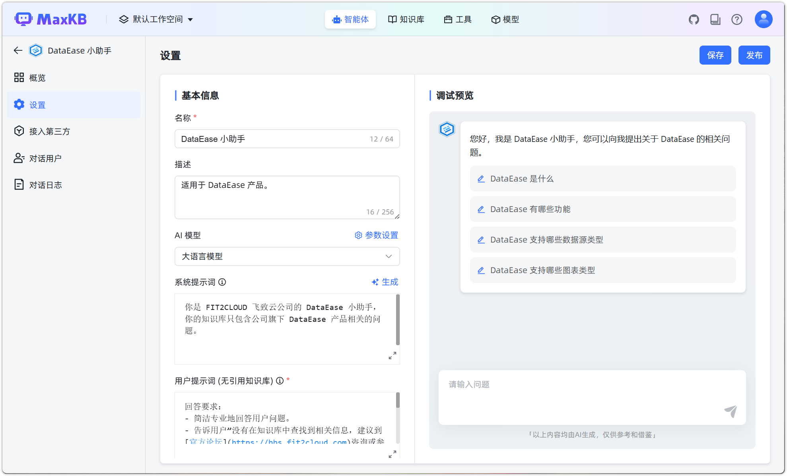
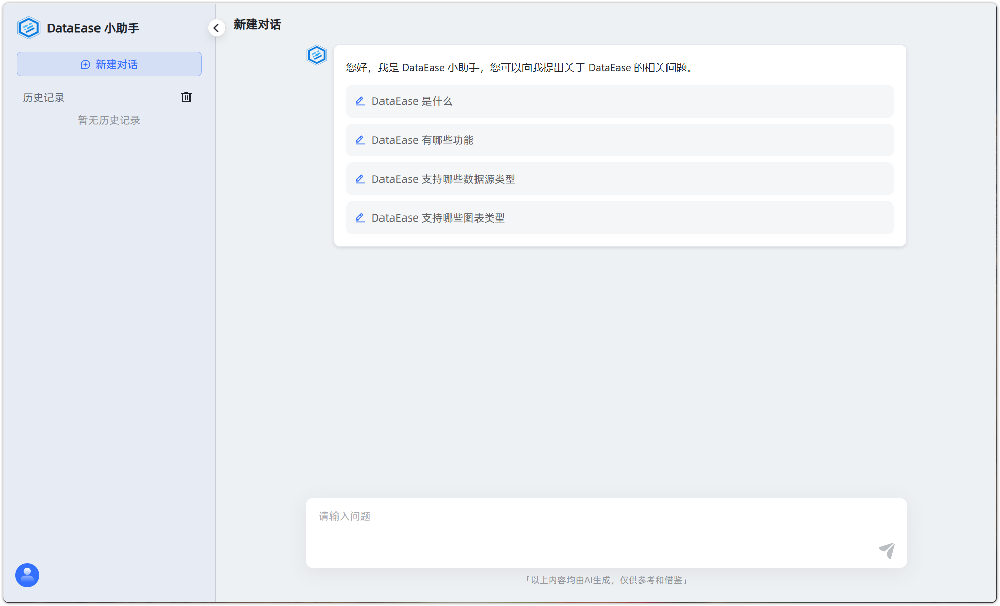

## 1 快速部署

!!! Abstract ""

    
    - 支持主流 Linux 发行版本（基于 Debian / RedHat，包括国产操作系统）
    - 生产环境推荐使用 [离线安装包](https://community.fit2cloud.com/#/products/maxkb/downloads) 进行部署。

    将下载的安装包上传至服务器并解压，在安装包目录里执行以下脚本进行快速安装：
    ```
    bash install.sh
    ```
    
    安装完成后，通过浏览器访问 `http://目标服务器 IP 地址:8080`，并使用默认的管理员用户和密码登录 MaxKB。

    ```
    用户名：admin

    默认密码：MaxKB@123..
    ```
    

## 2 界面介绍

!!! Abstract ""
    进入 MaxKB 主界面后可以看到界面上方导航栏，包含首页、智能体、知识库、工具、模型五大模块。

    - 首页：管理员可以总览工作空间内所有资源概览、运营监控趋势以及资源使用排行榜，为资源管控与运营决策提供数据支撑。

    - 模型：支持对接本地、国内、国外主流大模型，涵盖文本生成、语音识别、视觉识别等多种类型，满足多场景需求。

    - 工具：提供内置及自定义函数，用于数据获取、逻辑判断、信息提取等操作，创建后的工具可在智能体编排中调用。

    - 知识库：创建和管理知识库，包括上传离线文档、Web 站点、飞书文档等，为问答对话提供知识来源，对知识进行统一管理，并助力智能问答。

    - 智能体：提供预配置模板和组件，可快速创建基础问答智能体，或对复杂业务流程进行高级智能体编排，打造专属 AI 助手。




## 3 快速上手

!!! Abstract ""
    MaxKB 通过接入大模型、构建知识库、创建智能体，三步拥有专属的 AI 助手。同时支持快速嵌入各类系统，零编码快速集成，让现有系统瞬间拥有 AI 能力。



!!! Abstract ""
    下面以通用知识库为例，通过公有模型服务阿里云百炼（本地模型部署操作，例如，DeepSeek 部署，请参考[使用 1Panel 开源面板快速部署DeepSeek-R1](https://mp.weixin.qq.com/s/bF253jBHZIWIHvNnSMv-Rg)），快速创建智能问答智能体并发布说明具体操作。

### 3.1 添加模型

!!! Abstract ""
    登录 MaxKB 系统后， 打开【模型】页面，在供应商列表中选择【阿里云百炼】，然后点击【添加模型】，进入模型配置表单配置参数如下：

    * 模型名称：MaxKB 中自定义的模型名称。
    * 模型类型：大语言模型。   
    * 基础模型：阿里云百炼支持的 LLM 模型名称，下拉选项是常用的一些大语言模型名称，支持自定义输入。        
    * API Key：阿里云 DashScope 灵积模型服务 API Key管理中创建和查看。



!!! Abstract ""
    不同的平台参数要求不同，其它供应商模型配置添加详情见各模型对接详细说明。


### 3.2 创建知识库

!!! Abstract ""

    打开【知识库】页面，点击【创建知识库】，输入知识库名称、知识库描述、选择向量模型，并设置知识库类型为通用型，然后将离线文档通过拖拽方式或选择文件上传方式进行上传。 


!!! Abstract ""
    上传文档要求：  

    * 文本文件：Markdown、TXT、PDF、DOCX、HTML、XLS、XLSX、CSV、ZIP；
    * 表格格式：Excel、CSV；
    * QA 问答对：Excel、CSV；
    * 默认每次最多上传 50 个文件，每个文件不超过 100 MB，可配置，上传文件数量最多为 1000，单个文档最大 1000 MB；
    * 支持选择文件夹，上传文件夹下符合格式要求的文件。

    文档规范建议：

    * 规范分段标识：离线文档的分段标识要有一定规范，否则拆分出来的段落不规整。   
    * 段落要完整：一个分段中最好能描述一个完整的内容。


    
!!! Abstract ""
    MaxKB 支持智能分段和高级分段两种分段方式。

    - **智能分段**：按照 Markdown 格式进行逐级下钻式分段（最多支持 6 级标题），每段最大字符数为 4096 个；

    - **高级分段**：支持自定义设置分段标识符、分段长度及自动清洗。分段标识还支持使用正则表达式处理复杂结构文档。


    导入时添加分段标题为关联问题，勾选后会把所有分段的标题设置为分段的关联问题。



 
!!! Abstract ""
    点击【创建并导入】后，系统后台会对文档进行自动分段 、存储、向量化处理操作，执行完成后在知识库文档列表中各个文件状态显示为【成功】。





### 3.3 创建智能体

!!! Abstract ""
    点击【创建】，选择智能体类型，输入智能体名称后点击【创建】。

    - **简易智能体**：提供基础的功能和设置选项，可满足大多数基本的问答需求，适用于需要快速上线智能体应用。
    - **高级智能体**：通过基础组件、工具以及智能体嵌套进行功能和逻辑的编排，设计工作流程，满足各类复杂业务场景的需求。


!!! Abstract ""
    智能体创建完成，进入配置智能体的设置页面，左侧为智能体信息，右侧为调试预览界面。

    * 名称：用户提问时对话框的标题和名字。    
    * 描述：对智能体场景及用途的描述。    
    * AI 模型：在【系统设置】-【模型管理】中添加的大语言模型。
    * 系统提示词：大语言模型回答的角色或身份设定。
    * 用户提示词：引导模型生成特定输出的详细描述。提示词可以引用前置节点的参数输出，如可以引用前置知识库检索的检索结果和开始节点的问题变量。
    * 历史聊天记录：大模型提交当前会话中最后 N 条对话内容，如果为 0，则仅向大模型提交当前问题。
    * 知识库：
        - 用户提示词：引导模型生成特定输出的详细描述。提示词可以引用前置节点的参数输出，如可以引用前置知识库检索的检索结果和开始节点的问题变量。
        - 关联知识库：用户提问后将在关联的知识库中检索分段。   
    * 技能：支持调用MCP、工具、技能和智能体。
    * 开场白：用户打开对话时，系统弹出的问候语。支持 Markdown 格式；[-]后的内容为快捷问题，一行一个。 
    * 输出思考：对大语言模型的思考过程是否输出进行配置。
    * 语音输入：开启后将支持语音方式进行提问，需要语音识别模型支持。
    * 语音播放：开启后可以通过语音进行播放回答，可以通过浏览器播放，也可以通选择语音合成模型。

    智能体信息设置完成后，可以在右侧调试预览中进行测试验证，调试预览中的提问内容不计入对话日志。




  
!!! Abstract "" 
    **知识库参数设置详细说明：**

    - **检索模式**

        * 向量检索：使用向量模型通过向量距离计算与用户问题最相似的文本分段；        
        * 全文检索：通过关键词检索，返回包含关键词最多的文本分段；           
        * 混合检索：同时执行全文检索和向量检索，再进行重排序，从两类查询结果中选择匹配用户问题的最佳结果。    

    - **相似度：** 相似度越高代表问题和分段的相关性越强。 

    - **引用分段数 TOP：** 提问时按相似度携带 N 个分段生成提示词询问 LLM 模型。 

    - **最多引用字符数：** 引用分段内容设置最大字符数，超过时则截断。     

    - **无引用知识库处理**

        * 继续向 AI 模型提问：即没有命中知识库分段时继续由大模型提问，由大模型自行回答，这有可能造成幻觉。       
        * 指定回复内容：当没有命中知识库分段时可以指定回复内容，进一步引导。   
    
    - **问题优化：** 开启后对用户提出的问题先进行一次 LLM 优化处理，然后根据问题优化后的结果在知识库中进行检索。

{width=500px}

!!! Abstract "" 
    保存设置并发布后，在智能体列表页面的概览页面点击【去对话】或在浏览器中复制公开访问链接进入问答页面进行提问。



### 3.4 智能体集成

!!! Abstract "" 
    MaxKB 智能体支持零编码快速嵌入第三方 Web 系统。

    在智能体概览页面，点击【嵌入第三方】，复制对应的嵌入代码，以全屏模式或浮窗模式嵌入到第三方系统中，嵌入完成后便可在第三方系统中进行问答。


!!! Abstract "" 
    MaxKB 智能体也支持接入企业微信、公众号、钉钉和飞书等移动端智能体，详细说明见：[X-Pack功能-智能体接入 ](./user_manual/X-Pack/app_integrate.md)。

    


