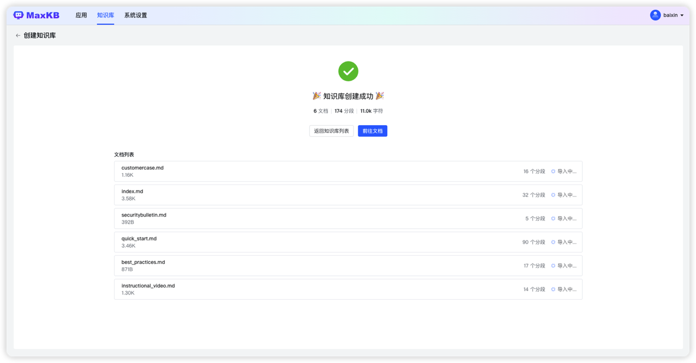
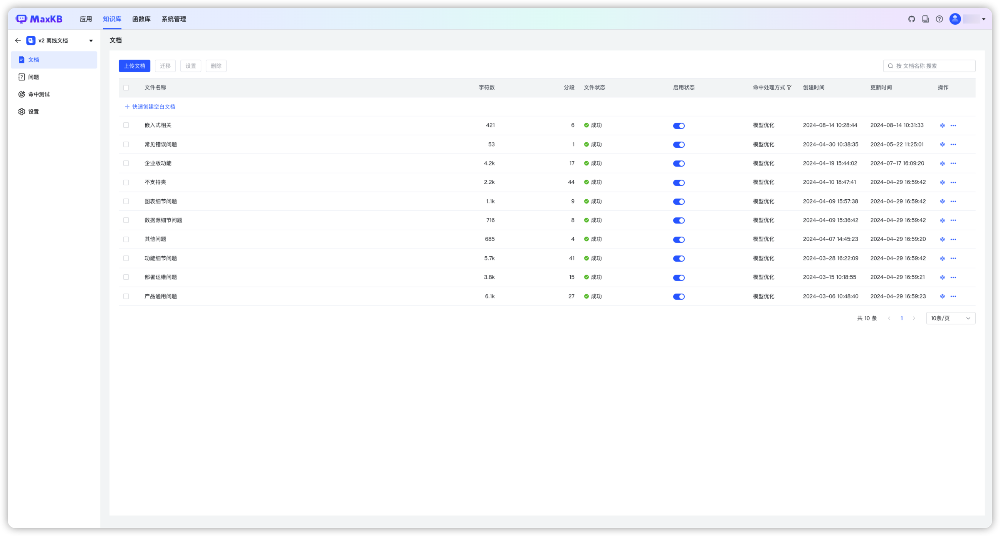

## 1 登录 MaxKB 系统

!!! Abstract ""
    使用浏览器打开服务地址：http://目标服务器IP地址:目标端口。   
    默认的登录信息：  
    用户名：admin    
    默认密码：MaxKB@123.. 

## 2 添加模型

!!! Abstract ""
    登录 MaxKB 系统后，可以先对接一下模型，也可以在创建应用时添加模型。

### 2.1 添加千帆大模型

!!! Abstract ""
    点击【添加模型】，选择供应商【千帆大模型】，直接进入下一步填写千帆大模型表单。
    或者左侧供应商先选择【千帆大模型】，然后点击【添加模型】，则直接进入千帆大模型表单。


!!! Abstract ""
    模型名称： MaxKB 中自定义的模型名称。   
    模型类型： 大语言模型。    
    基础模型： 为供应商的 LLM 模型，支持自定义输入官方模型，选项中列了的一些常用的大语言模型。
            注意自定义基础模型名称需保证与供应商平台的模型名称一致才能校验通过。    
    API Key 和 Secret Key：千帆大模型中应用的API Key 和 Secret Key（需要先创建应用）   


### 2.2 添加 Ollama 模型

!!! Abstract ""
    点击【添加模型】，选择供应商【 Ollama 】，直接进入下一步填写 Ollama 供应商的大模型表单。
    或者左侧供应商先选择【 Ollama 】，然后点击【添加模型】，则直接进入 Ollama 表单。    
    模型名称： MaxKB 中自定义的模型名称。   
    模型类型： 大语言模型。    
    基础模型： 为供应商的 LLM 模型，支持自定义输入，但需要与供应商的模型名称保持一致，系统会自动下载部署模型。   
    API 域名和 API Key: 为供应商的连接信息（Ollama 服务地址， 如：http://42.92.198.53:11434 ）。若没有 API Key 可以输入任意字符。     
    点击【添加】后 校验通过则添加成功，便可以在应用的 AI 模型列表选择该模型。
    


### 2.3 添加 Azure OpenAI 模型

!!! Abstract ""
    在模型管理中，点击供应商【 Azure OpenAI 】，直接进入下一步填写Azure OpenAI 的模型表单。    
    或者左侧供应商先选择【 Azure OpenAI 】，然后点击【添加模型】，则直接进入 Azure OpenAI 的模型表单。    
    模型名称： MaxKB 中自定义的模型名称。   
    模型类型： 大语言模型。   
    基础模型： 为供应商的 LLM 模型，支持自定义输入和下拉选项，当前可下拉选择的大语言模型如：gpt-3.5-turbo-0613、gpt-3.5-turbo-0301、gpt-3.5-turbo-16k-0613 等。    


!!! Abstract ""
    API 域名、API Key、部署名称: 是Azure OpenAI 的模型部署中提供的，需要填写一致，参考下图：


### 2.4 添加 OpenAI 大模型

!!! Abstract ""
    在模型管理中，点击供应商【 OpenAI 】，直接进入下一步填写 OpenAI 的模型表单。    
    或者左侧供应商先选择【 OpenAI 】，然后点击【添加模型】，则直接进入 OpenAI 的模型表单。    
    模型名称： MaxKB 中自定义的模型名称。   
    模型类型： 大语言模型。   
    基础模型： 为供应商的 LLM 模型，支持自定义输入，下拉选项是 OpenAI 常用的一些大语言模型如：gpt-3.5-turbo-0613、gpt-3.5-turbo、gpt-4 等。    
    API 域名（国外）：https://api.openai.com/v1 。
    API 域名：国内服务器反向代理地址/v1。
    API Key：访问 OpenAI 的 Key。


### 2.5 添加讯飞星火大模型

!!! Abstract ""
    在模型管理中，点击供应商【讯飞星火】，直接进入下一步填写讯飞星火的模型表单。    
    或者左侧供应商先选择【讯飞星火】，然后点击【添加模型】，则直接进入讯飞星火的模型表单。    
    模型名称： MaxKB 中自定义的模型名称。   
    模型类型： 大语言模型。   
    基础模型： 支持自定义输入，对应接口文档中domain，下拉选项是讯飞星火常用的一些大语言模型。    
    API 域名：每个基础模型对应的API域名不同，请根据所选基础模型输入对应的API域名，参考[讯飞星火官方文档](https://www.xfyun.cn/doc/spark/Web.html#_1-%E6%8E%A5%E5%8F%A3%E8%AF%B4%E6%98%8E)。

{width="800px"}
!!! Abstract ""
    APP ID、API Key、Secret Key 需要现在讯飞星火开放平台创建应用，并该应该的剩余tokens>0，才能添加成功。


### 2.6 添加智谱AI大模型

!!! Abstract ""
    在模型管理中，点击供应商【智谱AI】，直接进入下一步填写智谱AI的模型表单。    
    或者左侧供应商先选择【智谱AI】，然后点击【添加模型】，则直接进入智谱AI的模型表单。    
    模型名称： MaxKB 中自定义的模型名称。   
    模型类型： 大语言模型。   
    基础模型： 为供应商的 LLM 模型，支持自定义输入，下拉选项是常用的一些大语言模型。    
    API Key： 需要现在智谱 AI 开放平台创建。


### 2.7 添加通义千问大模型

!!! Abstract ""
    在模型管理中，点击供应商【通义千问】，直接进入下一步填写通义千问的模型表单。    
    或者左侧供应商先选择【通义千问】，然后点击【添加模型】，则直接进入通义千问的模型表单。    
    模型名称： MaxKB 中自定义的模型名称。   
    模型类型： 大语言模型。   
    基础模型： 为供应商的 LLM 模型，支持自定义输入，下拉选项是常用的一些大语言模型。    
    API Key： 需要在阿里云->DashScope灵积模型服务->API Key管理中获取。


### 2.8 添加 Kimi 大模型

!!! Abstract ""
    在模型管理中，点击供应商【Kimi】，直接进入下一步填写Kimi的模型表单。    
    或者左侧供应商先选择【Kimi】，然后点击【添加模型】，则直接进入Kimi的模型表单。    
    模型名称： MaxKB 中自定义的模型名称。   
    模型类型： 大语言模型。   
    基础模型： 为供应商的 LLM 模型，支持自定义输入，下拉选项是常用的一些大语言模型。  
    API 域名： https://api.moonshot.cn/v1  
    API Key： 在Kimi 账户中心的 API Key 管理中获取 key。


### 2.9 添加 DeepSeek 大模型

!!! Abstract ""
    在模型管理中，点击供应商【DeepSeek】，直接进入下一步填写 DeepSeek 的模型表单。    
    或者左侧供应商先选择【DeepSeek】，然后点击【添加模型】，则直接进入 DeepSeek 的模型表单。    
    模型名称： MaxKB 中自定义的模型名称。   
    模型类型： 大语言模型。   
    基础模型： 为供应商的 LLM 模型，支持自定义输入，下拉选项是常用的一些大语言模型。  
    API Key： 在 [DeepSeek官方](https://www.deepseek.com) 获取 API Key。


###  2.10 添加 Gemini 大模型

!!! Abstract ""
    在模型管理中，点击供应商【Gemini】，直接进入下一步填写 Gemini 的模型表单。    
    或者左侧供应商先选择【Gemini】，然后点击【添加模型】，则直接进入 Gemini 的模型表单。    
    模型名称： MaxKB 中自定义的模型名称。   
    模型类型： 大语言模型。   
    基础模型： 为供应商的 LLM 模型，支持自定义输入，下拉选项是常用的一些大语言模型。  
    API Key： 获取 API Key。

    注意：使用 Gemini API 需要确保程序所在服务器位于 [Gemini API所支持的地区](https://ai.google.dev/gemini-api/docs/available-regions?hl=zh-cn) ，否则无法调用API，并且无法进入Google AI Studio。


## 3 创建通用型知识库

!!! Abstract ""
    打开【知识库】页面，点击【创建知识库】，进入创建知识库页面。 输入知识库名称、知识库描述、选择通用型知识库类型。
    然后将离线文档通过拖拽方式或选择文件上传方式进行上传。 


- **上传文档** 

!!! Abstract ""
    上传文档要求：  
    支持文本文件格式为：Markdown、TXT、PDF、DOCX、HTML； 
    支持 QA 问答对格式为：Excel、CSV；  
    每次最多上传 50 个文件；   
    每个文件不超过 100 MB；
    支持选择文件夹，上传文件夹下符合要求的文件。
        
    文档规范建议：    
    1、规范分段标识：离线文档的分段标识要有一定规范，否则拆分出来的段落会不规整。   
    2、段落要完整：一个分段中最好能描述一个完整的功能点或问题。   
    ```


- **设置分段规则**  
!!! Abstract ""
    **智能分段** 
    
    ``` 
    MarkDown 类型的文件分段规则为：根据标题逐级下钻式分段（最多支持 6 级标题），每段的字符数最大为 4096 个字符；   
                            当最后一级的文本段落字符数超过设置的分段长度时，会查找分段长度以内的回车进行截取。     
    HTML、DOCX 类型的分段规则为：识别标题格式转换成 markdown 的标题样式，逐级下钻进行分段（最多支持 6 级标题）每段的字符数最大为 4096 个字符；
    TXT和 PDF 类型的文件分段规则为：按照标题# 进行分段，若没有#标题的则按照字符数4096个字符进行分段，会查找分段长度以内的回车进行截取。  
    ```   


!!! Abstract ""
    **高级分段** 
    ```    
    用户可以根据文档规范自定义设置分段标识符、分段长度及自动清洗。   
    分段标识支持：#、##、###、####、#####、######、-、空行、回车、空格、分号、逗号、句号，若可选项没有还可以自定义输入分段标识符。   
    分段长度：支持最小 50个字符，最大 4096 个字符。   
    自动清洗：开启后系统会自动去掉重复多余的符号如空格、空行、制表符等。     
    ```

!!! Abstract ""
    **导入时添加分段标题为关联问题**         
    勾选后会把所有分段的标题设置为分段的关联问题。


!!! Abstract ""
    **预览** 
    ```  
    分段规则设置完成后，需要点击【生成预览】查看最新规则的分段效果。
    ```


!!! Abstract ""
    用户可在分段预览中对不合理的分段进行编辑和删除。


- **创建完成** 
!!! Abstract ""
    点击【创建并导入】后，系统会对文档进行自动分段 -> 存储 -> 向量化处理操作。    
    在创建完成页面可以看到导入的文档数量、分段数量和字符数。  


!!! Abstract ""
    点击【返回知识库列表】回到知识库列表页面。   
    点击【前往文档】进入该知识库的【文档】列表页面。  


## 4 创建应用  
!!! Abstract ""
    点击【创建应用】，输入应用名称，选择【简易配置应用】，点击【创建】


!!! Abstract ""
    应用创建完成，进入简易配置应用的设置页面，左侧为应用信息，右侧为调试预览界面。      
    应用名称：用户提问时对话框的标题和名字。    
    应用描述：对应用场景及用途的描述。    
    AI模型： 在【系统设置】-【模型管理】中添加的大语言模型。    
    提示词：系统默认有智能知识库的提示词，用户可以自定义通过调整提示词内容，可以引导大模型聊天方向.
    多轮对话： 开启时当用户提问携带用户在当前会话中最后3个问题；不开启则仅向大模型提交当前问题题。           
    关联知识库：用户提问后会在关联的知识库中检索分段。   
    开场白：用户打开对话时，系统弹出的问候语。支持 Markdown 格式；[-]后的内容为快捷问题，一行一个。       
    问题优化：对用户提出的问题先进行一次 LLM 优化处理，将优化后的问题在知识库中进行向量化检索；    
            开启后能提高检索知识库的准确度，但由于多一次询问大模型会增加回答问题的时长。   
    
    应用信息设置完成后，可以在右侧调试预览中进行提问预览，调试预览中提问内容不计入对话日志。


- **参数设置详细说明**
  
!!! Abstract "" 
    **1、检索模式：**  
    向量检索：使用向量模型通过向量距离计算与用户问题最相似的文本分段；        
    全文检索：通过关键词检索，返回包含关键词最多的文本分段；           
    混合检索：同时执行全文检索和向量检索，再进行重排序，从两类查询结果中选择匹配用户问题的最佳结果。    

    **2、相似度：**       
    相似度越高代表问题和分段的相关性越强。 

    **3、引用分段数：**    
    提问时按相似度携带N个分段生成提示词询问 LLM 模型。 

    **4、引用最大字符数：**      
    引用分段内容设置最大字符数，超过时则截断。     

    **5、无引用知识库时，有 2 种处理方式可设置：**        
    继续提问：可以自定义设置提示词，需要有{question}用户问题的占位符，才会把用户问题发送给模型。       
    指定回复内容：当没有命中知识库分段时可以指定回复内容。           


!!! Abstract ""
    以上 4 步完成后，便可进行问答对话了。

## 5 演示预览
!!! Abstract "" 
    在应用列表页面，点击【演示】或者点击应用面板，在概览页面点击演示或复制公开访问链接至浏览器进入问答页面进行提问。


## 6 对话日志

!!! Abstract "" 
    在对话日志钟记录了所有用户会话中的问答详情，包括用户对AI 回答的反馈信息。  
    维护人员可以通过查看对话日志和用户反馈来修正答案。


