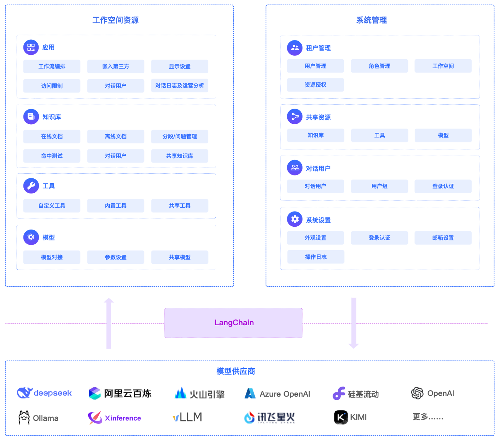

# 系统架构

## 1 整体架构

## 2 技术栈

!!! Abstract "" 
    - 前端：[Vue.js](https://cn.vuejs.org/)、[LogicFlow](https://github.com/didi/LogicFlow)
    - 后端：[Python / Django](https://www.djangoproject.com/)、[langchain](https://www.langchain.com/)  
    - 向量数据库：[PostgreSQL / pgvector](https://www.postgresql.org/)、Redis
    - 大模型：DeepSeek、通义千问、Kimi、百度千帆、讯飞星火、智谱AI、OpenAI、Azure OpenAI、Anthropic、Gemini、Ollama等。
