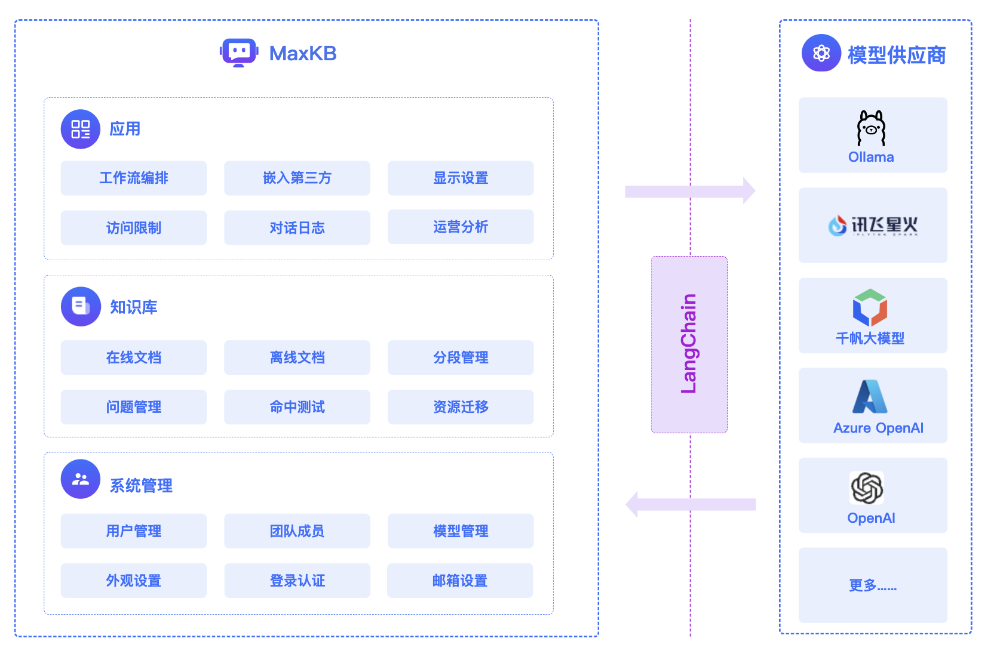

# 系统架构

## 1 整体架构

{width="950px"}

## 2 实现原理

## 3 技术栈

!!! Abstract "" 
    - 前端：[vue.js](https://cn.vuejs.org/)、[LogicFlow](https://github.com/didi/LogicFlow)
    - 后端：[Python / Django](https://www.djangoproject.com/)、[langchain](https://www.langchain.com/)  
    - 向量数据库：[PostgreSQL / pgvector](https://www.postgresql.org/)
    - 大模型：[Ollama](https://github.com/ollama/ollama)、Azure OpenAI、OpenAI、Anthropic、Gemini、DeepSeek、通义千问、Kimi、百度千帆、讯飞星火等。
