# 应用

## 1 应用接入

!!! Abstract "" 
    MaxKB X-Pack 支持与企业微信应用、公众号（服务号和订阅号）、钉钉应用、飞书应用接入，实现企业内部、外部公众进行对话。
    
### 1.1 企业微信应用接入

!!! Abstract ""
    （1）在应用接入中点击【企业微信应用】的【配置】按钮，配置信息中会自动生成回调 URL,并需要复制到企业微信应用的 API 接收设置中，除此之外的其它信息，将在企业微信管理后台中生成并获取。 

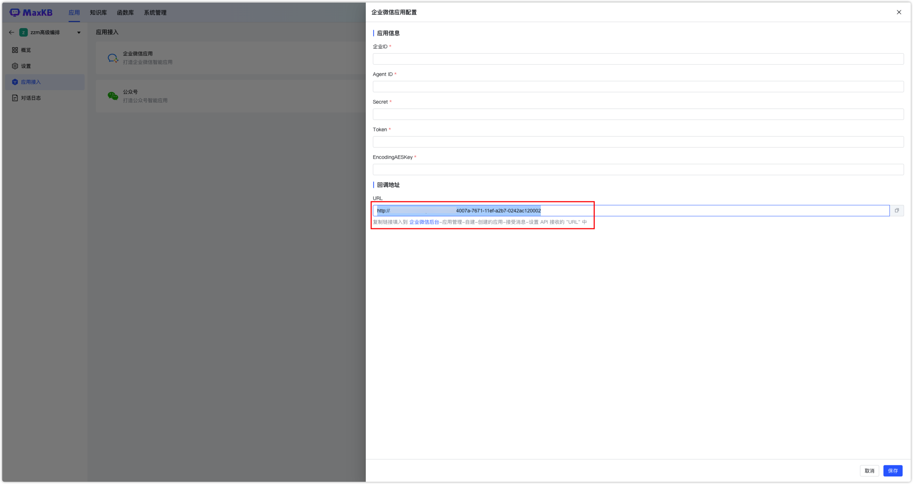

!!! Abstract ""
    （2）获取企业ID: 在企业微信管理后台，点击 【我的企业】菜单，在最下方可以看到企业ID 信息。


!!! Abstract "" 
    （3）创建企业微信应用：在【应用管理】中点击【创建应用】，选择应用logo，设置应用名称和应用介绍以及可见范围。


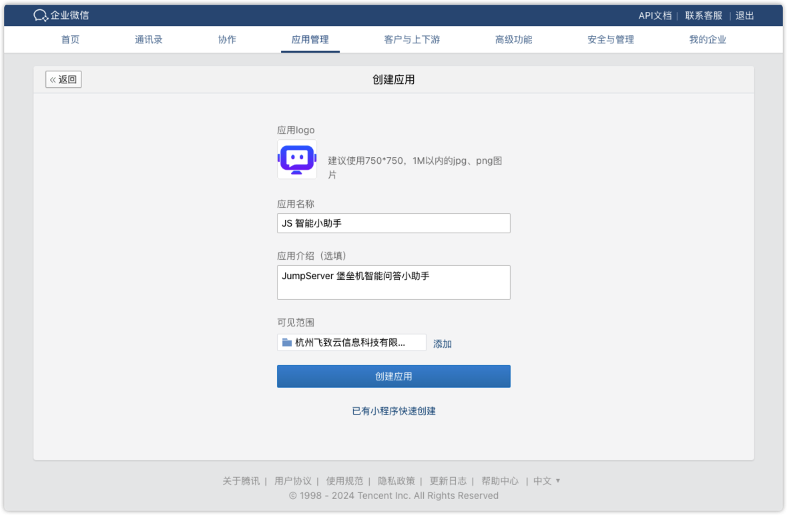

!!! Abstract ""
    （4）获取 Agentid 和 Secret:进入创建的应用，获取 AgentId 和 Secret。点击【查看】Secret 将通过企业微信进行查看。 

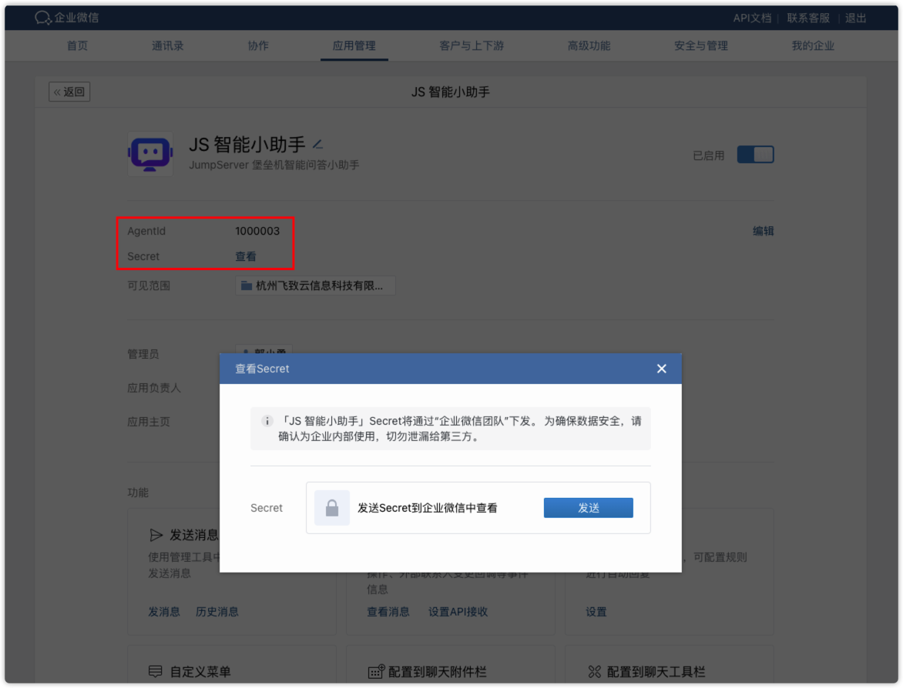

!!! Abstract ""
    （5）获取 Token 和 EncodingAESKey：进入企业微信应用设置的【接收消息】-【设置API接收】，输入企业微信应用接入配置中自动生成的回调 URL，并随机获取 Token 和EncodingAESKey。


!!! Abstract ""
    （6）配置企业可信IP：进入企业微信应用设置的【企业可信IP】中，把 MaxKB 服务的IP地址设置为可信IP。

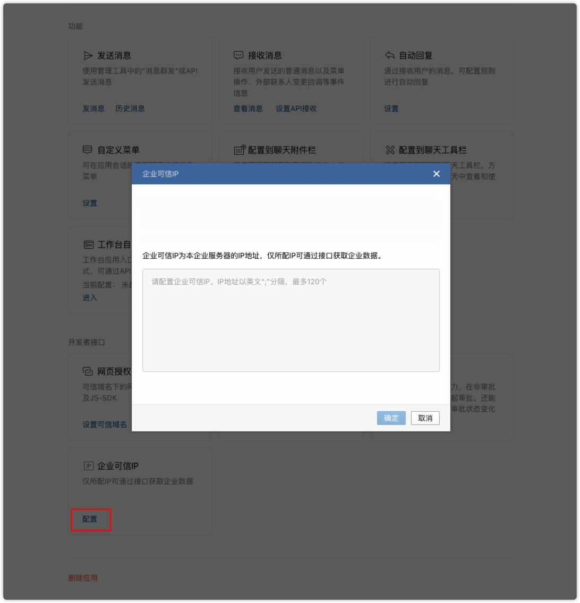  

!!! Abstract "" 

    以上步骤配置完成后，并在企业微信应用接入配置中输入企业微信应用信息后保存，便可在企业微信应用中找到机器人进行对话了。

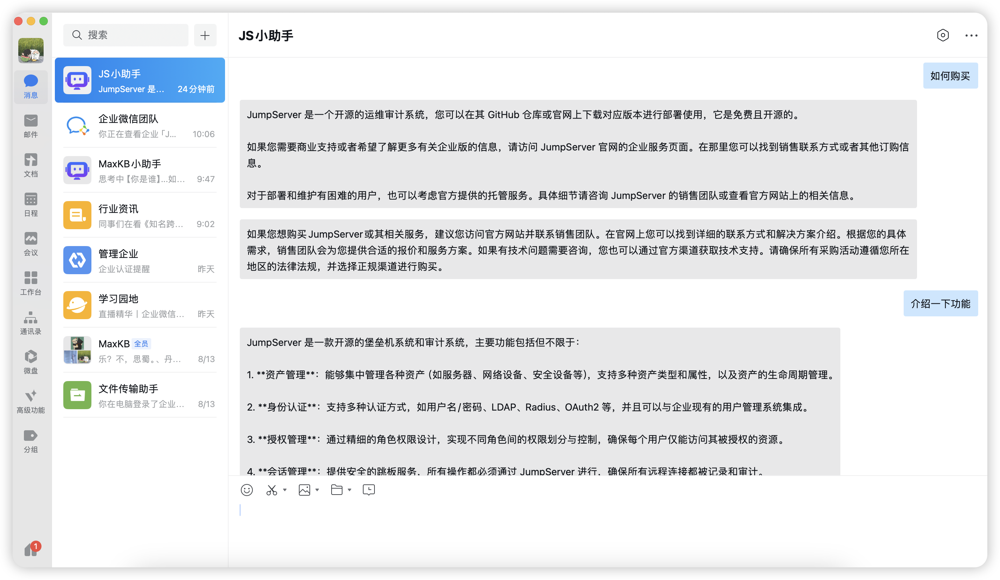


### 1.2 公众号接入

!!! Abstract "" 
    （1）在应用接入中点击【公众号】的【配置】按钮，配置信息中会自动生成回调 URL,并需要复制到【微信公众平台-设置与开发-基本配置-服务器配置】服务器地址URL 中，除此之外的其它信息，将在微信公众平台中生成并获取。


!!! Abstract "" 
    （2） 获取APP ID、APP Secret、Token和消息加解密密钥：在微信公众平台-设置与开发-基本配置中获取APP ID、APP Secret、Token和消息加解密密钥。


!!! Abstract "" 
    （3） 开启客服接口权限。


!!! Abstract "" 
    （4） 配置服务器地址：打开微信公众平台-基本配置-服务器配置的 "服务器地址URL" 中，输入 MaxKB 公众号接入自动生成的回调地址URL。</br>
    注意：</br>
    1. 回调URL仅支持 80 或 443 端口，其它端口会失败。</br>
    2. 服务器配置确认为【已启用】状态。


!!! Abstract "" 
    （5） 设置IP白名单：进入公众号基本配置的【IP白名单】中，添加 MaxKB 服务器的 IP 地址。


!!! Abstract "" 
    根据以上步骤完成配置后，并在公众号接入配置中输入公众号信息后保存，即可在公众号中发送消息进行对话了。

{width="500px"}


### 1.3 钉钉应用接入

!!! Abstract ""
    （1）在应用接入中点击【钉钉应用】的【配置】按钮，配置信息中会自动生成回调 URL,并需要复制到【微信公众平台-设置与开发-基本配置-服务器配置】服务器地址URL 中，除此之外的其它信息，将在钉钉开放平台中生成并获取。
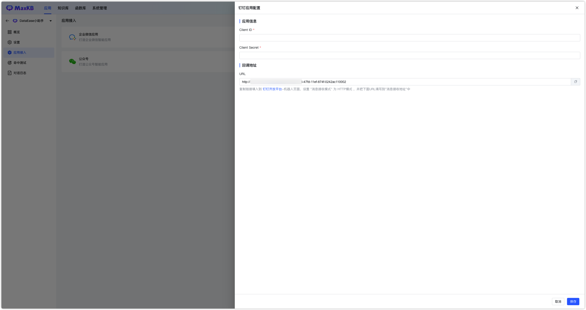

!!! Abstract ""
    （2）创建机器人：在钉钉开放平台的【应用开发】-【钉钉应用】中，点击【创建应用】，填写应用信息。

!!! Abstract ""
    点击【添加应用能力】，选择 【机器人】能力，点击 【添加】
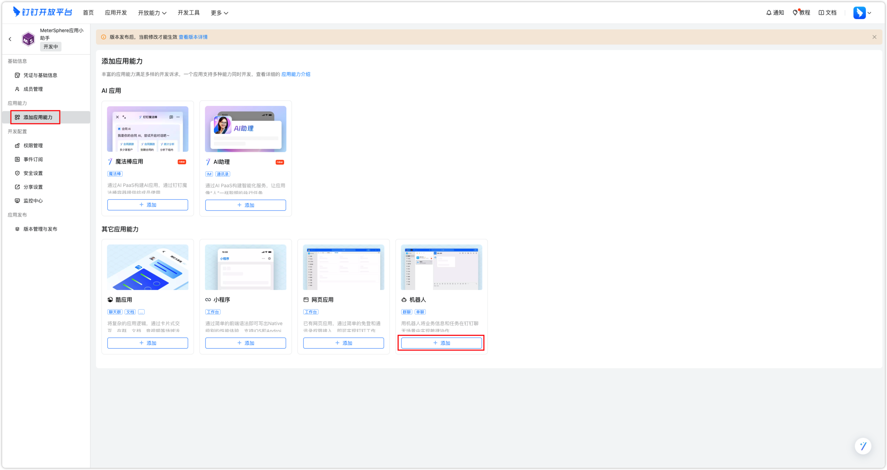

!!! Abstract ""
    （3）获取Client ID和Client Secret： 进入创建好的钉钉应用，打开【凭证与基础信息】页面，获取Client ID和Client Secret。
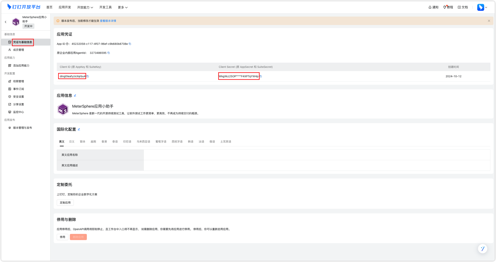

!!! Abstract ""
    （4）进入创建好的钉钉应用，打开【机器人】页面，打开机器人设置，【消息接收模式】设置为HTTP模式，将MaxKB中回调地址的URL填写到消息接收地址中。


!!! Abstract ""
    根据以上步骤完成配置后，并在钉钉应用接入配置中输入钉钉应用信息后保存，就可以群里@机器人中进行对话，或与机器人应用一对一对话。
{width="500px"}

### 1.4 飞书应用接入

!!! Abstract ""
    （1）在应用接入中点击【飞书应用】的【配置】按钮，配置信息中会自动生成回调 URL,并需要复制到【飞书开放平台-事件与回调-事件配置-配置订阅方式]的[请求地址]中，除此之外的其它信息，将在飞书开放平台中生成并获取。

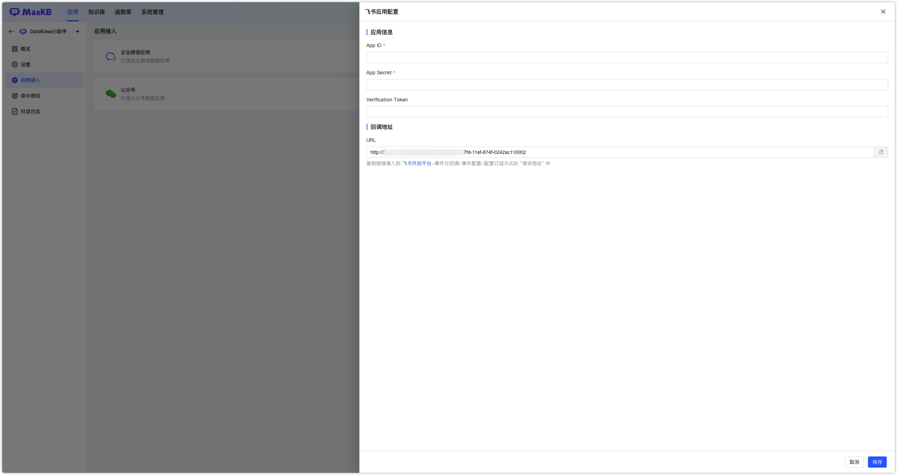

!!! Abstract ""
    （2）创建飞书机器人：首先在飞书开发平台的【企业自建应用】中，点击【创建企业自建应用】，填写应用信息。


!!! Abstract ""
    点击【添加应用能力】，选择 【机器人】 能力，点击 【添加】


!!! Abstract ""
    （3）添加权限：打开【权限管理】，复制下面的权限配置，然后粘贴到【权限配置】下方的输入框内，全选筛选出来的权限，点击【批量开通】，最后点击【确认】。


    ```
     m:message,im:message.group_at_msg:readonly,im:message.p2p_msg:readonly,im:message:send_as_bot,im:resource, contact:contact.base:readonly，contact:user.base:readonly
    ```


!!! Abstract ""
    （4）获取APP ID、APP Secret和Verification Token：进入创建好的飞书应用，打开【凭证与基础信息】页面，获取APP ID和APP Secret。
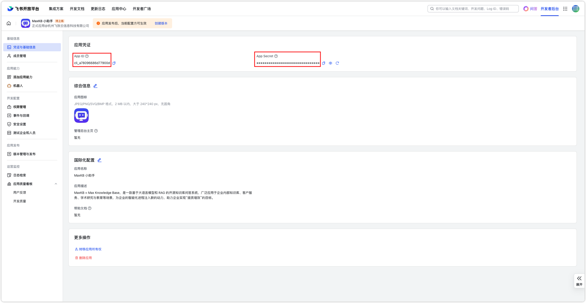


!!! Abstract ""
    打开【事件与回调】-【加密策略】，获取 Verification Token。


!!! Abstract ""
    （5）配置回调URL：打开【事件与回调】-【回调配置】的订阅方式中，将MaxKB中飞书应用的回调地址的URL填写到【请求地址】中。


!!! Abstract ""
    （6）发布应用：点击【创建版本】，填写版本信息后，点击【保存】发布。

!!! Abstract ""
    确认应用状态为：已启用


!!! Abstract ""
    根据以上步骤完成配置后，即可打开飞书客户端找到机器人应用一对一对话。
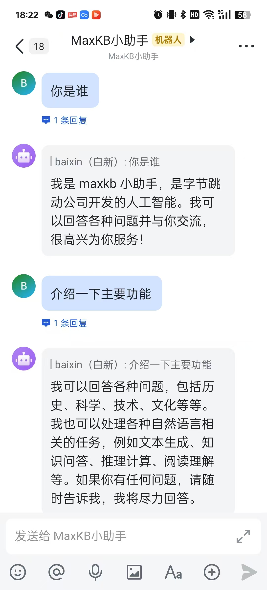{width="500px"}

## 2 显示设置

!!! Abstract "" 
    在【应用】的【显示设置】中，支持设置浮窗模式的对话框入口图标、AI回复的头像和拖拽位置，且支持设置是否显示历史记录。

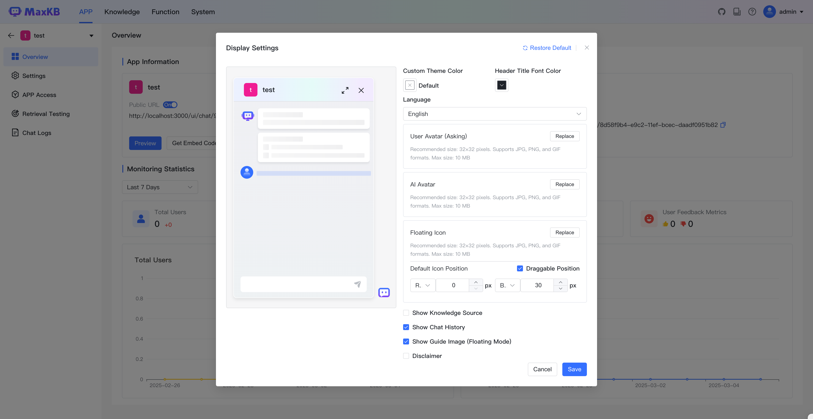

!!! Abstract "" 
    应用显示配置效果示例图：
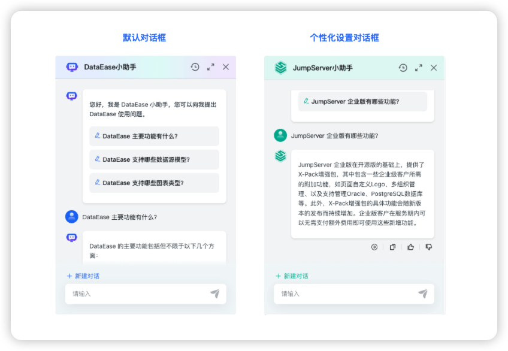