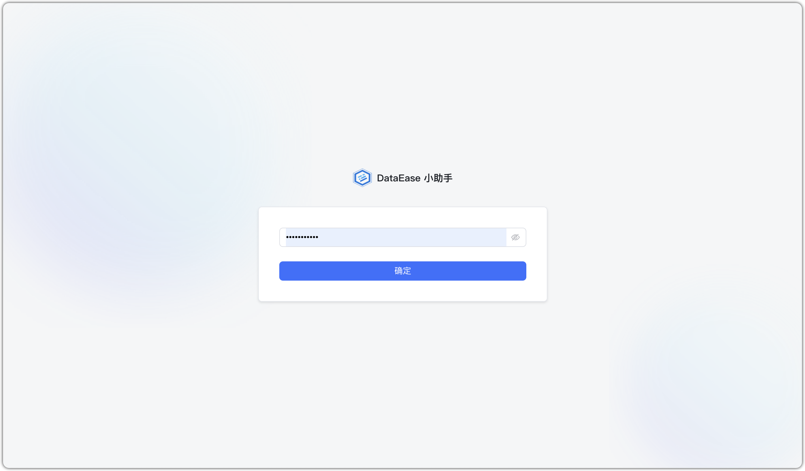
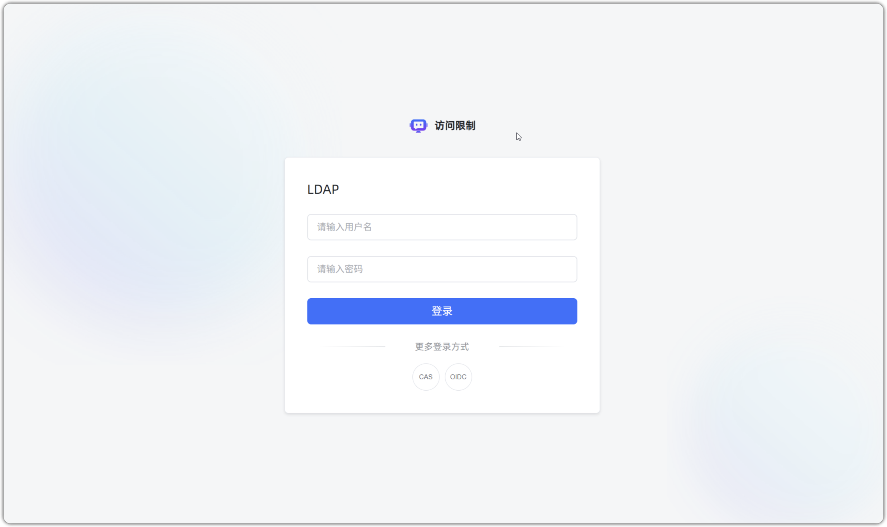

# 访问限制

!!! Abstract "" 
    支持通过身份验证的方式对应用进行访问限制，进一步保障信息安全 可设置【密码验证】或【登录认证】。

    选择【登录认证】后，需至少启用一种登录方式。

    - 【对话用户】需管理员在【系统管理 】中对【对话用户】以及【用户组】里增删改用户组及用户。
    - 【登录方式】需管理员在【系统管理】中配置 【登录认证】，以及在【对话用户】中开启单点登录和扫码登录后才会显示。

!!! Abstract "" 
    应用身份验证开启后，通过公开访问链接时(包括浮窗框)需要输入验证密码才可以进入问答页面。    
    **说明：** 身份验证开启后，通过公开访问链接访问应用时都需要输入验证密码，包括演示以及全屏/浮窗模式嵌入，而应用接入到企业微信、公众号、钉钉、飞书则不受影响。

    

!!! Abstract ""
    如选择扫码登录方式（如钉钉、飞书或企业微信），当用户访问小助手进行对话时，系统将自动弹出所选平台的扫码界面。用户完成扫码后即可快速登录并开始对话

