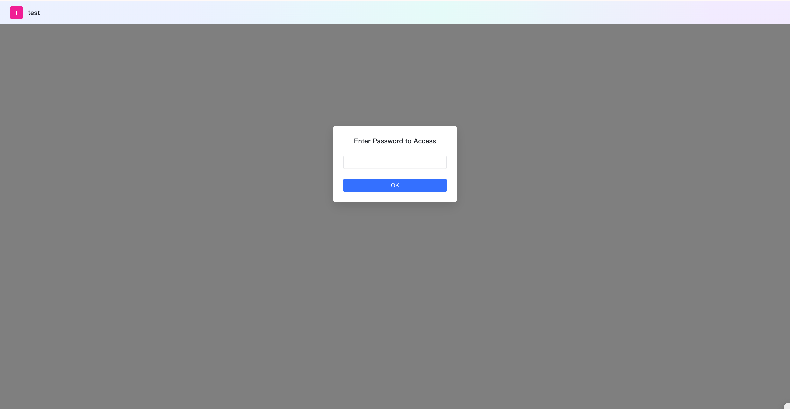

# Access Control

!!! Abstract "" 
    MaxKB X-Pack supports restricting application access through authentication methods to further ensure information security.

!!! Abstract "" 
    After application authentication is enabled, users need to enter a verification password to access the Q&A page when using public access links (including floating windows).    
    **Note:** When authentication is enabled, verification passwords are required when accessing applications through public links, including demo and fullscreen/floating window embedding. However, applications integrated with WeChat Work, WeChat Official Accounts, DingTalk, and Lark are not affected.

{width="500px"}
