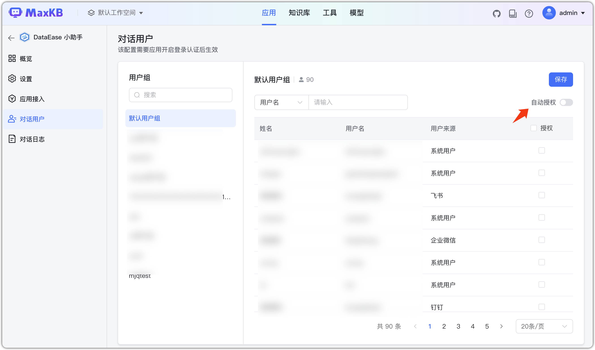

# 对话用户

!!! Abstract "" 
    支持设置允许进入当前应用问答页面进行提问的用户组及用户。

!!! Abstract ""
    若对话用户属于多个用户组，任一用户组被授权即可进入应用提问。 用户被移出用户组后，对应授权将被取消。  
    自动授权规则：

    - 开启：当前用户组及后续新增成员自动授权，可进入应用提问。
    - 关闭：需手动为用户组成员授权，新增成员默认未授权。

    **注意**：

    - 在应用中仅支持查看和授权用户组，用户组和成员管理需要空间管理员或系统管理员在【系统管理】中进行。
    - 未在【身份验证】中启用登录认证，应用关联的全部知识库可被任意用户检索。

