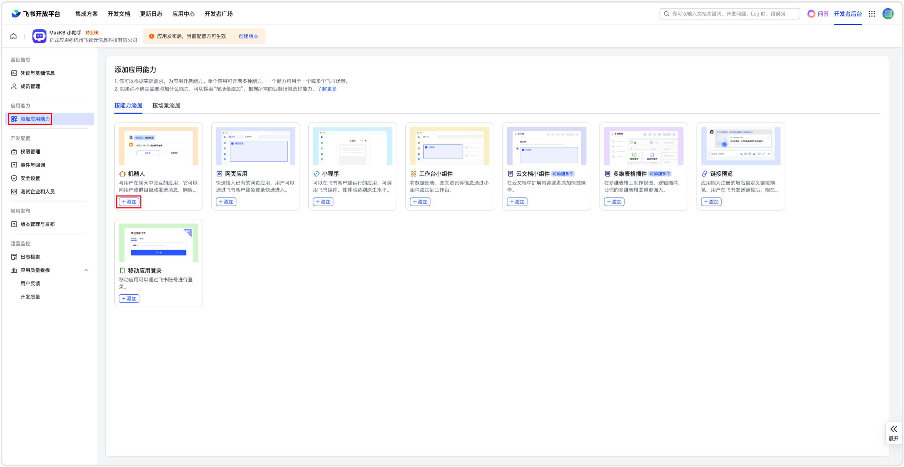
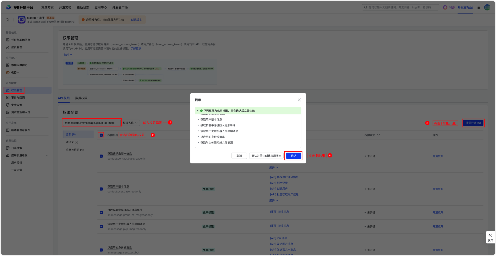

# 应用接入


!!! Abstract "" 
    MaxKB X-Pack 支持创建的应用的与企业微信应用、企业微信客服、公众号（服务号和订阅号）、钉钉应用、飞书应用接入，实现企业内部员工、外部公众进行对话。
    
### 1 企业微信应用接入

!!! Abstract ""
    （1）在应用接入中点击【企业微信应用】的【配置】按钮，配置信息中会自动生成回调 URL,并需要复制到企业微信应用的 API 接收设置中，除此之外的其它信息，将在企业微信管理后台中生成并获取。 


!!! Abstract ""
    （2）获取企业ID: 在[企业微信管理后台](https://work.weixin.qq.com/wework_admin/frame#apps)，点击 【我的企业】菜单，在最下方可以看到企业ID 信息。


!!! Abstract "" 
    （3）创建企业微信应用：在【应用管理】中点击【创建应用】，选择应用logo，设置应用名称和应用介绍以及可见范围。


!!! Abstract ""
    （4）获取 Agentid 和 Secret:进入创建的应用，获取 AgentId 和 Secret。点击【查看】Secret 将通过企业微信进行查看。 


!!! Abstract ""
    （5）获取 Token 和 EncodingAESKey：进入企业微信应用设置的【接收消息】-【设置API接收】，随机获取 Token 和EncodingAESKey。然后在 MaxKB 企业微信应用配置输入对应的参数并保存，然后再回到企业微信应用设置【接收消息】-【设置API接收】企业微信应用接入配置中自动生成的回调 URL，然后再点击【保存】。

    **注意：** 在企业微信应用API接收消息配置保存之前，一定要在 MaxKB 中完成企业微信应用配置并保存，不然保存时将报错`openapi回调地址请求不通过`。


!!! Abstract ""
    **注意：** 在企业微信应用API接收消息配置保存之前，一定要在 MaxKB 中完成企业微信应用配置并保存，不然保存时将报错`openapi回调地址请求不通过`。


!!! Abstract ""
    （6）配置企业可信IP：进入企业微信应用设置的【企业可信IP】中，把 MaxKB 服务的IP地址设置为可信IP。

  

!!! Abstract "" 

    以上步骤配置完成后，并在企业微信应用接入配置中输入企业微信应用信息后保存，便可在企业微信应用中找到机器人进行对话了。


### 2 企业微信客服对接
    
!!! Abstract ""
    MaxKB 应用接入企业微信应用后，在此基础上，还可以将此应用接入到微信客服，对外部用户提供服务。   
    （1）创建客服账号：在企业微信管理后台的【应用管理】中，点击【微信客服】，并创建账号,客服账号的接待方式选择：机器人+人工接待

{width="800px"}

{width="800px"}

!!! Abstract ""
    （2）客服账号与应用关联：在微信客服中配置【可调用接口的应用】，并配置客服账号。

{width="800px"}

{width="800px"}

!!! Abstract ""
    （3）开启客服助理：在企业的外部群设置中开启【客服助理】，微信客服便会加入群中，群里的任何用户仅需要@客服助理，即可发起咨询，并微信客服进行一对一的对话。

{width="500px"}

{width="500px"}

### 3 公众号接入

!!! Abstract "" 
    （1）在应用接入中点击【公众号】的【配置】按钮，配置信息中会自动生成回调 URL,并需要复制到【微信公众平台-设置与开发-基本配置-服务器配置】服务器地址URL 中，除此之外的其它信息，将在微信公众平台中生成并获取。


!!! Abstract "" 
    （2）获取APP ID、APP Secret、Token和消息加解密密钥：在微信公众平台-设置与开发-基本配置中获取APP ID、APP Secret信息，并启动服务器配置，生成 Token 和消息加解密密钥。


!!! Abstract "" 
    （3）将生成的APP ID、APP Secret、Token 和消息加解密密钥信息输入到MaxKB 公众号配置窗口中，并保存。


!!! Abstract "" 
    （4）回到第（2）步，将【公众号-基本配置-服务器配置】中的 URL 设置为 MaxKB 公众号配置窗口中的回调地址 URL，然后提交，并启用服务器配置。


!!! Abstract "" 
    （5）开启客服接口权限。


!!! Abstract "" 
    （6）设置IP白名单：进入公众号基本配置的【IP白名单】中，添加 MaxKB 服务器的 IP 地址。


!!! Abstract "" 
    根据以上步骤完成配置后，即可在公众号中发送消息进行对话了。

{width="500px"}


### 4 钉钉应用接入

!!! Abstract ""
    （1）在应用接入中点击【钉钉应用】的【配置】按钮，配置信息中会自动生成回调 URL,并需要复制到钉钉-机器人设置-消息接收地址中，其它信息，将在钉钉开放平台中生成并获取。


!!! Abstract ""
    （2）创建机器人：在 [钉钉开放平台](https://open-dev.dingtalk.com/)的【应用开发】-【钉钉应用】中，点击【创建应用】，填写应用信息后，点击【保存】。


!!! Abstract ""
    （3）获取Client ID和Client Secret： 进入创建好的钉钉应用，打开【凭证与基础信息】页面，获取Client ID和Client Secret。


!!! Abstract ""
    （4）在MaxKB 钉钉应用配置窗口中输入步骤获取的Client ID和Client Secret 应用凭证，并保存。


!!! Abstract ""
    （5）点击【添加应用能力】，选择 【机器人】能力，点击 【添加】，输入机器人基本配置信息后，将【消息接收模式】设置为HTTP模式，并将 MaxKB 钉钉应用配置中的回调地址的URL填写到消息接收地址中，然后点击【发布】。


!!! Abstract ""
    根据以上步骤完成配置后，就可以群里@机器人中进行对话，或与机器人应用一对一对话。
{width="500px"}

### 5 飞书应用接入

!!! Abstract ""
    （1）在应用接入中点击【飞书应用】的【配置】按钮，配置信息中会自动生成回调 URL，并需要复制到【飞书开放平台-事件与回调-事件配置-配置订阅方式】的请求地址中，除此之外的其它信息，将在飞书开放平台中生成并获取。


!!! Abstract ""
    （2）创建飞书机器人：首先在 [飞书开发平台](https://open.feishu.cn/app/)的【企业自建应用】中，点击【创建企业自建应用】，填写应用信息。


!!! Abstract ""
    点击【添加应用能力】，选择 【按能力添加-机器人】，点击【添加】


!!! Abstract ""
    （3）添加权限：打开【权限管理】，复制下面的权限配置并粘贴到【API权限-权限配置】输入框，全选筛选出来的权限项，点击【批量开通】，最后点击【确认】。

    ```
     m:message,im:message.group_at_msg:readonly,im:message.p2p_msg:readonly,im:message:send_as_bot,im:resource, contact:contact.base:readonly，contact:user.base:readonly
    ```



!!! Abstract ""
    （4）获取APP ID、APP Secret和Verification Token：进入创建好的飞书应用，打开【凭证与基础信息】页面，获取APP ID和APP Secret。


!!! Abstract ""
    打开【事件与回调-加密策略】，获取 Verification Token。


!!! Abstract ""
    （5）在MaxKB 飞书应用配置窗口输入上述信息，并保存。


!!! Abstract ""
    （6）配置回调URL：在飞书开放平台中打开【事件与回调】-【回调配置】的订阅方式中，将MaxKB中飞书应用的回调地址的URL填写到【请求地址】中。


!!! Abstract ""
    （7）发布应用：点击【创建版本】，填写版本信息后，点击【保存】。


!!! Abstract ""
    确认发布后，应用状态将更新为`已启用`。


!!! Abstract ""
    根据以上步骤完成配置后，即可打开飞书客户端搜索`MaxKB小助手`，点击【添加】后进行一对一对话。
{width="500px"}

{width="500px"}
