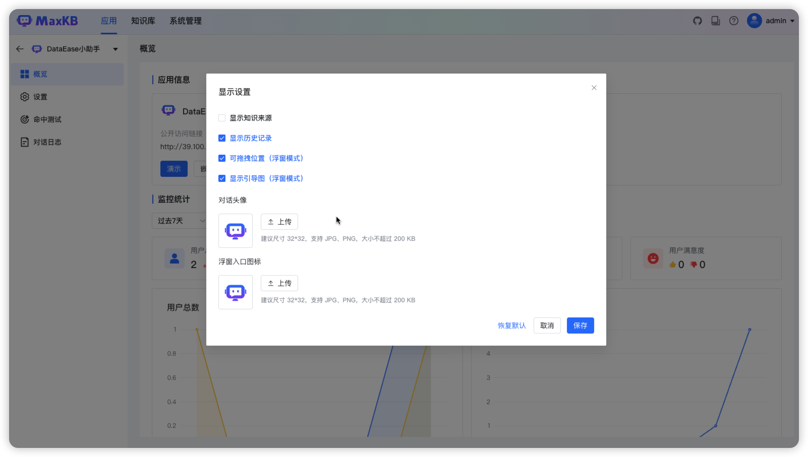
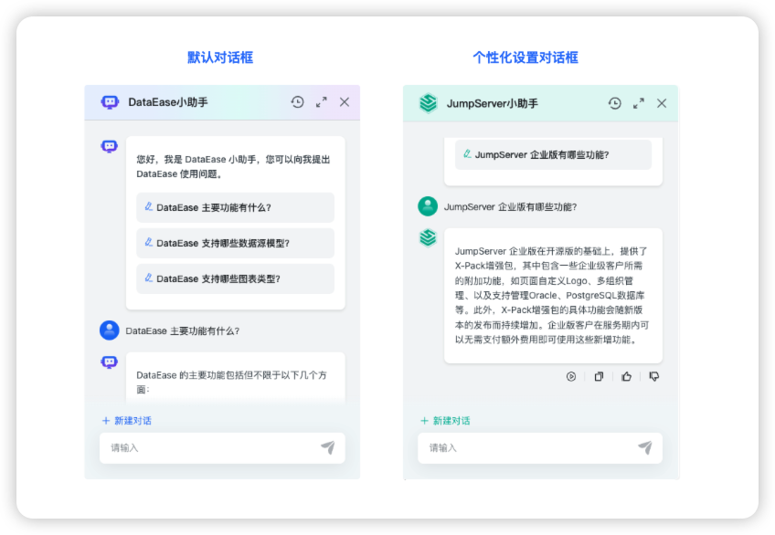

# App Diaplay Settings

!!! Abstract "" 
    In the "Display Settings" of App, in addition to supporting the display of knowledge sources, the Professional Edition supports richer configurations, including application dialog theme color, font color, user avatar for questions, AI reply avatar, floating window entry icon and position, history records, guide images and disclaimers, etc.

!!! Abstract "" 
    Example of application display configuration:
