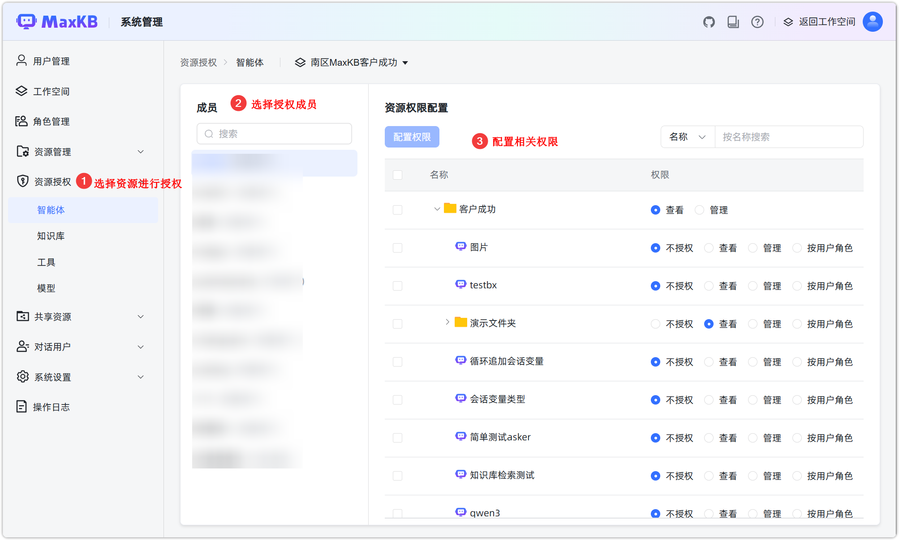
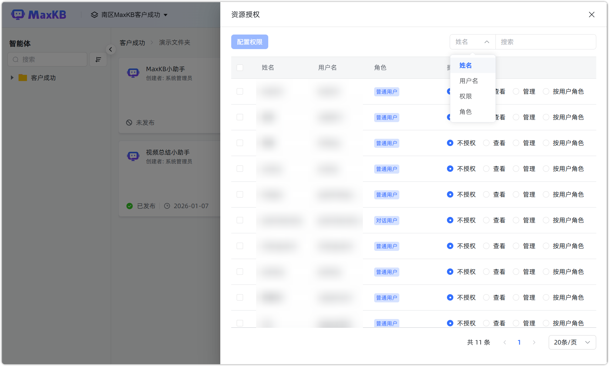

# 资源授权

!!! Abstract ""
    资源授权功能用于管理用户对工作空间内资源的访问权限。
    
    - 系统管理员可以在【系统管理】中对所有资源进行授权；
    - 工作空间管理员可以在工作空间中，对工作空间内的所有资源进行授权；
    - 普通用户可以对自己创建的资源进行授权。

## 1 系统资源授权

!!! Abstract ""
    系统管理员（所有工作空间）和工作空间管理员（仅可以选择作为工作空间管理员角色的工作空间）可进行资源授权操作：

    - 成员：列出所选工作空间下的含有普通用户及继承普通用户角色的成员。
    - 资源：智能体、知识库、工具、模型按工作空间的文件夹管理目录列出所选工作空间下的资源。
    - 操作：
        - 不授权：默认对资源不进行授权。
        - 查看：仅能查看和使用资源，不能对该资源进行增删改操作。
        - 管理：可以对该资源进行所有操作。
        - 按用户角色：对所选的资源，按照角色拥有的权限赋予用户权限。

    **注意**：工作空间及角色管理等为 X-Pack 功能。

## 2 用户资源授权

!!! Abstract ""
    用户可以在智能体、知识库、工具和模型中，将资源授权给指定的用户，授权的用户为当前工作空间下的所有成员。资源授权支持根据姓名、用户名、权限以及角色进行筛选，筛选后可以进行批量配置权限。

    **注意**：用户角色为 X-Pack 功能。
    

## 3 资源授权规则

!!! Abstract ""

    - 默认对系统管理员的授权是按用户角色，修改工作空间管理员和系统管理员不影响二者对资源的角色权限（优先级高）；
    - 当普通用户被授予【管理】权限时，也可对智能体进行资源授权操作，但需遵守角色权限最高规则;
    - 如果成员有多个角色，取所有角色的最大权限（并集）进行授权。