# 对话用户

!!! Abstract ""
    对话用户是经过身份验证后，能够在问答页面进行提问的用户。管理员可以通过用户组管理功能，在【智能体】和【知识库】灵活控制哪些用户可以访问问答页面和使用知识库，并为不同用户组分配不同的权限。   
    权限说明：

    - **系统管理员**：可管理对话用户、用户组、登录认证。
    - **工作空间管理员**：可管理对话用户和用户组。

## 1 用户管理

### 1.1 创建用户
!!! Abstract ""
    管理员可以创建和删除对话用户。用户信息包括：

    - 用户名：4-20个字符，必填且唯一。
    - 姓名：1-20个字符，必填且唯一。
    - 状态：正常/禁用。禁用后，用户无法访问系统的任何功能。
    - 邮箱、手机号：非必填。
    - 密码：必填，规则同系统用户。第三方用户的默认密码为Profile配置中的密码（例如：MaxKB@123）。
    - 用户组：一个用户可以属于多个用户组，也可以不选择任何用户组。
    - 用户来源：本地创建。
    - 创建时间：自动记录用户的创建时间。

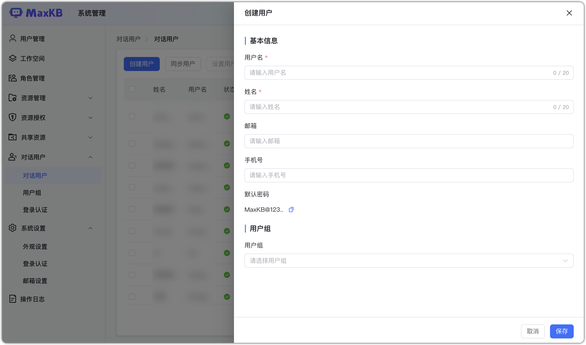

!!! Abstract ""
    除用户名外，其他属性均可编辑修改。

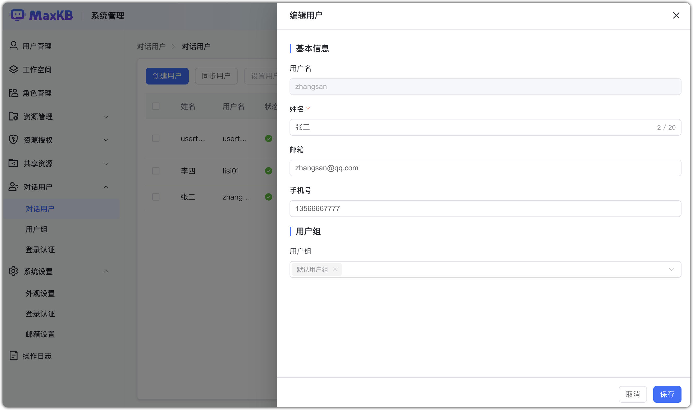

!!! Abstract ""
    管理员可以修改对话用户账号的登录密码，密码规则与系统用户一致。

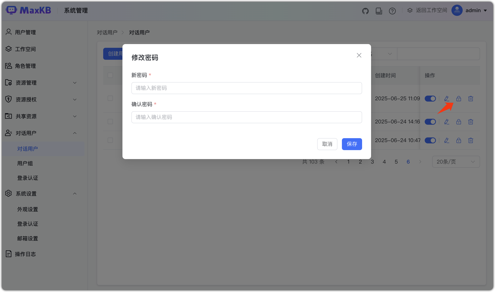

### 1.2 设置用户组
!!! Abstract ""
    设置用户组。支持多个对话用户批量设置用户组。

    - 勾选需要设置的对话用户。
    - 点击【设置用户组】按钮，弹出设置对话框。
    - 选择设置方式：
        - 追加：为所选用户追加新的用户组。
        - 替换：删除所选用户原有的用户组，设置新的用户组。

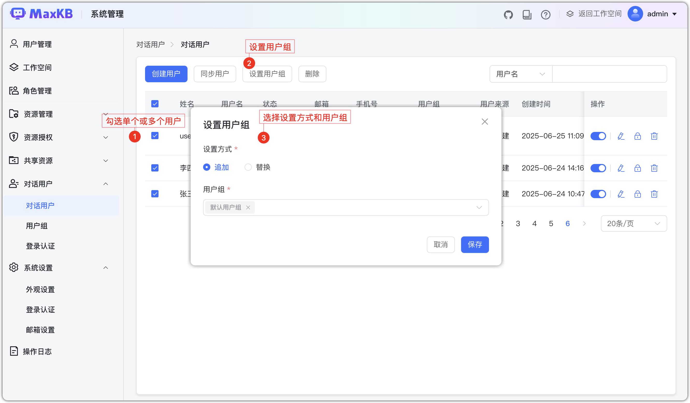

### 1.3 同步用户
!!! Abstract ""
    仅系统管理员可以执行此操作，工作空间管理员无此功能。同步时：

    - 用户来源：支持同步系统用户。
    - 同步字段：用户名、姓名、邮箱、手机号、状态、密码、用户类型。
    - 用户组：同步的用户将被分配到默认用户组。
    - 用户类型：与系统用户保持一致。
    - 同步逻辑：已存在的用户将被跳过，不会重复添加或更新。

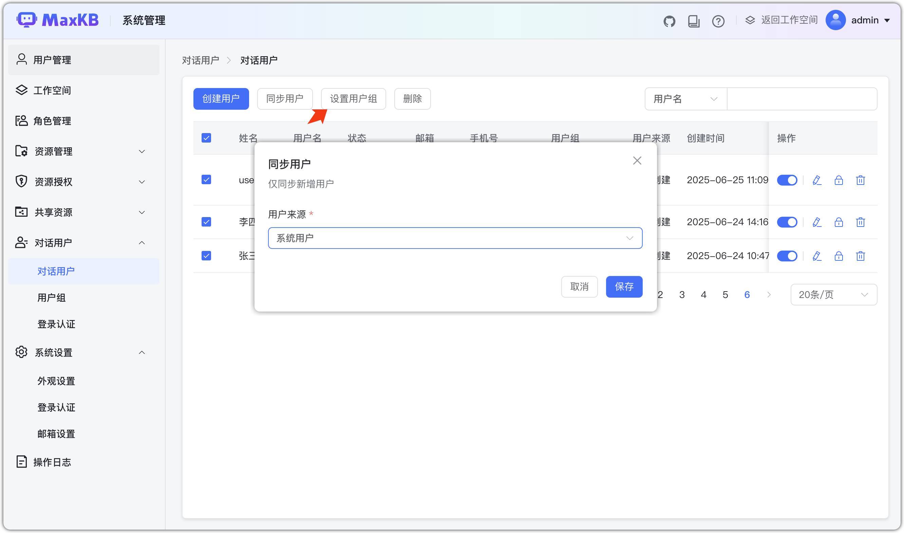

## 2 用户组管理

!!! Abstract ""
    用户组是对话用户管理，用于将用户分类并集中管理。通过用户组，管理员可以为不同类型的用户分配不同的权限。  
    系统管理员和工作空间管理员可以进行以下操作：

    - 添加用户组：创建新的用户组。
    - 删除/重命名用户组：统内置一个默认用户组，该用户组不可删除，但可以重命名。
    - 添加/移除成员：为用户组添加或移除成员，支持批量操作。

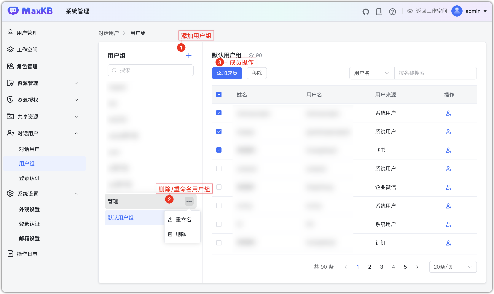

!!! Abstract ""
    用户组名称是唯一，最大 128 个字符。

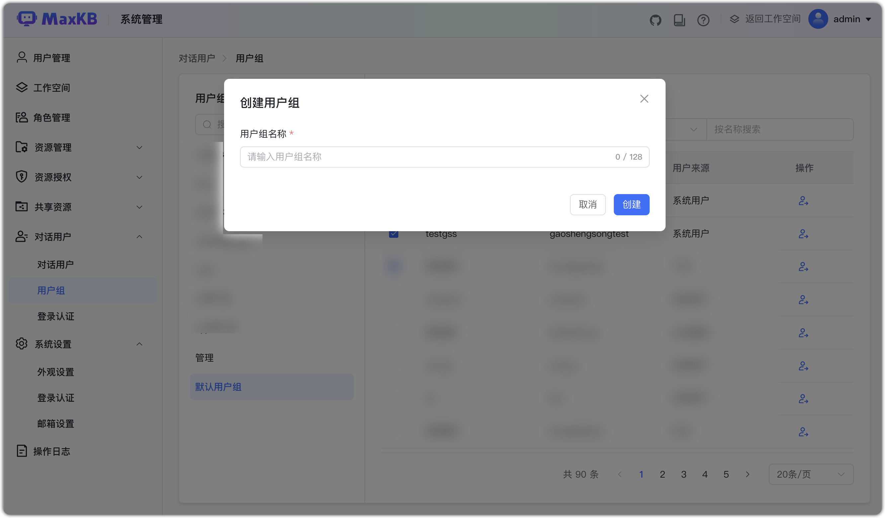

!!! Abstract ""
    删除用户组时，系统会提示确认操作，并提醒管理员该用户组下的所有成员将被移除。

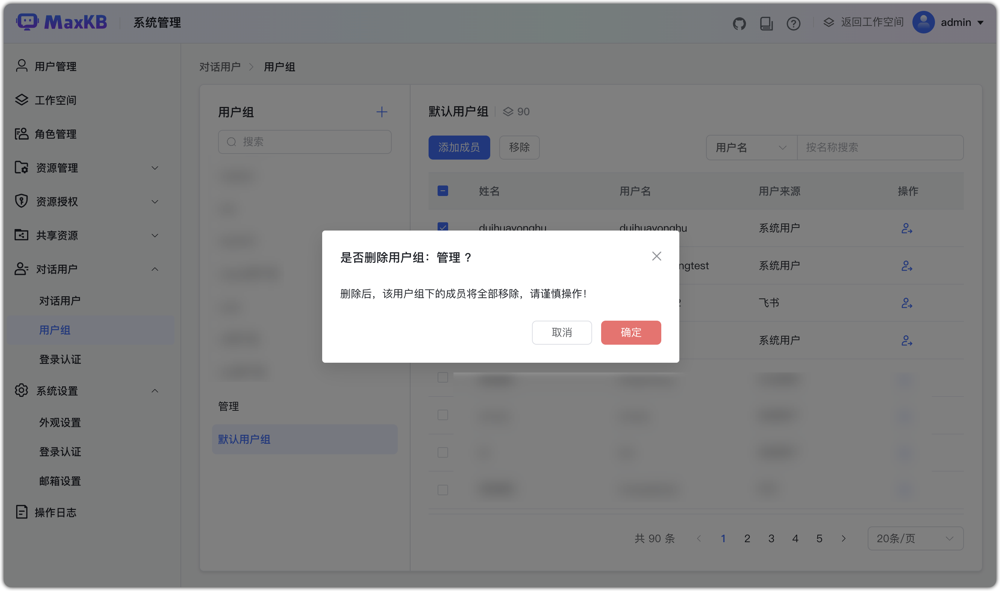

!!! Abstract ""
    支持给用户组添加成员。

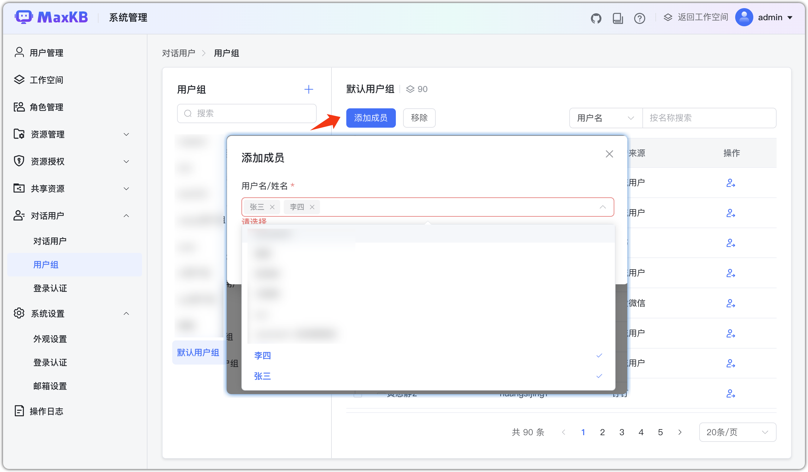

## 3 登录认证
!!! Abstract ""
    系统支持灵活配置对话用户的登录认证方式，包括集成主流第三方平台的扫码登录功能，适用于构建安全、高效、统一的对话用户管理体系。
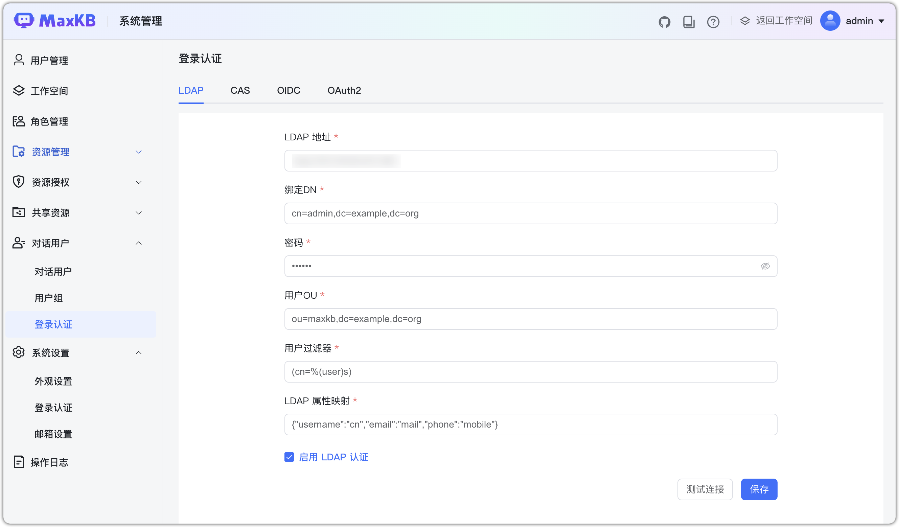

!!! Abstract ""
    登录认证配置完成后，可以在【智能体】- 【概览】 - 【访问限制】中显示该登录方式。

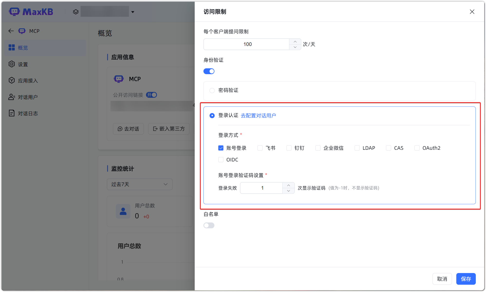

!!! Abstract ""
    如选择扫码登录方式（如钉钉、飞书或企业微信），当用户访问小助手进行对话时，系统将自动弹出所选平台的扫码界面。用户完成扫码后即可快速登录并开始对话。

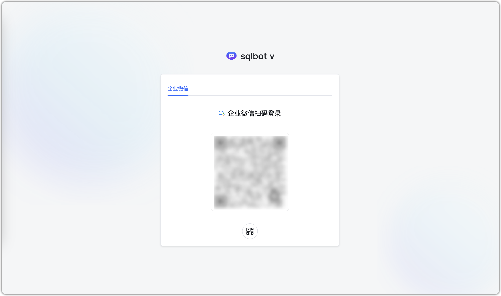

### 3.1 企业微信智能体免密登录
!!! Abstract ""
    开启智能体免密登录需系统管理员在【系统管理】-【对话用户】-【登录认证】-【扫码登录】中，提前配置企业微信信息。

!!! Abstract ""
    智能体开启【访问限制】-【身份验证】-【登录认证】并勾选企业微信后，保存登录认证设置。同时在【对话用户】中，给相应的对话用户进行授权。

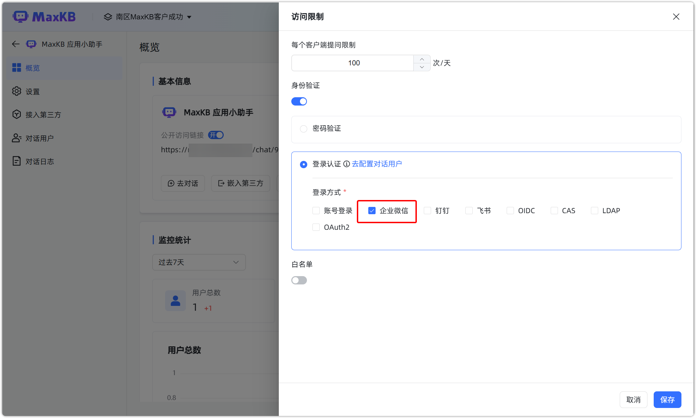

!!! Abstract ""
    智能体主页地址的构造可以参考企业微信开发指南[造网页授权链接——构造企业oauth2链接](https://developer.work.weixin.qq.com/document/path/91120#%E6%9E%84%E9%80%A0%E4%BC%81%E4%B8%9Aoauth2%E9%93%BE%E6%8E%A5)。  
    
    链接格式即参数说明如下：

    - 链接格式：https://open.weixin.qq.com/connect/oauth2/authorize?appid=CORPID&redirect_uri=REDIRECT_URI/chat/api/auth/wecom/oauth2?accessToken=ACCESSTOKEN&response_type=code&scope=snsapi_privateinfo&agentid=AGENTID&state=STATE#wechat_redirect
    - CORPID： 企业微信的 CorpID
    - REDIRECT_URI：授权后重定向的回调链接地址，需要使用 urlencode 对链接进行处理，例如：https%3A%2F%2Fmaxkbk.fit2cloud.cn，调整域名部分即可
    - ACCESSTOKEN：智能体 ID，如公开访问连接为 https://maxkb.fit2cloud.cn/chat/e113a4980984be3fe，e113a4980984be3fe 即为相应的智能体 ID
    - AGENTID：企微应用 ID，如 1000001

    主页地址示例：https://open.weixin.qq.com/connect/oauth2/authorize?appid=ww8ef82888c6f6e33&redirect_uri=https%3A%2F%2Fmaxkb.fit2cloud.cn/chat/api/auth/wecom/oauth2?accessToken=e113a4980984be3fe&response_type=code&scope=snsapi_privateinfo&agentid=1000002&state=STATE#wechat_redirect

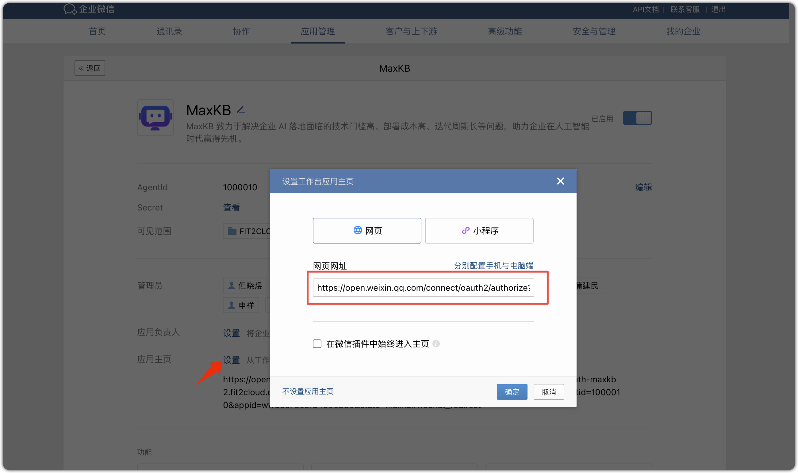

!!! Abstract ""
    设置可信域名，在【应用管理】中点击【设置可信域名】，添加可信域名，并进行校验。可参考[可信域名配置](https://kb.fit2cloud.com/?p=915e0151-5581-406f-ac2e-22afb9b3b4bf)。

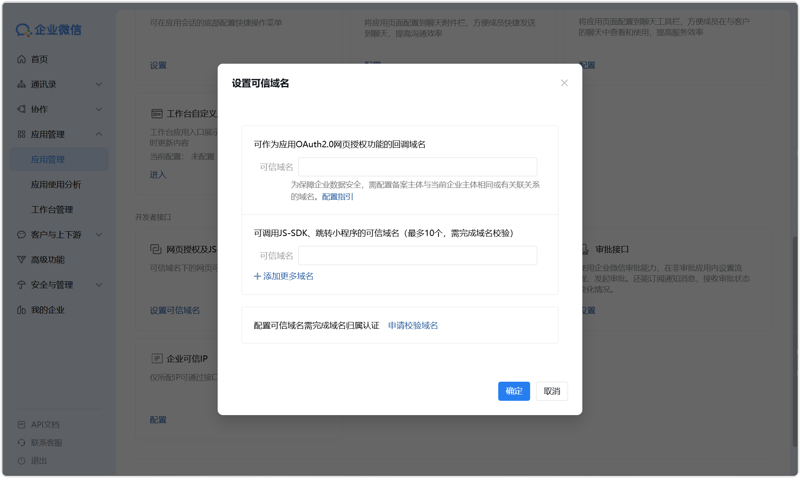

!!! Abstract ""
    配置企业可信IP。在【企业可信IP】中配置可信ip。
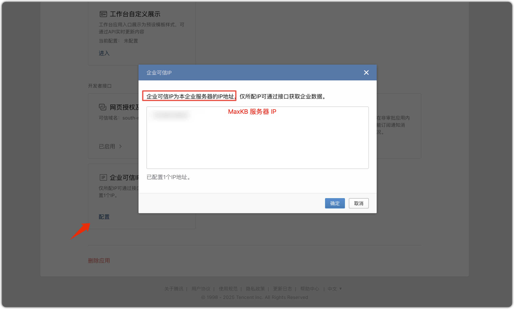

!!! Abstract ""
    配置完成后，在企业微信工作台中找到 MaxKB 智能体，免登进行对话。

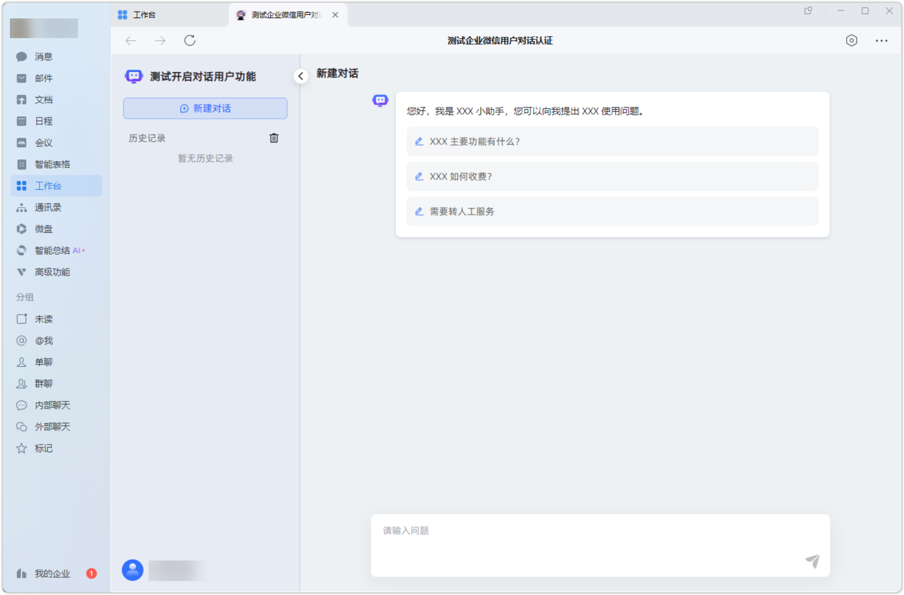

### 3.2 钉钉智能体免密登录
!!! Abstract ""
    开启智能体免密登录需系统管理员在【系统管理】-【对话用户】-【登录认证】-【扫码登录】中，提前配置钉钉信息。

!!! Abstract ""
    智能体开启【访问限制】-【身份验证】-【登录认证】并勾选钉钉后，保存登录认证设置。同时在【对话用户】中，给相应的对话用户进行授权。
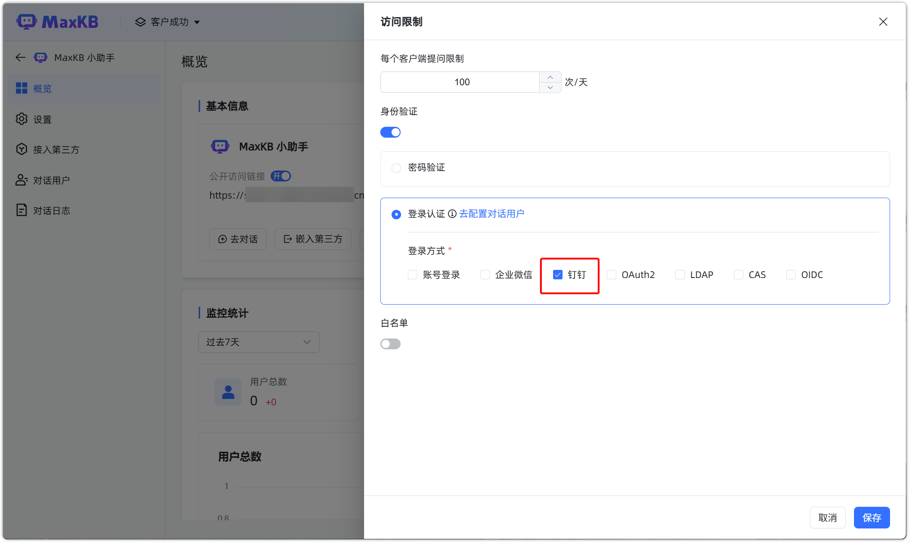

!!! Abstract ""
    添加网页应用能力。在钉钉开放平台的【应用能力】中，添加【网页应用】。

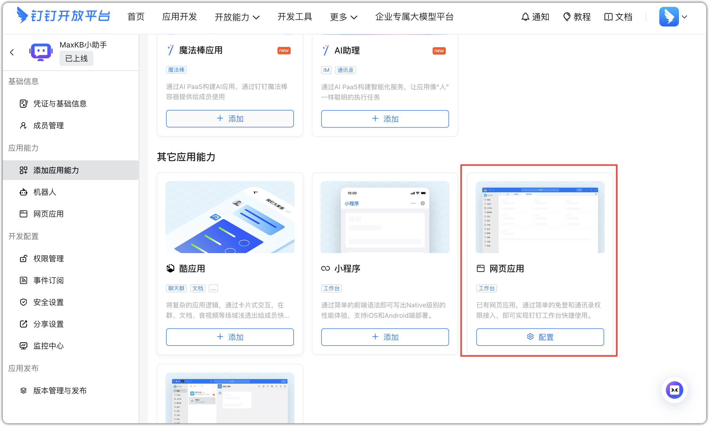

!!! Abstract ""
    设置【应用首页】和【PC 端首页地址】。

    链接格式即参数说明如下：

    - 链接格式：http(s)://xxx.xxx.xxx/chat/login/ACCESSTOKEN?client=dingtalk&corpId=CORPID。
    - ACCESSTOKEN：智能体 ID，例如，公开访问连接为 https://maxkb.fit2cloud.cn/chat/e113a4980984be3fe，e113a4980984be3fe 即为相应的智能体 ID
    - CORPID：钉钉企业的 CorpId，例如 dinge20bxxxxxxxxxxxxx53d9884

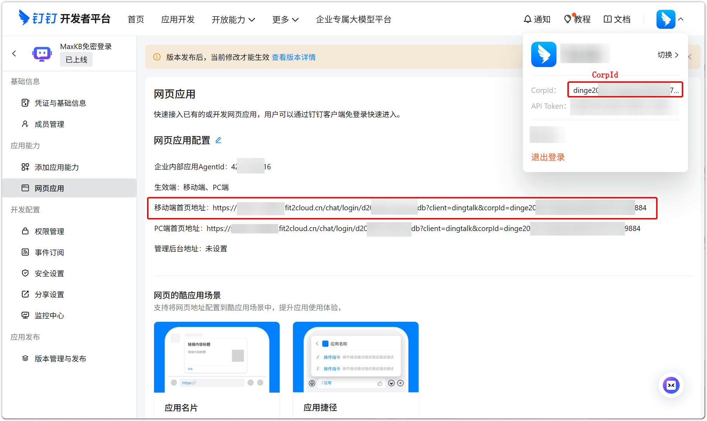

!!! Abstract ""
    安全设置。在【安全设置】中设置重定向 URL。

    注意：该地址是在【系统管理】-【对话用户】-【登录认证】-【扫码登录】中，钉钉的回调地址。
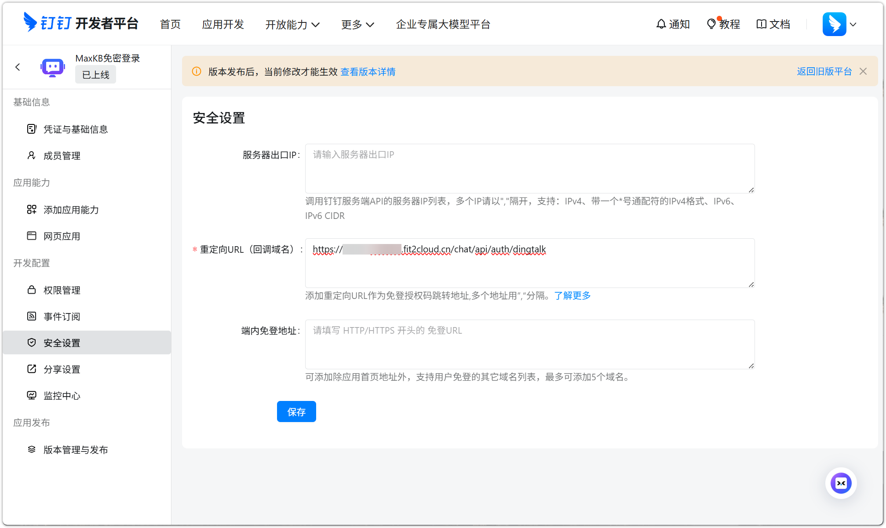

!!! Abstract ""
    分享设置，在【接入登录】中设置【回调域名】。

    注意：该地址是在【系统管理】-【对话用户】-【登录认证】-【扫码登录】中，钉钉的回调地址。
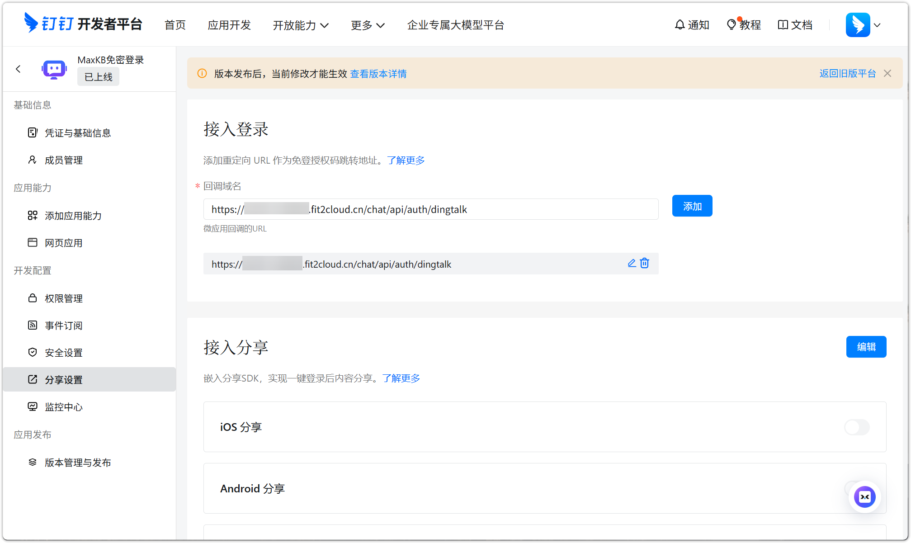

!!! Abstract ""
    权限管理，进入到【权限管理】中，添加如下图所示的权限。

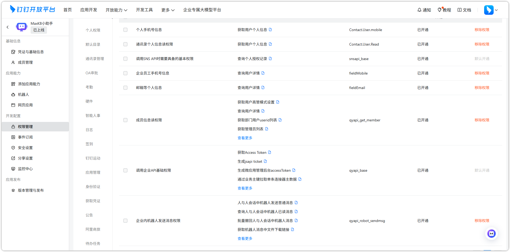

!!! Abstract ""
    应用发布后，即可在钉钉工作台免登录访问 MaxKB。

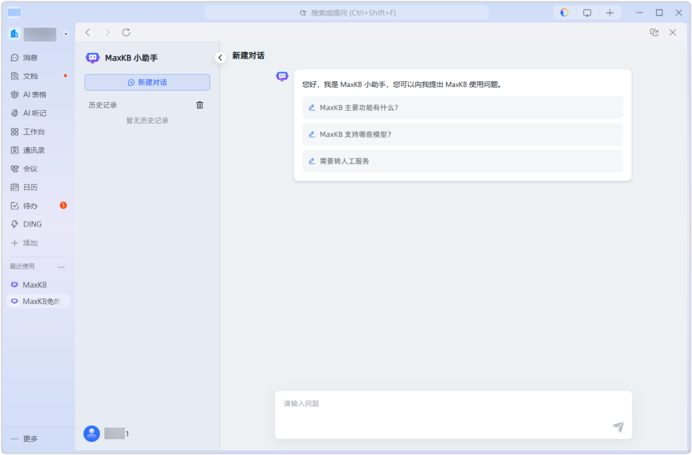

### 3.3 飞书智能体免密登录
!!! Abstract ""
    开启智能体免密登录需系统管理员在【系统管理】-【对话用户】-【登录认证】-【扫码登录】中，提前配置飞书信息。

!!! Abstract ""
    智能体开启【访问限制】-【身份验证】-【登录认证】并勾选飞书后，保存登录认证设置。同时在【对话用户】中，给相应的对话用户进行授权。

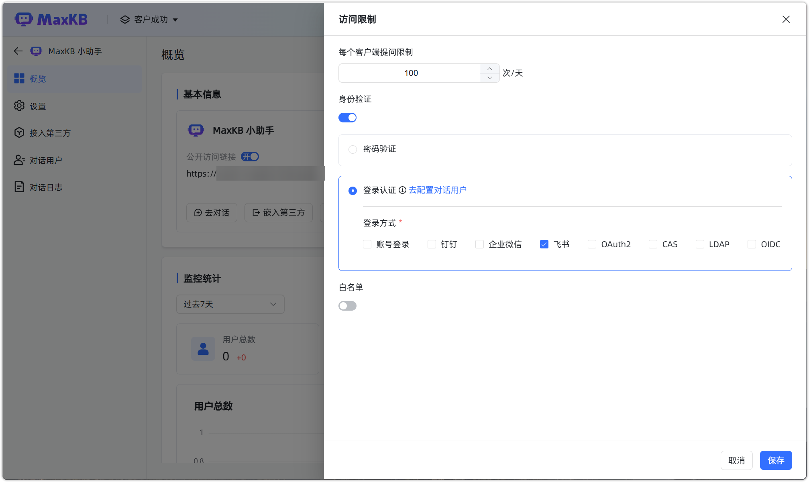

!!! Abstract ""
    添加【页面应用】能力。

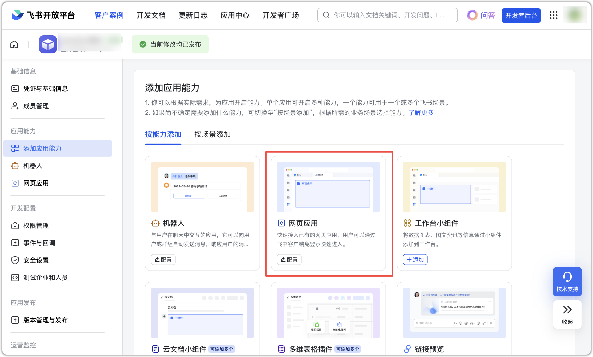

!!! Abstract ""
    配置网页应用。

    链接格式即参数说明如下：

    - 链接格式：http(s)://xxx.xxx.xxx/chat/login/ACCESSTOKEN?client=lark&appId=AppID。
    - ACCESSTOKEN：智能体 ID，例如，公开访问连接为 https://maxkb.fit2cloud.cn/chat/e113a4980984be3fe，e113a4980984be3fe 即为相应的智能体 ID
    - AppID：飞书应用的 App ID
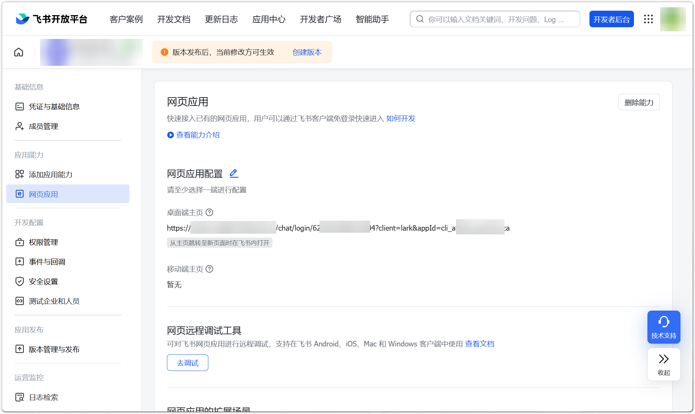

!!! Abstract ""
    在【安全设置】中添加重定向 URL。

    链接格式即参数说明如下：

    - 【系统管理】-【对话用户】-【登录认证】-【扫码登录】中，飞书的回调地址：http(s)://xxx.xxx.xxx/chat/api/auth/lark
    - http(s)://xxx.xxx.xxx/chat/login/ACCESSTOKEN 。其中 ACCESSTOKEN 为智能体 ID，例如，公开访问连接为 https://maxkb.fit2cloud.cn/chat/e113a4980984be3fe，e113a4980984be3fe 即为相应的 ACCESSTOKEN

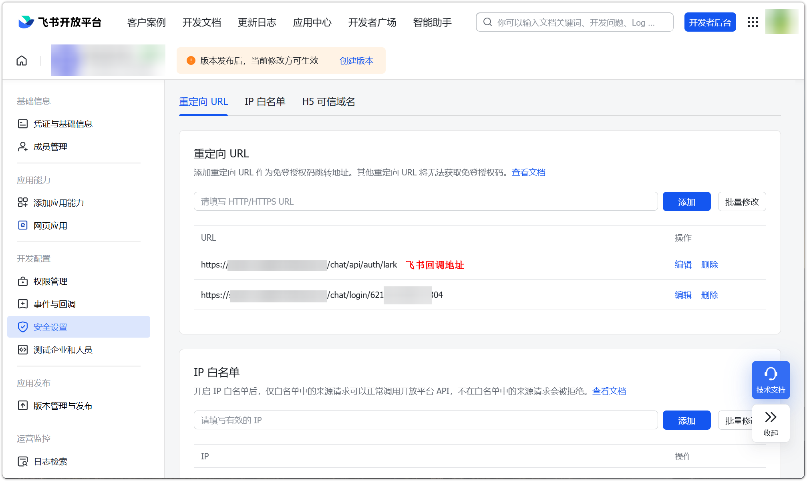

!!! Abstract ""
    应用发布后，即可在飞书工作台免登录访问 MaxKB。

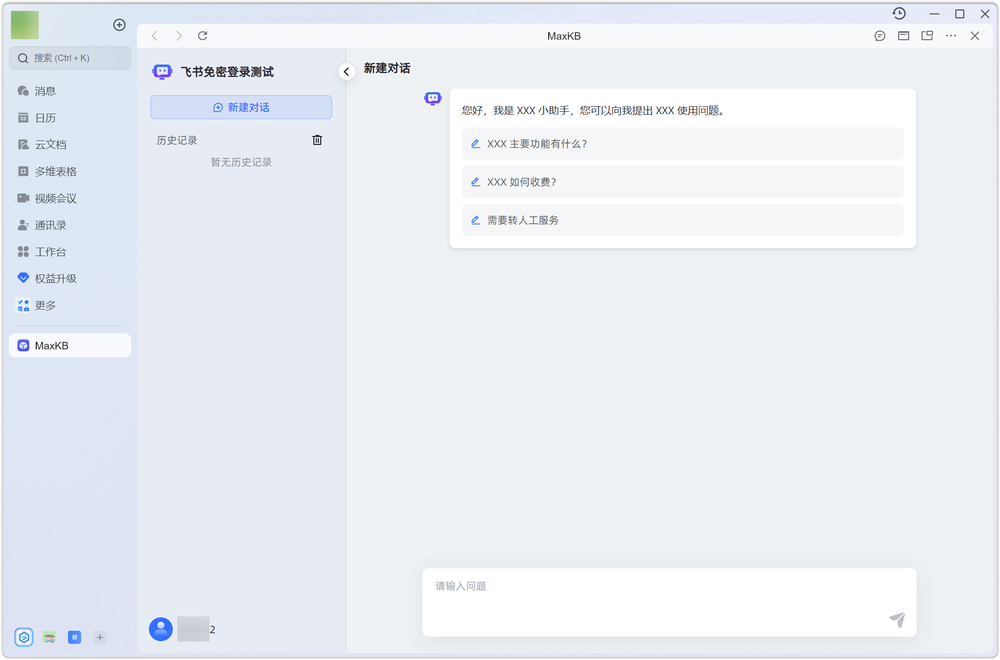

## 4 使用场景

!!! Abstract ""
    系统管理员设置完用户对话用户，用户在创建智能体和知识库时，可以设置对话用户组来控制使用相关权限。

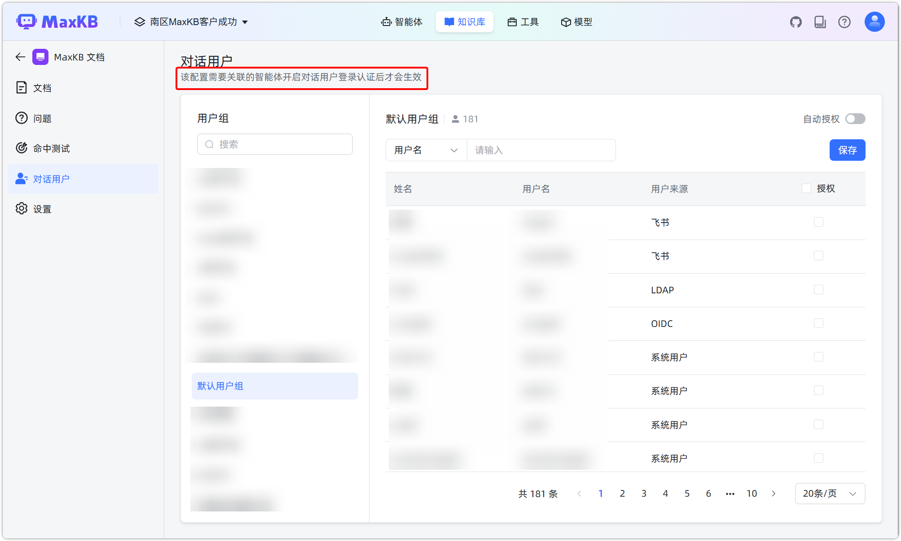

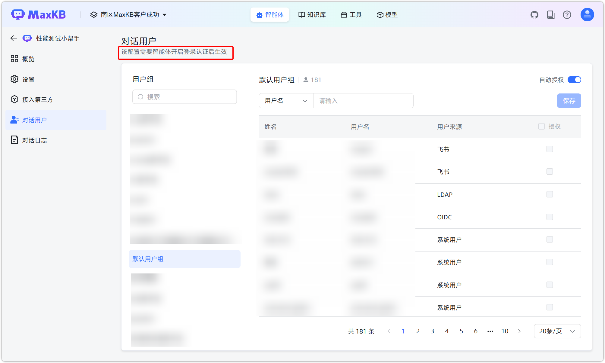