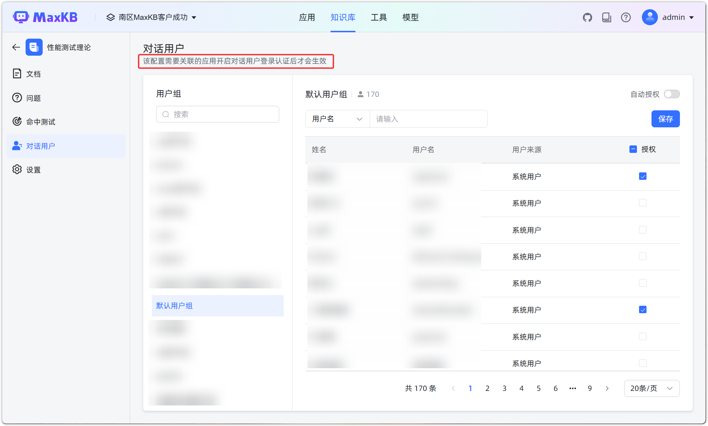
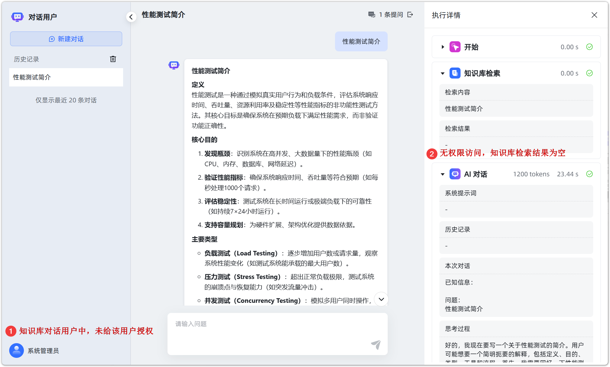
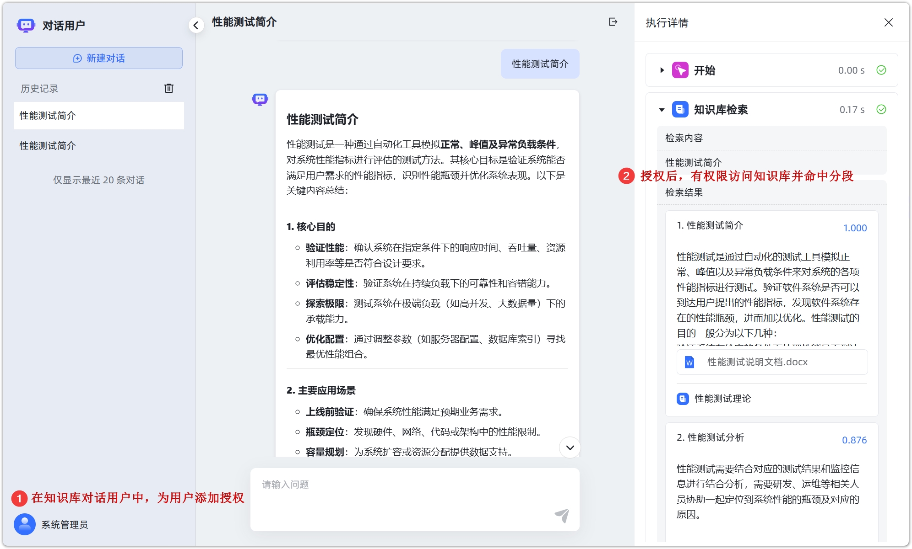

# 对话用户

!!! Abstract ""
    知识库支持设置允许访问当前知识库的用户组及用户。

!!! Abstract ""
    若对话用户属于多个用户组，任一用户组被授权即可进入应用提问。 用户被移出用户组后，对应授权将被取消。
    
    自动授权规则：

    * 开启：若给用户组授权后，开启自动授权，当前用户组及后续新增成员自动授权，可获取知识库内容。
    * 关闭：需手动为用户组成员授权，新增成员默认未授权。
    
    注意：

    * 在知识库中仅支持查看和授权用户组，用户组和成员管理需要空间管理员或系统管理员在【系统管理】中进行。
    * 该配置需要关联的应用开启对话用户登录认证后才会生效。

!!! Abstract ""
    开启知识库对话用户后，在应用中，需在[应用访问限制](https://maxkb.cn/docs/v2/user_manual/X-Pack/app_auth/)中设置登录认证方式为账号登录，同时设置允许进入当前应用问答页面进行提问的用户组及用户。

    分别设置好知识库和应用的对话用户后，对应用进行提问，有知识库授权的用户即可在知识库中检索相关分段；未在知识库授权的用户则无法获取知识库信息。

