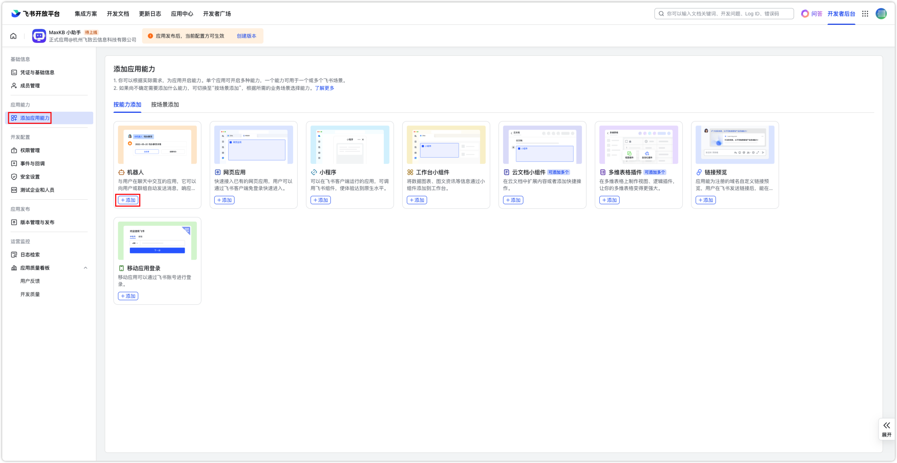
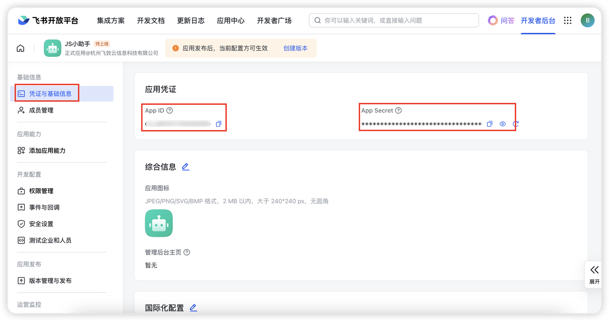
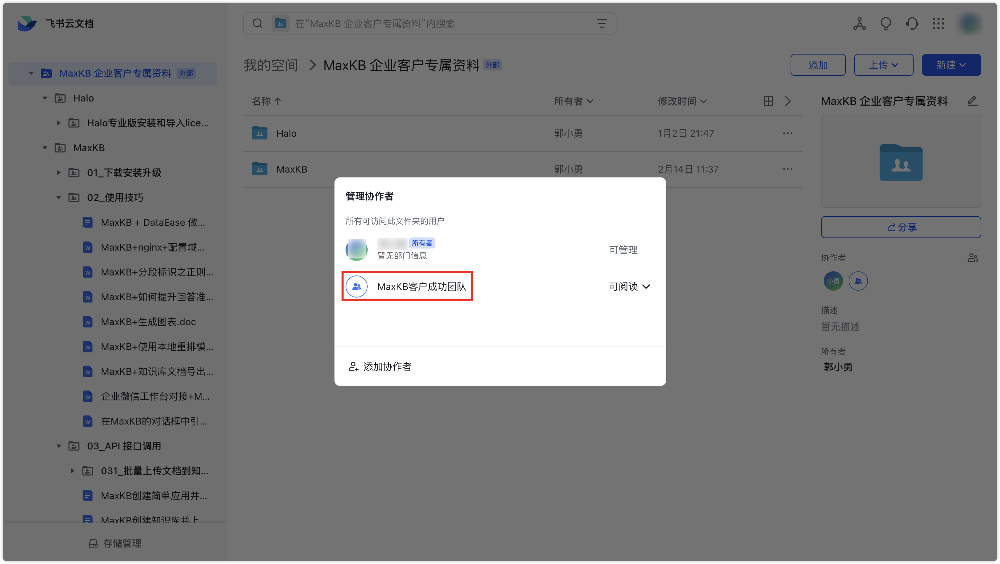
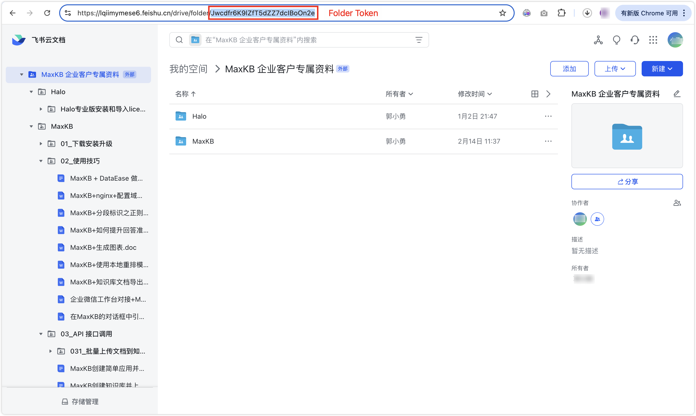
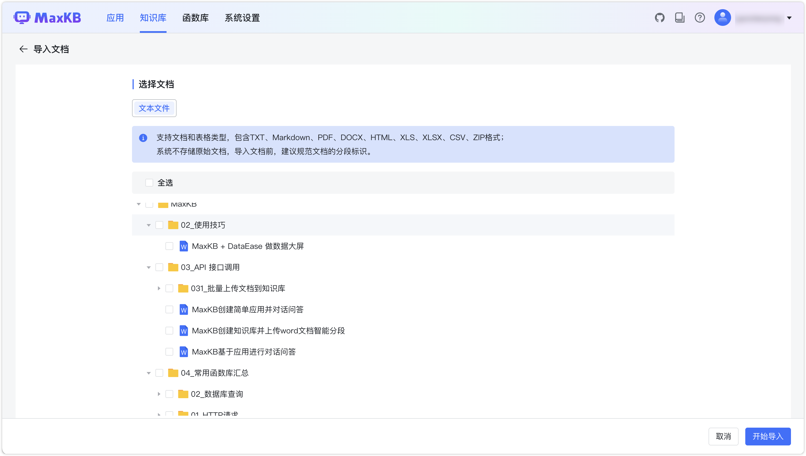

# 飞书文档知识库

## 1 飞书机器人配置

!!! Abstract "" 
    MaxKB 专业版支持通过飞书文档构建知识库，目前支持飞书的云文档和表格文档。
    MaxKB 对飞书文档的支持是通过飞书机器人并配置对应的文档权限实现，并在群组中通过将机器人设置为协作者。

### 1.1 创建飞书机器人

!!! Abstract "" 
    首先在 [飞书开发平台](https://open.feishu.cn/app/)的【企业自建应用】中，点击【创建企业自建应用】，填写应用信息。


!!! Abstract ""
    点击【添加应用能力】，选择 【按能力添加-机器人】，点击【添加】


### 1.2 添加权限

!!! Abstract ""
    打开【权限管理】，复制下面的权限配置并粘贴到【API权限-权限配置】输入框，全选筛选出来的权限项，点击【批量开通】，最后点击【确认】。

    ```
    docs:document:export,docx:document:readonly,drive:drive,space:document:retrieve
    ```


### 1.3 获取必要信息

!!! Abstract ""
    获取APP ID、APP Secret和 Folder Token。
    进入创建好的飞书应用，打开【凭证与基础信息】页面，获取APP ID和APP Secret。


### 1.4 应用发布

!!! Abstract ""
    点击【创建版本】，填写版本信息后，点击【保存】，待管理员审核后进行群组设置。


### 1.5 群组设置
    
!!! Abstract ""
    在内部群组中添加对应的群机器人。


!!! Abstract ""
    在飞书文档的文件夹中，添加包含应用机器人的群组作为协作者。



## 2 创建飞书文档知识库
    
!!! Abstract "" 
    在创建知识库时，知识库类型选择为`飞书`，并配置相应参数：

    - App ID：飞书应用唯一标识。
    - App Secret：飞书应用凭证。
    - Folder Token：是飞书云空间中每个文件夹的唯一标识，用于区分和操作特定的文件夹飞书中的文件夹。选中文件夹，在链接信息中即可获取。




!!! Abstract "" 
    在飞书知识库中，点击【导入文档】，选择飞书文件夹下面需要上传的文档，点击开始导入，即可以将飞书文档导入到 MaxKB 中。

