# 登录认证
!!! Abstract "" 
    MaxKB专业版支持 LDAP、CAS、OIDC、OAUTH2 单点认证协议，以及企业微信、钉钉、飞书移动端扫码登录验证，满足企业对于强身份验证和访问控制的需求。

## 1 LDAP

!!! Abstract ""  
    配置 LDAP 的过程可参考下图，注意勾选下方"启用 LDAP 认证"后开启此功能。     
    提示：配置完成可点击上方【测试连接】即时测试配置信息是否正确，网络是否连通。      
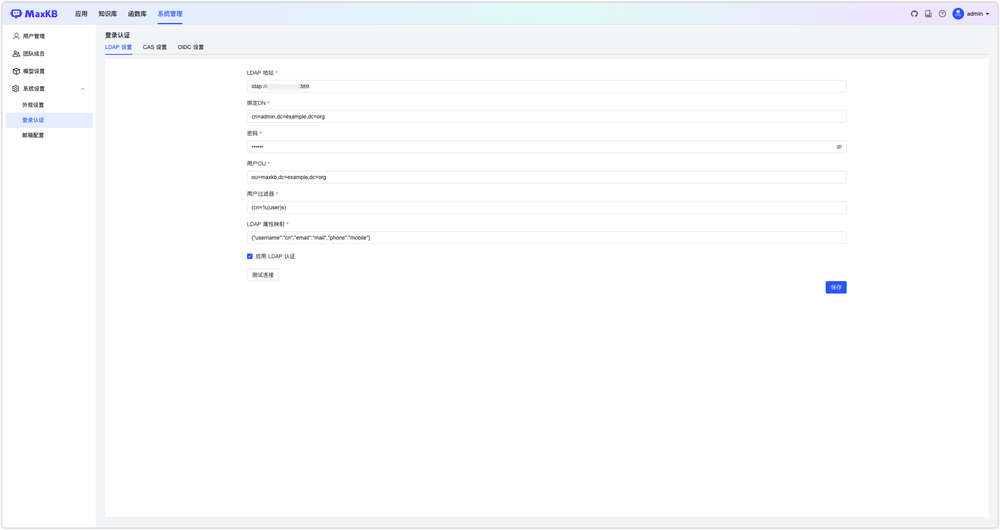

## 2 CAS

!!! Abstract ""
    配置 CAS 的过程可参考下图，注意勾选下方"启用 CAS 认证"后开启此功能。    
    **说明：** CAS 回调地址即 MaxKB 访问地址加上`/api/cas`，例如：`http://40.100.86.240:8080/api/cas`
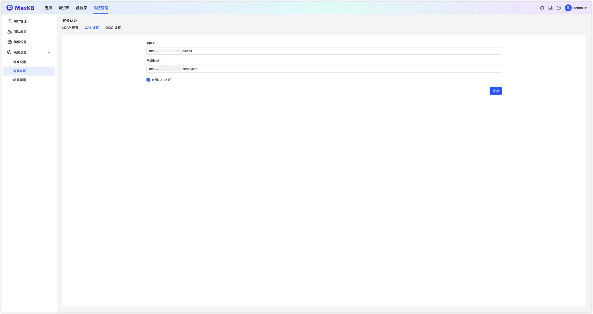

## 3 OIDC

!!! Abstract ""
    配置 OIDC 的过程可参考下图，注意勾选下方"启用 OIDC 认证"后开启此功能。   
    **说明：** OIDC 回调地址即 MaxKB 访问地址加上`/api/oidc`，例如：`http://40.100.86.240:8080/api/oidc`
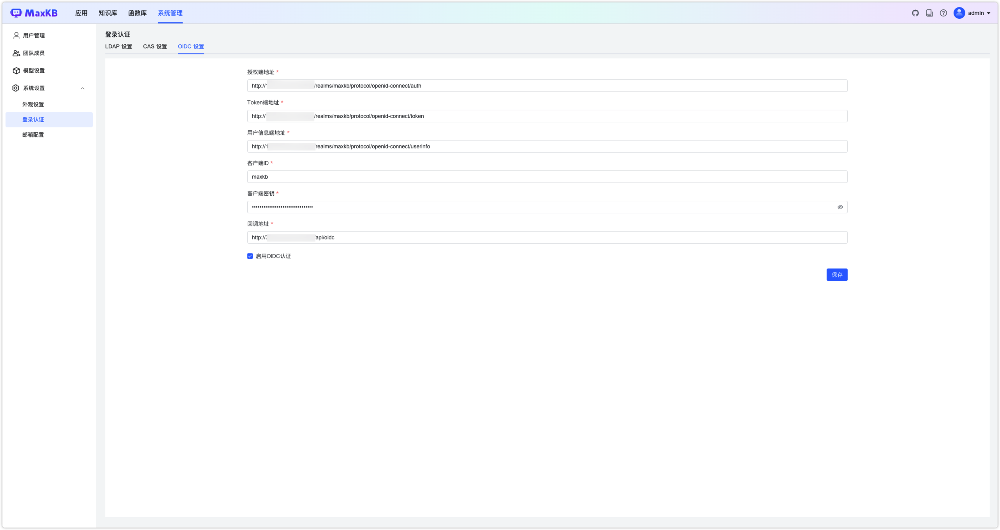

## 4 OAUTH2

!!! Abstract ""
    配置 OAUTH2 的过程可参考下图（授权端以 github 为例），注意勾选下方"启用 OAHTU2 认证"后开启此功能。   
    **说明：** OAUTH2 回调地址即 MaxKB 访问地址加上`/api/oauth2`，例如：`http://40.100.86.240:8080/api/oauth2`
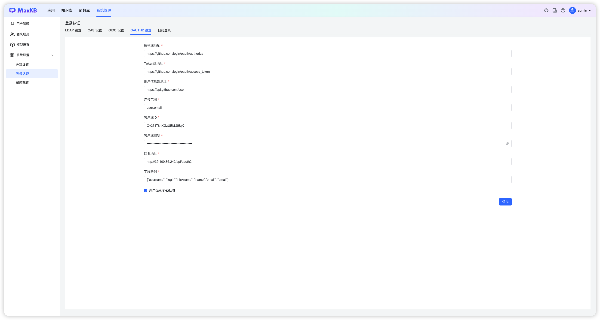

## 5 扫描登录

### 5.1 企业微信扫码登录

!!! Abstract ""
    企业微信扫码登录配置参数说明：
    
    - Corp ID: 企业ID，企业微信管理员在管理后台的【企业信息】中获取。
    - Agent ID：企业微信自建应用唯一标识，企业微信管理在管理后台创建或查看应用时获取。
    - App Secret：企业微信自建应用的密钥。   
    - 回调地址：即 MaxKB 访问URL。

!!! Abstract ""
    MaxKB 配置企业微信扫码登录时，需要企业微信管理员登录 [企业微信管理管理](https://work.weixin.qq.com/wework_admin/frame) 并创建企业自建应用，完成配置后发布应用。    
    第一步：创建应用。在【应用管理-应用-自建】中点击【创建应用】，输入应用名称等信息，应用创建完成后即可查看应用Agent ID和Secret。
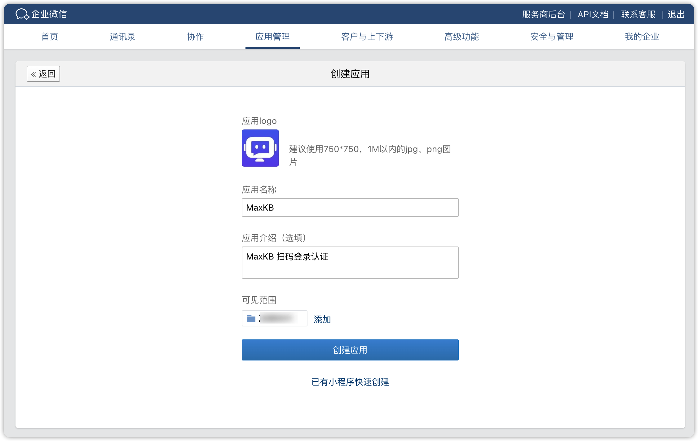{width="500px"}

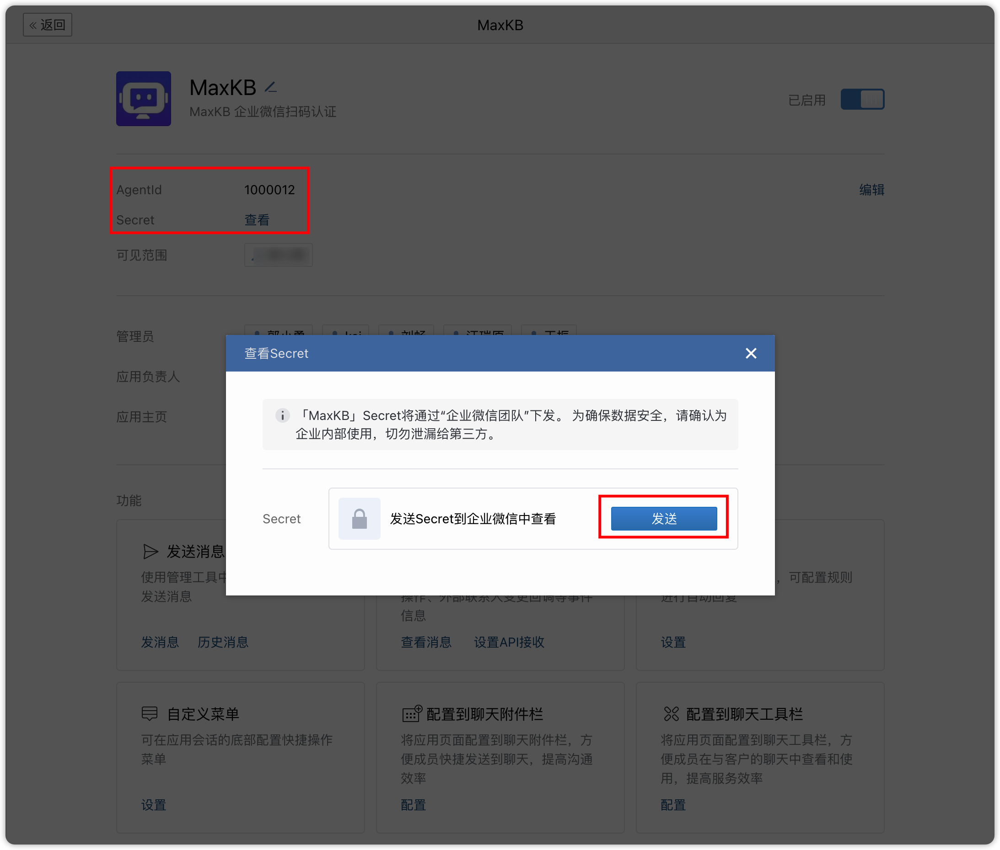{width="500px"}

!!! Abstract ""
    第二步：设置可信域名。在【开发者接口】中点击【设置可信域名】，添加可信域名，并进行校验。
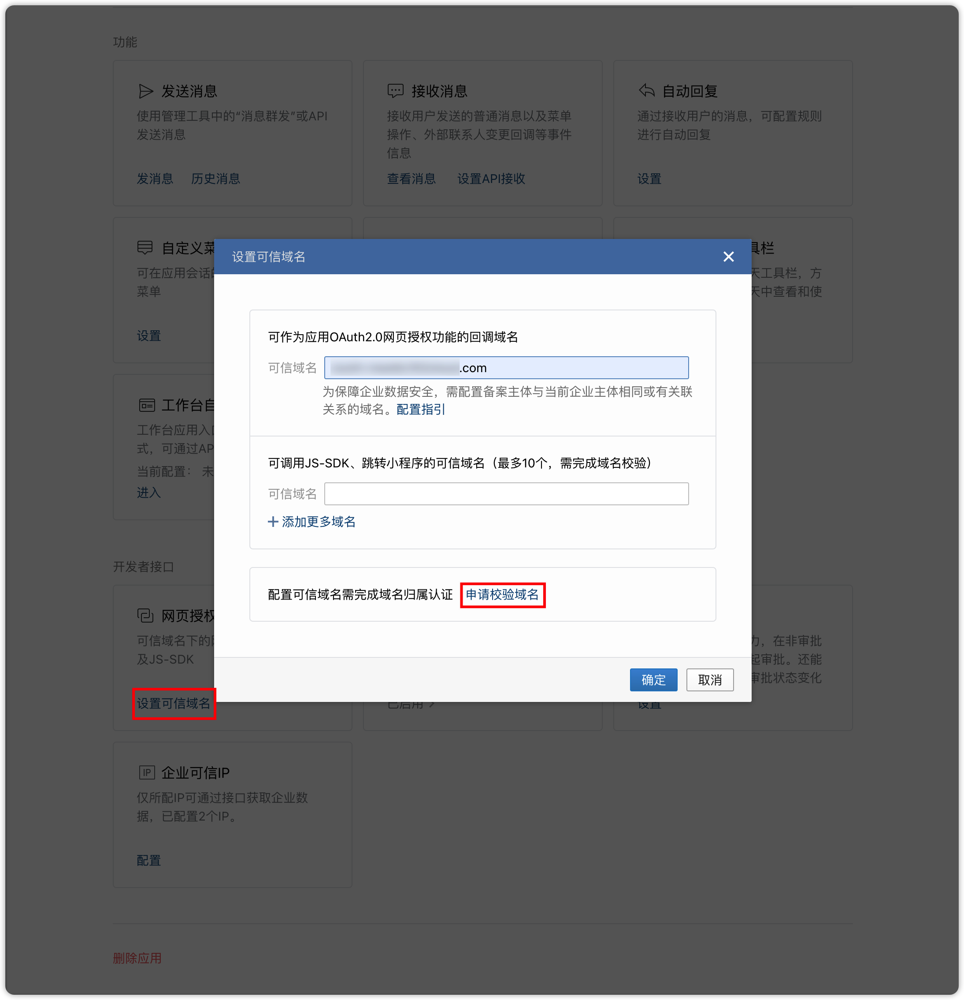{width="500px"}

!!! Abstract ""
    第三步：授权回调域。在【企业微信授权】中设置授权回调域。
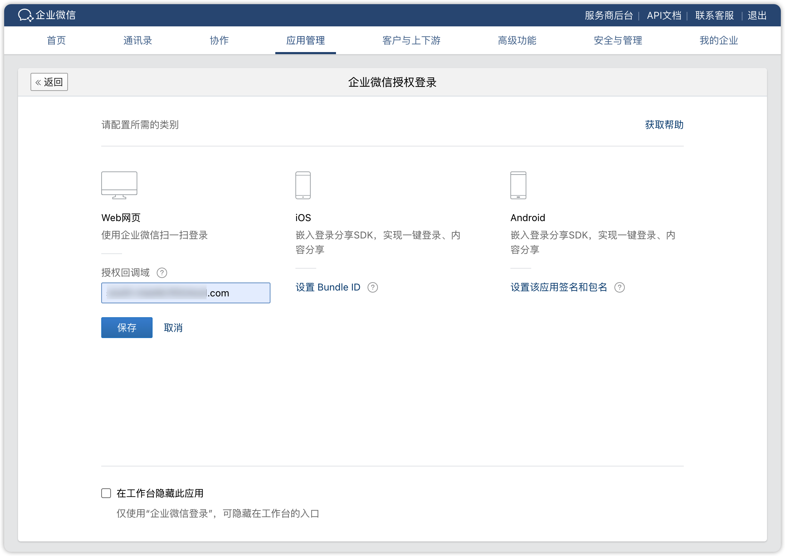{width="500px"}

!!! Abstract ""
    第三步：配置企业可信IP。在【企业可信IP】中配置可信ip。
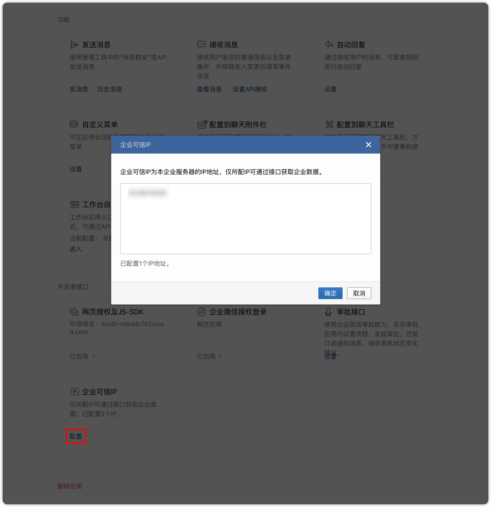{width="500px"}

!!! Abstract ""
    完成企业微信应用的配置和发布后，在 MaxKB 企业微信登录扫码配置页面配置相应信息并通过效验。
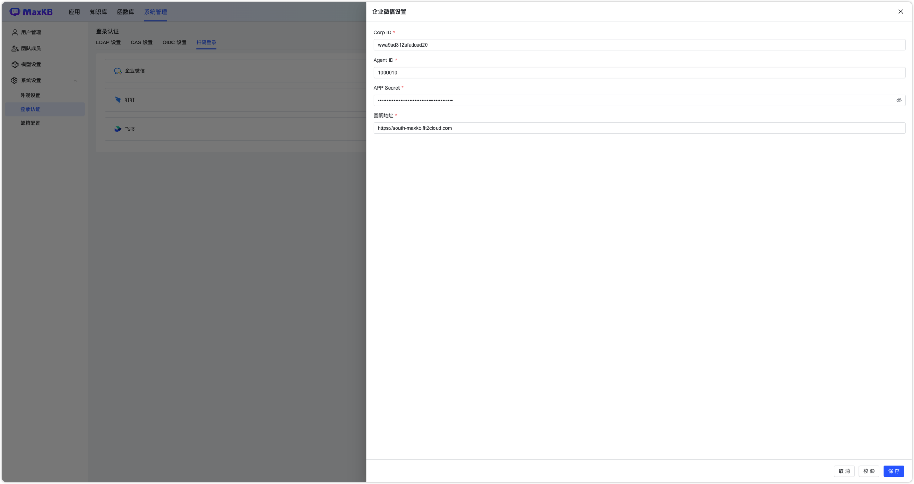

### 5.2 钉钉扫码登录

!!! Abstract ""
    钉钉扫码登录配置参数说明：

    - Corp ID：钉钉组织标识，在钉钉开放平台中右上方组织信息中查看。
    - APP Key：钉钉应用标识，在钉钉开放平台中查看应用【凭证与基础信息】中查看。
    - App Secret：钉钉应用秘钥，在钉钉开放平台中查看应用【凭证与基础信息】中查看。
    - 回调地址：即 MaxKB 访问URL。

!!! Abstract ""
    MaxKB 配置钉钉扫码登录时，需要在 [钉钉开放平台](https://open-dev.dingtalk.com/) 创建应用并进行配置。

    第一步：创建应用。在【应用开  发-钉钉应用】中点击【创建应用】，应用创建完后在【凭证与基础信息】可查案APPKey和 APPSecret信息。
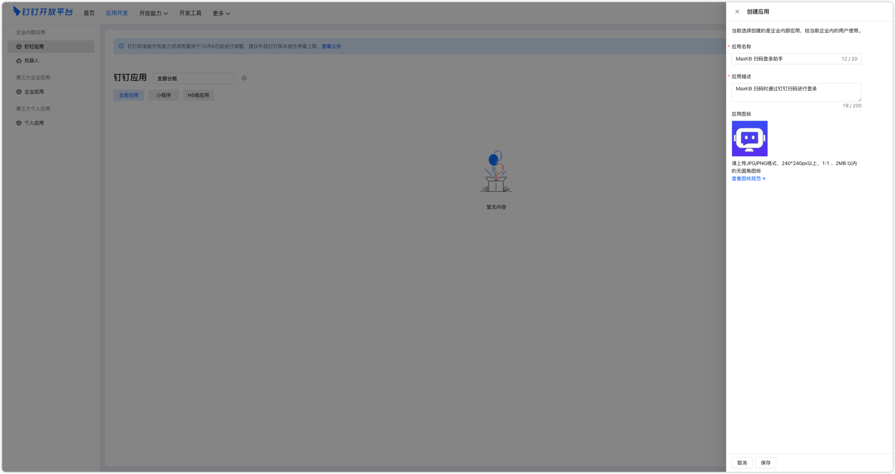
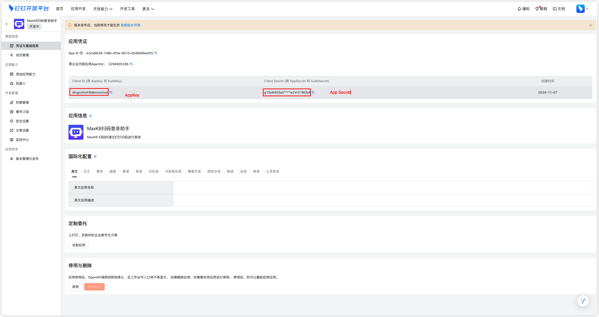

!!! Abstract ""
    第二步：发布应用。在【版本管理与发布】中，填写应用版本号、版本描述等信息，点击【保持】，发布应用。
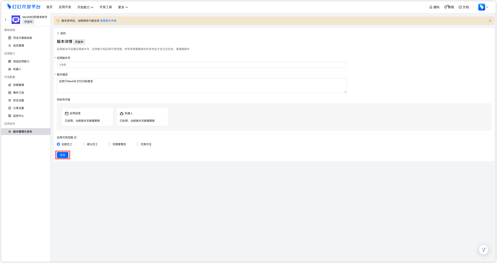

!!! Abstract ""
    完成配置后发布，然后在 MaxKB 钉钉扫码登录扫码配置页面进行配置并保存。
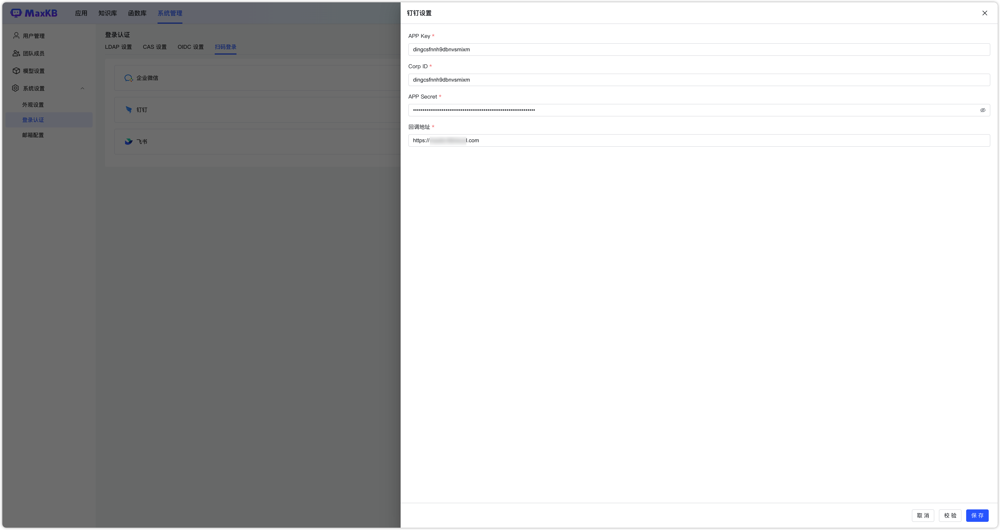

### 5.3 飞书扫码登录

!!! Abstract ""
    飞书扫码登录配置参数说明：

    - APP Key：
    - Corp ID：
    - App Secret：MaxKB提供的回调地址，并作为飞书免登录授权的跳转地址。
    - 回调地址：即 MaxKB URL地址 + '/api/feishu'，例如：`http://40.100.86.243/api/feishu`。

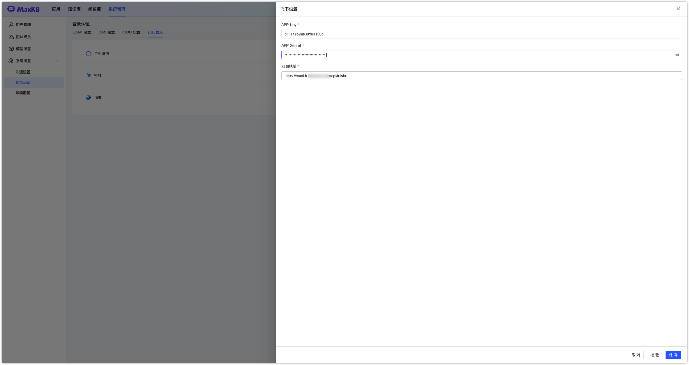

!!! Abstract ""
    MaxKB 配置飞书扫码登录时，需要在 [飞书开放平台](https://open.feishu.cn/) 创建企业自建应用，完成配置后发布，然后在 MaxKB 飞书扫码登录扫码配置页面进行配置并保存。

!!! Abstract ""
    第一步：创建企业自建应用。点击【创建企业自建应用】，输入应用名称、描述以及上传应用图标后，点击【创建】。
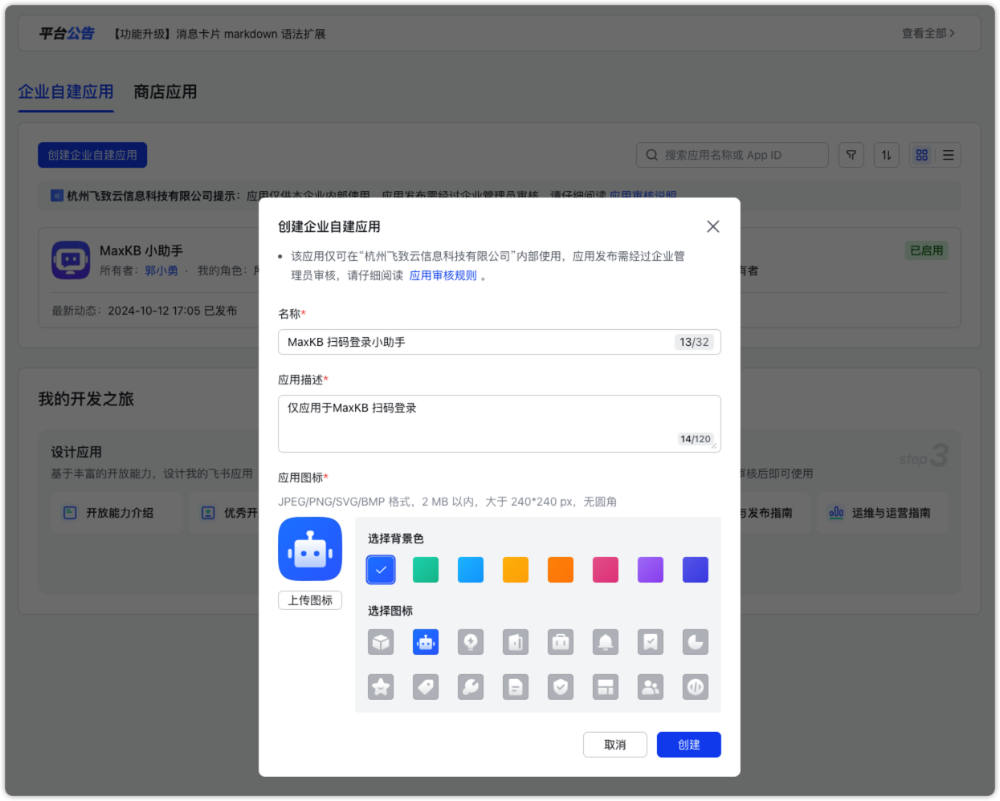

!!! Abstract ""
    第二步：配置重定向URL。在【开发配置-安全设置】中，输入MaxKB 飞书扫码配置弹出框中的回调地址，点击【添加】。

!!! Abstract ""
    第三步：发布应用。在【版本管理与发布】中，输入应用版本号、更新说明等信息，点击【保存】，完成应用发布。
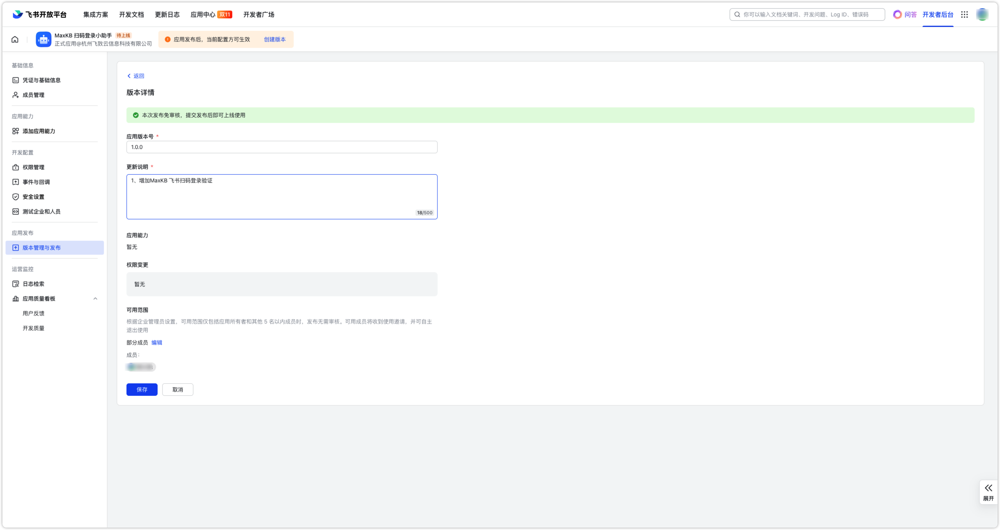

## 6 登陆认证

!!! Abstract ""
    完成认证信息配置后，在登陆页面点击选择对应的认证方式进行登陆。         

