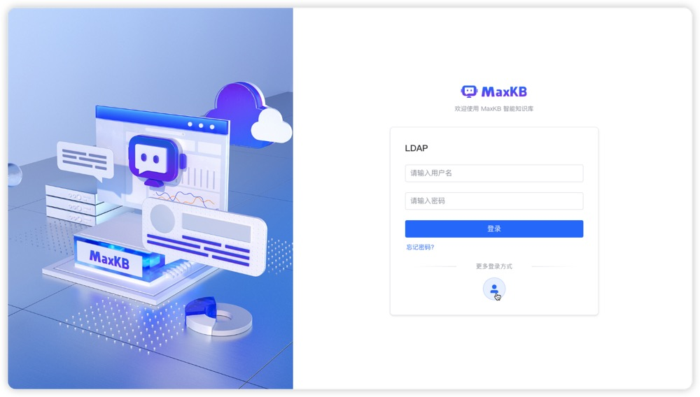
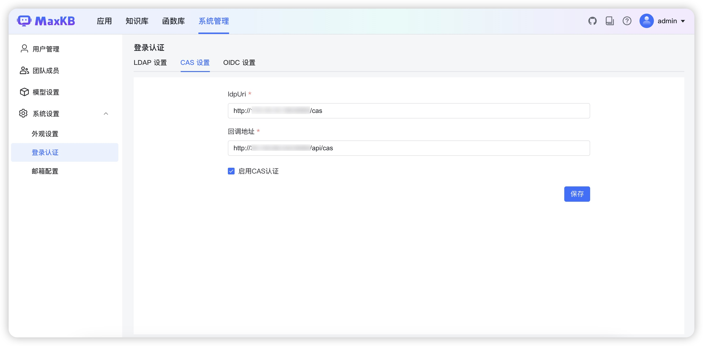
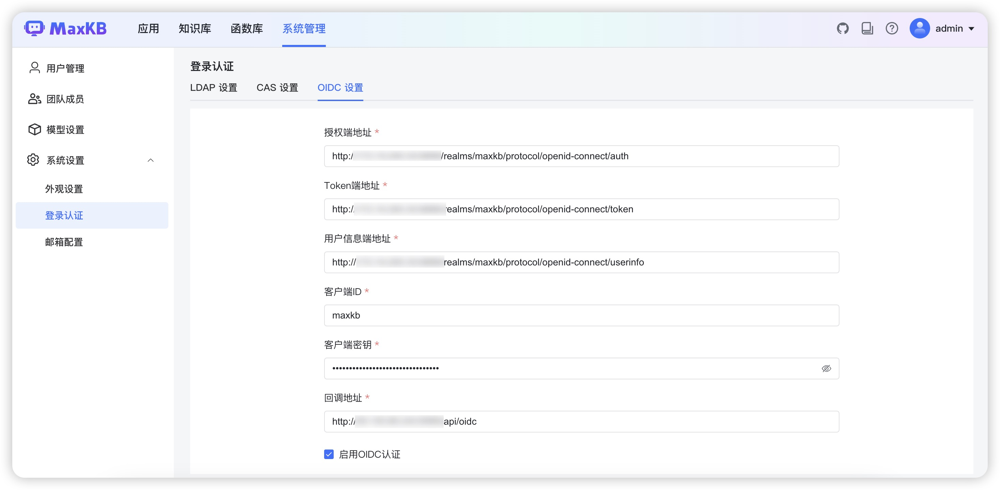
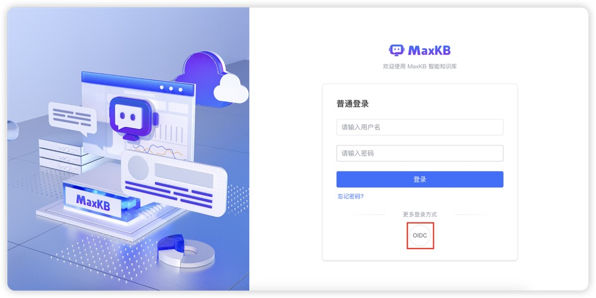

# 登录认证
!!! Abstract "" 
    MaxKB专业版已经支持LDAP、CAS、OIDC三种单点登录方式，基本满足了企业对于强身份验证和访问控制的需求。

## LDAP

!!! Abstract "" 
    支持在系统设置中进行 LDAP 配置，开启此功能跳转到登录页面即可使用相应方式登录。     
    配置 LDAP 的过程可参考下图，注意勾选下方"启用 LDAP 认证"后开启此功能。     
    提示： 配置完成可点击上方【测试连接】即时测试配置信息是否正确，网络是否连通。    

!!! Abstract "" 
    配置完成后，随即跳转到登录页面即可使用 LDAP 方式登录。   

## CAS

!!! Abstract "" 
    支持在系统设置中进行 CAS 配置，开启此功能跳转到登录页面即可使用相应方式登录。     
    配置 CAS 的过程可参考下图，注意勾选下方"启用 CAS 认证"后开启此功能。         

!!! Abstract "" 
    配置完成后，随即跳转到登录页面即可使用 CAS 方式登录。   

## OIDC

!!! Abstract "" 
    支持在系统设置中进行 OIDC 配置，开启此功能跳转到登录页面即可使用相应方式登录。     
    配置 OIDC 的过程可参考下图，注意勾选下方"启用 OIDC 认证"后开启此功能。         

!!! Abstract "" 
    配置完成后，随即跳转到登录页面即可使用 OIDC 方式登录。   

