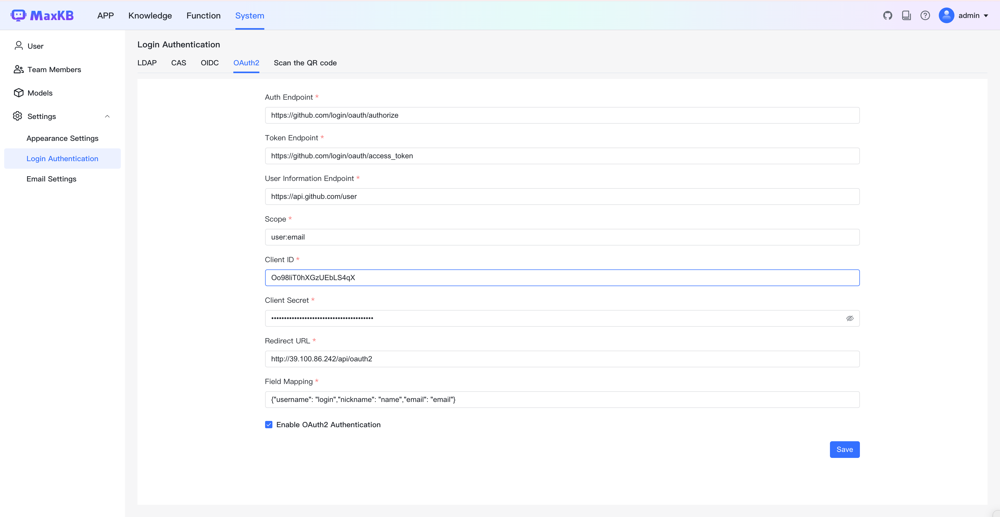
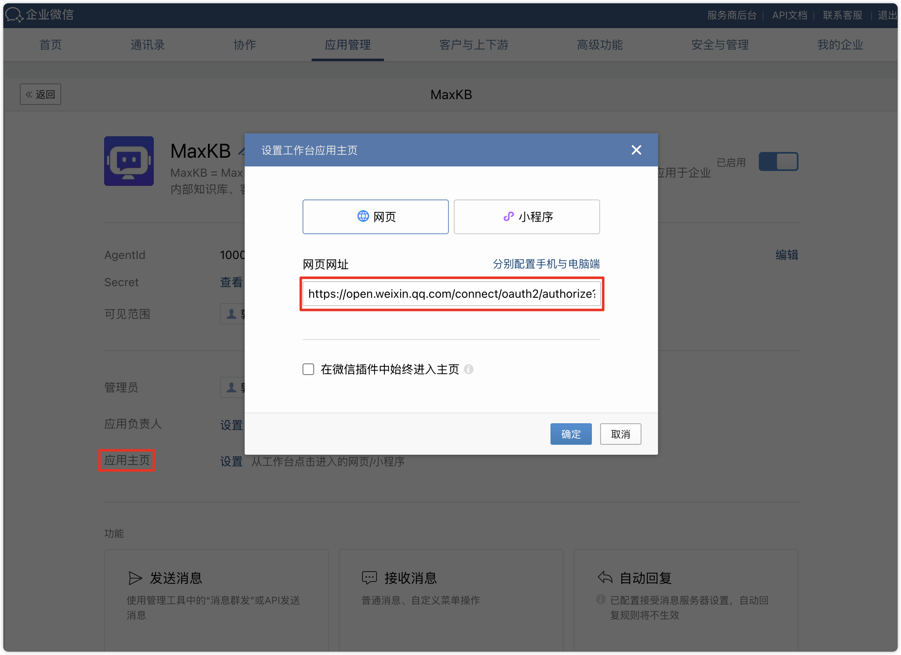
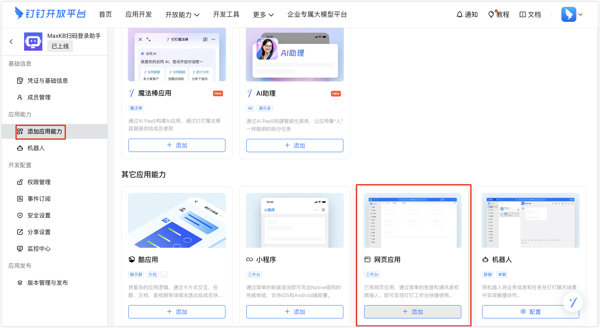
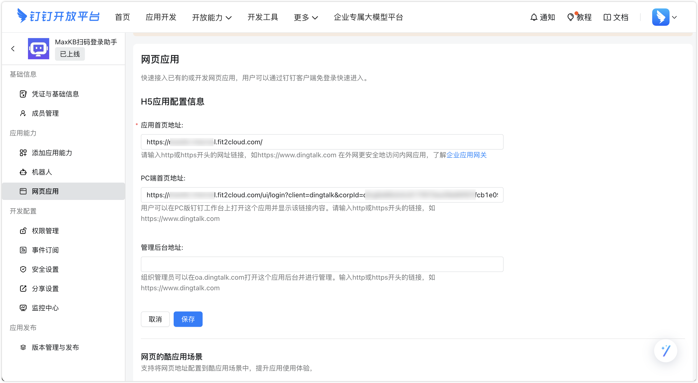
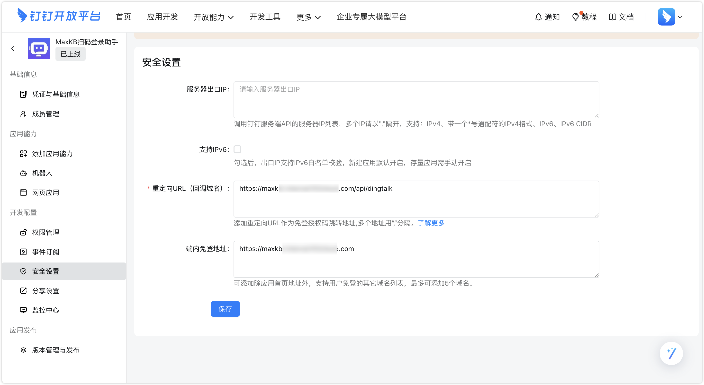
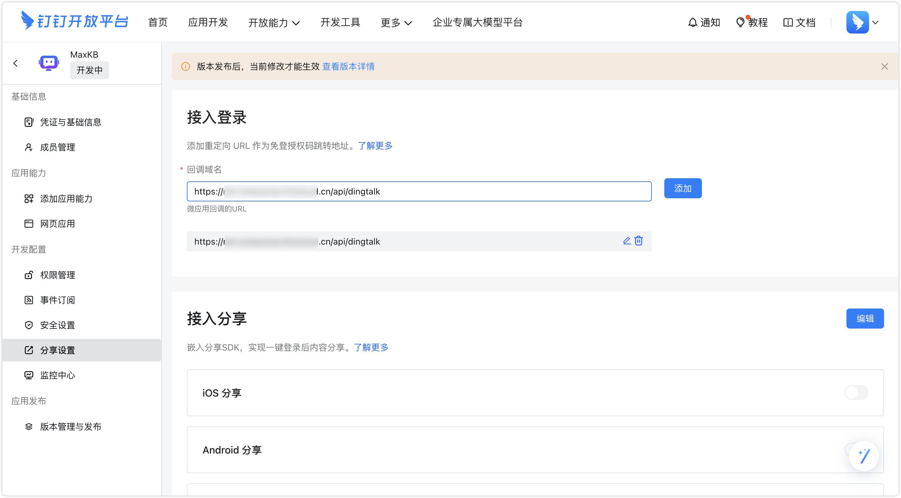
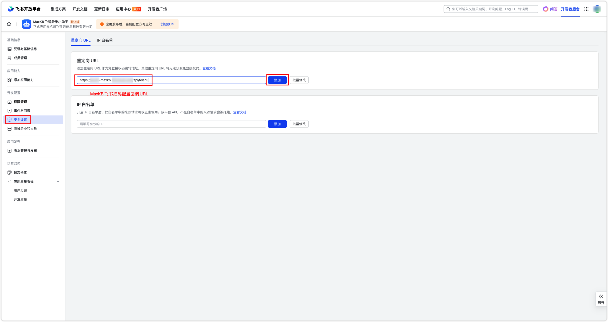
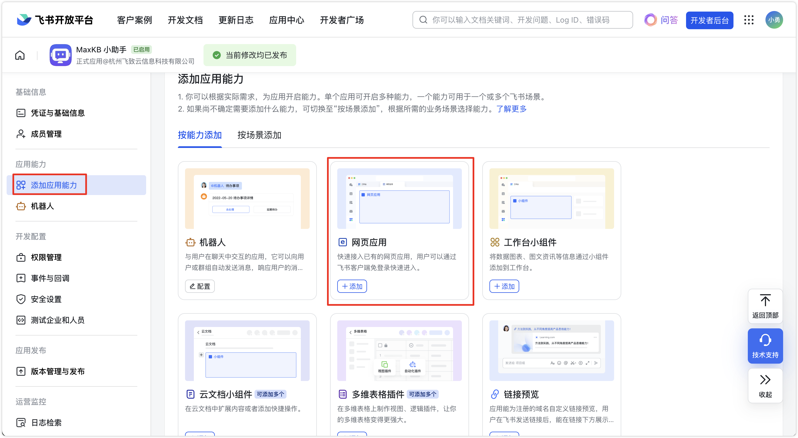
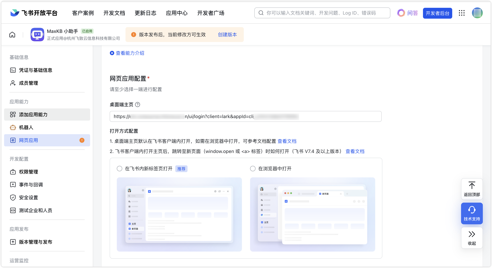
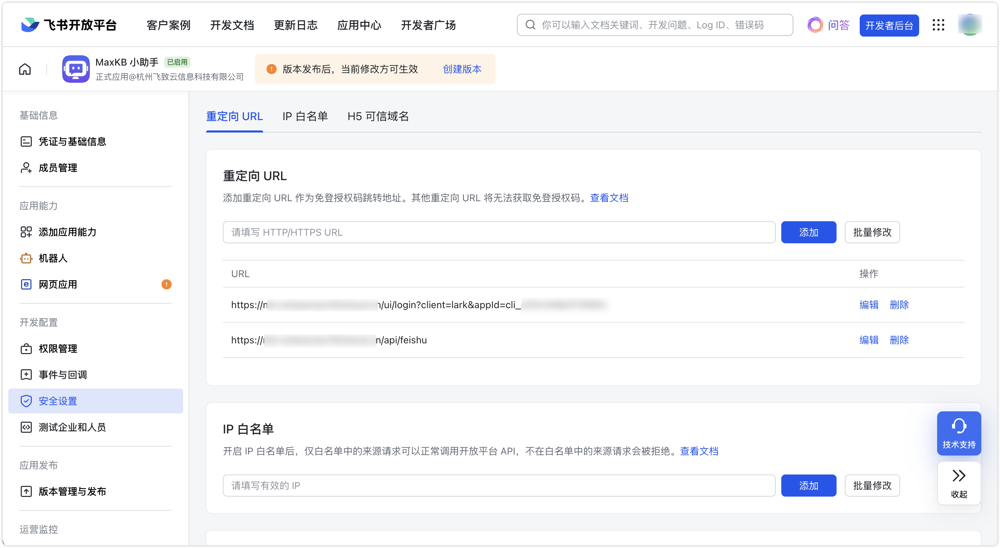

# 登录认证
!!! Abstract "" 
    MaxKB专业版支持 LDAP、CAS、OIDC、OAUTH2 单点认证协议，以及企业微信、钉钉、飞书移动端扫码登录和免密，满足企业对于强身份验证和访问控制的需求。

## 1 LDAP

!!! Abstract ""  
    配置 LDAP 的过程可参考下图，注意勾选下方"启用 LDAP 认证"后开启此功能。     
    提示：配置完成可点击上方【测试连接】即时测试配置信息是否正确，网络是否连通。      

## 2 CAS

!!! Abstract ""
    配置 CAS 的过程可参考下图，注意勾选下方"启用 CAS 认证"后开启此功能。    
    **说明：** CAS 回调地址即 MaxKB 访问地址加上`/api/cas`，例如：`http://40.100.86.240:8080/api/cas`

## 3 OIDC

!!! Abstract ""
    配置 OIDC 的过程可参考下图，注意勾选下方"启用 OIDC 认证"后开启此功能。   
    **说明：** OIDC 回调地址即 MaxKB 访问地址加上`/api/oidc`，例如：`http://40.100.86.240:8080/api/oidc`

## 4 OAUTH2

!!! Abstract ""
    配置 OAUTH2 的过程可参考下图（授权端以 github 为例），注意勾选下方"启用 OAHTU2 认证"后开启此功能。   
    **说明：** OAUTH2 回调地址即 MaxKB 访问地址加上`/api/oauth2`，例如：`http://40.100.86.240:8080/api/oauth2`

## 5 平台对接

!!! Abstract ""
    支持企业微信平、钉钉、飞书接入，支持扫码登录、免密登录等。

### 5.1 企业微信对接

#### 5.1.1 企业微信对接设置

!!! Abstract ""
    企业微信扫码登录配置参数说明：
    
    - Corp ID: 企业ID，企业微信管理员在管理后台的【企业信息】中获取。
    - Agent ID：企业微信自建应用唯一标识，企业微信管理在管理后台创建或查看应用时获取。
    - App Secret：企业微信自建应用的密钥。   
    - 回调地址：即 MaxKB 访问URL。

!!! Abstract ""
    MaxKB 配置企业微信扫码登录时，需要企业微信管理员登录 [企业微信管理管理](https://work.weixin.qq.com/wework_admin/frame) 并创建企业自建应用，完成配置后发布应用。    
    第一步：创建应用。在【应用管理-应用-自建】中点击【创建应用】，输入应用名称等信息，应用创建完成后即可查看应用Agent ID和Secret。

{width="500px"}

{width="500px"}

!!! Abstract ""
    第二步：设置可信域名。在【开发者接口】中点击【设置可信域名】，添加可信域名，并进行校验。
{width="500px"}

!!! Abstract ""
    第三步：授权回调域。在【企业微信授权】中设置授权回调域。
{width="500px"}

!!! Abstract ""
    第三步：配置企业可信IP。在【企业可信IP】中配置可信ip。
{width="500px"}

!!! Abstract ""
    完成企业微信应用的配置和发布后，在 MaxKB 企业微信登录扫码配置页面配置相应信息并通过效验。

!!! Abstract ""
    后续即可在 MaxKB 登陆页面点击选择企业微信进行扫码登陆。

#### 5.1.2 企业微信免登设置

!!! Abstract ""
    应用主页地址的构造可以参考企业微信开发指南[造网页授权链接——构造企业oauth2链接](https://developer.work.weixin.qq.com/document/path/91120#%E6%9E%84%E9%80%A0%E4%BC%81%E4%B8%9Aoauth2%E9%93%BE%E6%8E%A5)。
    链接格式即参数说明如下：

    - 链接格式：https://open.weixin.qq.com/connect/oauth2/authorize?appid=CORPID&redirect_uri=REDIRECT_URI&response_type=code&scope=SCOPE&agentid=AGENTID&state=STATE#wechat_redirect
    - CORPID： 企业的CorpID
    - REDIRECT_URI：授权后重定向的回调链接地址，需要使用urlencode对链接进行处理，例如：https%3A%2F%2Fmk-enterprise.fit2cloud.cn/api/wecom/oauth2，调整域名部分即可
    - SCOPE：填 snsapi_base 即可
    - AGENTID：应用 ID

    主页地址示例： https://open.weixin.qq.com/connect/oauth2/authorize?redirect_uri=https%3A%2F%2Fmk-enterprise.fit2cloud.cn/api/wecom/oauth2&response_type=code&scope=snsapi_privateinfo&agentid=1000008&appid=ww5fad05adxxxx&state=maxkb#wechat_redirect

!!! Abstract ""
    配置完成后，在企业微信工作台中找到 MaxKB 应用，免登访问 MaxKB。

### 5.2 钉钉对接

#### 5.2.1 钉钉对接设置

!!! Abstract ""
    钉钉扫码登录配置参数说明：

    - Corp ID：钉钉组织标识，在钉钉开放平台中右上方组织信息中查看。
    - APP Key：钉钉应用标识，在钉钉开放平台中查看应用【凭证与基础信息】中查看。
    - App Secret：钉钉应用秘钥，在钉钉开放平台中查看应用【凭证与基础信息】中查看。
    - 回调地址：即 MaxKB 访问URL。

!!! Abstract ""
    MaxKB 配置钉钉扫码登录时，需要在 [钉钉开放平台](https://open-dev.dingtalk.com/) 创建应用并进行配置。

    （1）创建应用。在【应用开发-钉钉应用】中点击【创建应用】，应用创建完后在【凭证与基础信息】可查案APPKey和 APPSecret信息。

!!! Abstract ""
    （2）发布应用。在【版本管理与发布】中，填写应用版本号、版本描述等信息，点击【保持】，发布应用。

!!! Abstract ""
    完成配置后发布，然后在 MaxKB 钉钉扫码登录扫码配置页面进行配置并保存。

!!! Abstract ""
    后续即可在 MaxKB 登陆页面点击选择钉钉进行扫码登陆。

#### 5.2.2 钉钉免登设置

!!! Abstract ""
    （1）添加网页应用能力。在钉钉开放平台的【应用能力】中，添加【网页应用】，并设置【应用首页】和【PC端首页地址】。

!!! Abstract ""
    （2）安全设置。在【安全设置】中设置重定向URL和端内免登录地址。

!!! Abstract ""
    （3）分享设置，在【接入登录】中设置【回调域名】。

!!! Abstract ""
    应用发布后，即可在钉钉工作台免登录访问 MaxKB。    

### 5.3 飞书对接

#### 5.3.1 飞书对接设置

!!! Abstract ""
    飞书扫码登录配置参数说明：

    - APP Key：
    - Corp ID：
    - App Secret：MaxKB提供的回调地址，并作为飞书免登录授权的跳转地址。
    - 回调地址：即 MaxKB URL地址 + '/api/feishu'，例如：`http://40.100.86.243/api/feishu`。

!!! Abstract ""
    MaxKB 配置飞书扫码登录时，需要在 [飞书开放平台](https://open.feishu.cn/) 创建企业自建应用，完成配置后发布，然后在 MaxKB 飞书扫码登录扫码配置页面进行配置并保存。

!!! Abstract ""
    (1)创建企业自建应用。点击【创建企业自建应用】，输入应用名称、描述以及上传应用图标后，点击【创建】。

!!! Abstract ""
    (2)配置重定向URL。在【开发配置-安全设置】中，输入MaxKB 飞书扫码配置弹出框中的回调地址，点击【添加】。

!!! Abstract ""
    (3)发布应用。在【版本管理与发布】中，输入应用版本号、更新说明等信息，点击【保存】，完成应用发布。

!!! Abstract ""
    发布应用后，即可在 MaxKB 登陆页面点击选择飞书进行扫码登陆。     

#### 5.3.2 飞书免登设置

!!! Abstract ""
    (1)添加页面应用，并配置桌面主页，例如：配置中填写 桌面端主页地址，如我们的测试环境地址：https://mk-enterprise.fit2cloud.cn/ui/login?client=lark&appId=cli_a7e1c1ddexxxxx

!!! Abstract ""
    (2)在【安全设置】中添加重定向 URL。

!!! Abstract ""
    应用发布后，即可在飞书工作台免登录访问 MaxKB。
