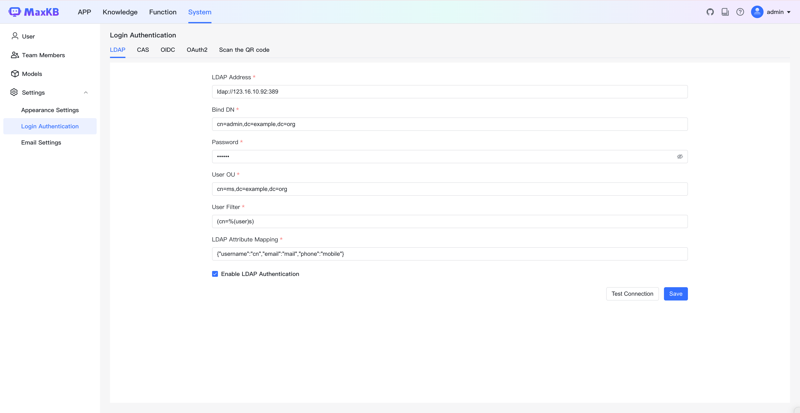
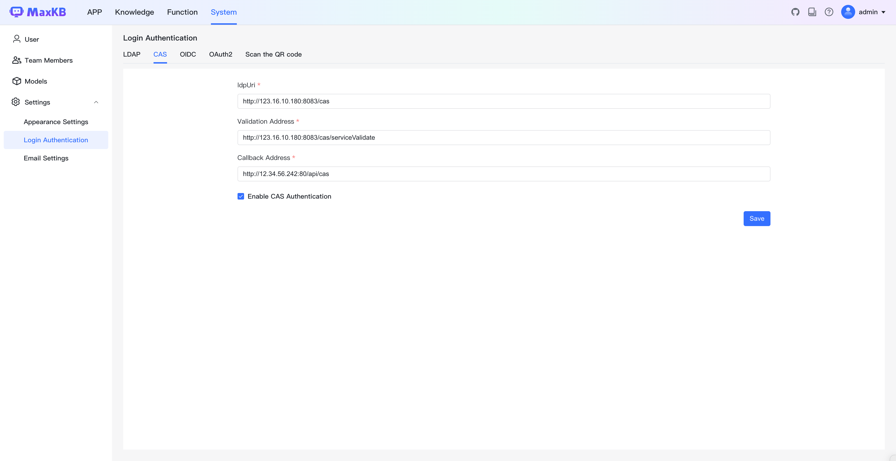

# Login Authentication
!!! Abstract "" 
    MaxKB Professional Edition supports LDAP, CAS, OIDC, OAUTH2 single sign-on protocols, as well as WeChat Work, DingTalk, and Lark mobile QR code login verification, meeting enterprise requirements for strong identity verification and access control.

## 1 LDAP

!!! Abstract ""  
    The LDAP configuration process can be referenced in the image below. Note that this feature is enabled by checking "Enable LDAP Authentication" at the bottom.     
    Tip: After configuration, you can click "Test Connection" at the top to instantly test if the configuration information is correct and the network is connected.      

## 2 CAS

!!! Abstract ""
    The CAS configuration process can be referenced in the image below. 
    **Note:** The CAS callback URL is the MaxKB access URL plus `/api/cas`, for example: `http://40.100.86.240:8080/api/cas`

## 3 OIDC

!!! Abstract ""
    The OIDC configuration process can be referenced in the image below. 
    **Note:** The OIDC callback URL is the MaxKB access URL plus `/api/oidc`, for example: `http://40.100.86.240:8080/api/oidc`

## 4 OAuth2

!!! Abstract ""
    The OAUTH2 configuration process can be referenced in the image below (using GitHub as an example authorization provider).
    **Note:** The OAUTH2 callback URL is the MaxKB access URL plus `/api/oauth2`, for example: `http://40.100.86.240:8080/api/oauth2`

## 5 QR Code 

### 5.1 WeChat Work QR Code Login

!!! Abstract ""
    WeChat Work QR code login configuration parameter description:
    
    - Corp ID: Enterprise ID, obtained by WeChat Work admin in the "Enterprise Information" section of the admin backend.
    - Agent ID: Unique identifier for WeChat Work custom application, obtained when creating or viewing applications in the admin backend.
    - App Secret: Secret key for WeChat Work custom application.   
    - Callback URL: The MaxKB access URL.

!!! Abstract ""
    To configure WeChat Work QR code login for MaxKB, the WeChat Work admin needs to log in to [WeChat Work Admin Portal](https://work.weixin.qq.com/wework_admin/frame) and create a custom enterprise application, then publish it after configuration.    
    Step 1: Create application. Go to [Application Management-Applications-Custom], click "Create Application", enter application name and other information. After creation, you can view the application's Agent ID and Secret.
    
{width="500px"}

{width="500px"}

!!! Abstract ""
    Step 2: Set trusted domain. Click "Set trusted domain name" in "Developer API ", add and verify trusted domain.
{width="500px"}

!!! Abstract ""
    Step 3: Set authorization callback domain. Configure the callback domain in "Log in to via authorization by WeCom".
{width="500px"}

!!! Abstract ""
    Step 3: Configure enterprise trusted IPs. Configure trusted IPs in "Company's Trusted IP".
{width="500px"}

!!! Abstract ""
    After completing WeChat Work application configuration and publishing, configure corresponding information in MaxKB WeChat Work login QR code configuration page and verify.

### 5.2 DingTalk QR Code Login

!!! Abstract ""
    DingTalk QR code login configuration parameter description:

    - Corp ID: DingTalk organization identifier, Shown in organization information at top right of DingTalk Open Platform.
    - APP Key: DingTalk application identifier, Shown in application "Credentials and Basic Information".
    - App Secret: DingTalk application secret, Shown in application "Credentials and Basic Information".
    - Callback URL: The MaxKB access URL.

!!! Abstract ""
    To configure DingTalk QR code login for MaxKB, you need to create and configure an application in [DingTalk Open Platform](https://open-dev.dingtalk.com/).

    Step 1: Create application. Go to [Application Development-DingTalk Applications], click "Create Application". After creation, you can view APPKey and APPSecret in "Credentials and Basic Information".

!!! Abstract ""
    Step 2: Publish application. In "Version Management and Publishing", fill in application version number, version description and other information, click "Save" to publish the application.

!!! Abstract ""
    After completing configuration and publishing, configure in MaxKB DingTalk QR code login configuration page and save.

### 5.3 Lark QR Code Login

!!! Abstract ""
    Feishu QR code login configuration parameter description:

    - APP Key: Application key
    - Corp ID: Organization ID
    - App Secret: Application secret
    - Callback URL: MaxKB URL + '/api/feishu', for example: `http://40.100.86.243/api/feishu`

!!! Abstract ""
    To configure Feishu QR code login for MaxKB, you need to create an enterprise custom application in [Feishu Open Platform](https://open.feishu.cn/), complete configuration and publish, then configure in MaxKB Feishu QR code login configuration page and save.

!!! Abstract ""
    Step 1: Create enterprise custom application. Click "Create Enterprise Custom Application", enter application name, description and upload application icon, then click "Create".

!!! Abstract ""
    Step 2: Configure redirect URL. In "Development Configuration-Security Settings", enter the callback URL from MaxKB Feishu QR code configuration popup, click "Add".

!!! Abstract ""
    Step 3: Publish application. In "Version Management and Publishing", enter application version number, update notes and other information, click "Save" to complete application publishing.

## 6 Login Authentication

!!! Abstract ""
    After completing authentication configuration, select the corresponding authentication method on the login page to log in.         

