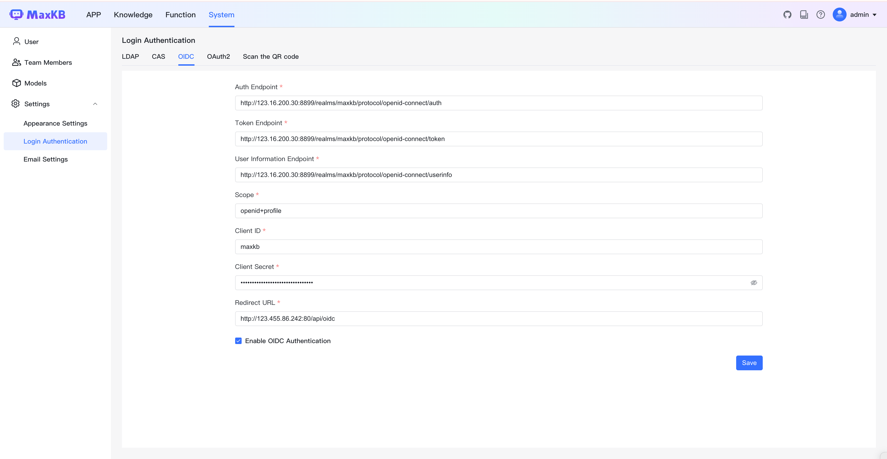

# 登录认证
!!! Abstract "" 
    MaxKB专业版已经支持LDAP、CAS、OIDC三种单点登录方式，满足企业对于强身份验证和访问控制的需求。

## 1 LDAP

!!! Abstract ""  
    配置 LDAP 的过程可参考下图，注意勾选下方"启用 LDAP 认证"后开启此功能。     
    提示：配置完成可点击上方【测试连接】即时测试配置信息是否正确，网络是否连通。    

## 2 CAS

!!! Abstract ""
    配置 CAS 的过程可参考下图，注意勾选下方"启用 CAS 认证"后开启此功能。    
    **说明：** CAS 回调地址即 MaxKB 访问地址加上`/api/cas`，例如：`http://40.100.86.240:8080/api/cas`

## 3 OIDC

!!! Abstract ""
    配置 OIDC 的过程可参考下图，注意勾选下方"启用 OIDC 认证"后开启此功能。 
    **说明：** OIDC 回调地址即 MaxKB 访问地址加上`/api/oidc`，例如：`http://40.100.86.240:8080/api/oidc`

## 4 登陆认证

!!! Abstract ""
    完成认证信息配置后，在登陆页面点击选择对应的认证方式进行登陆。         

