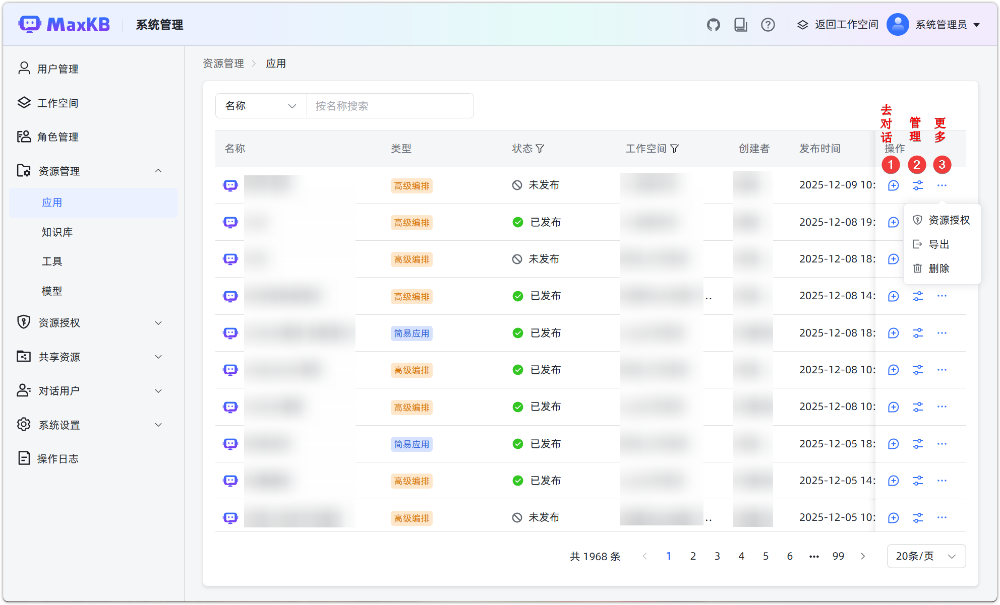

# 资源管理

!!! Abstract ""
    资源管理功能为系统管理员提供统一、高效的资源可视化管理能力。系统管理员可以集中查看、管理和维护所有工作空间下的核心资源，包括 应用、知识库、工具、模型等。

## 1 资源查看
!!! Abstract ""

    支持查看各种工作空间对知识库、应用、模型、工具资源：

    - 应用列表：显示名称、类型、状态、工作空间、创建者、最近发布时间、创建时间。
    - 查询支持：支持按创建者、名称、类型、状态、工作空间查询。

    支持关键词搜索和字段筛选，快速定位资源。

## 2 资源操作
!!! Abstract ""
    管理员可对不同类型资源执行特定操作，包括但不限于：

    - **应用**：对话、管理、导出、删除、跳转查看等；
    - **知识库**：支持管理、向量化、同步、生成问题、导出为 Excel 或 ZIP、配置设置、删除等；
    - **工具**：支持参数配置、启用/停用、导出等；
    - **模型**：支持修改、模型参数配置、删除等；

