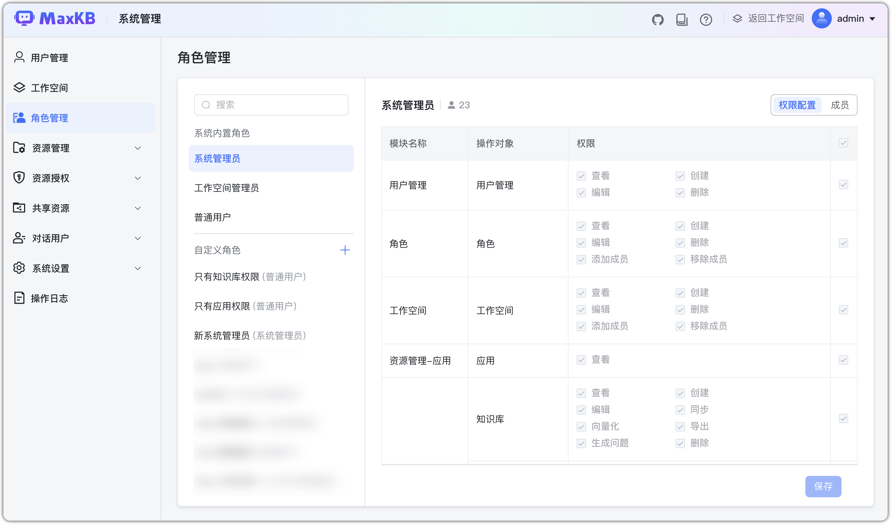
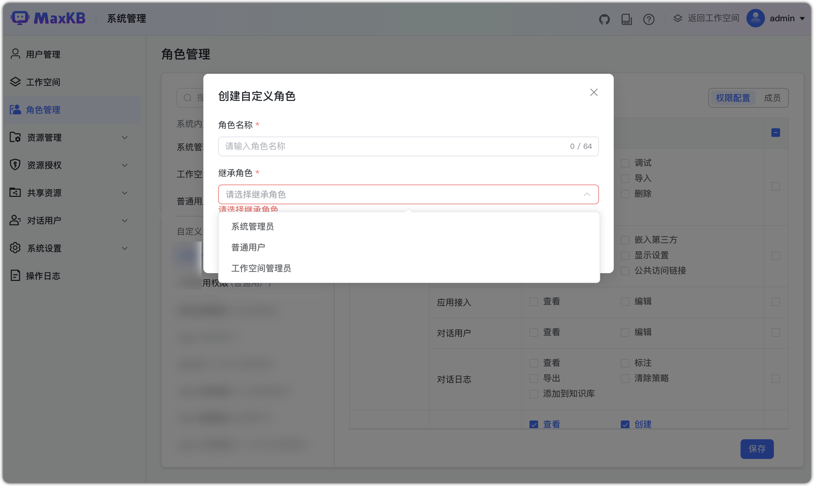
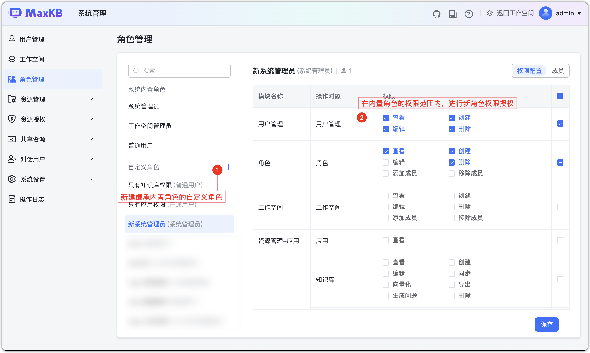
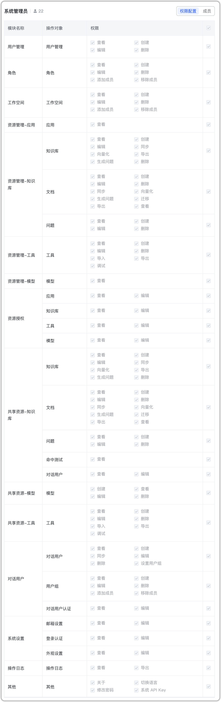
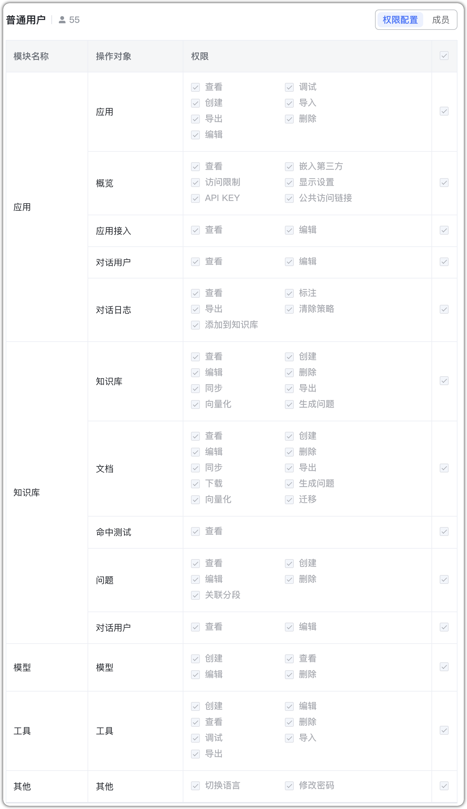
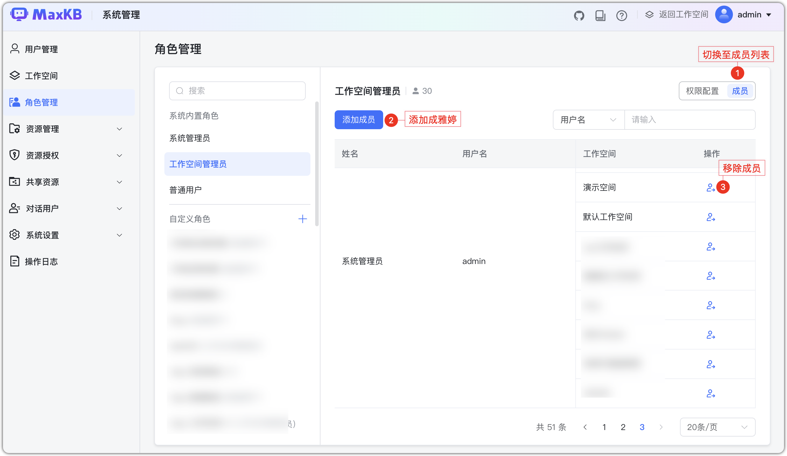
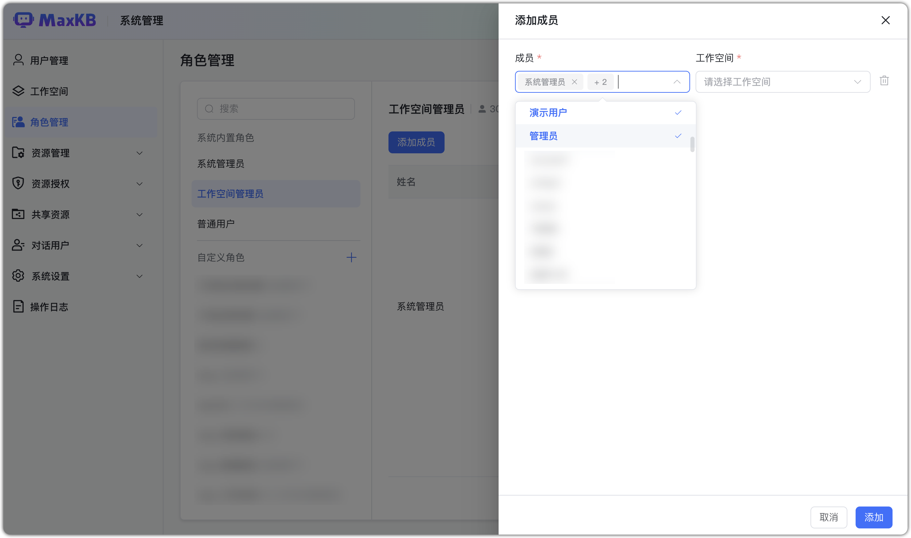

# 角色管理

!!! Abstract ""
    角色是用户在系统中的身份，用于批量进行权限管理。  

    系统内置角色：

    - 系统管理员：所有系统管理中功能的权限设置以及用户信息中菜单权限。
        - 可以查看所有角色（内置角色和自定义角色）的权限配置。
        - 可以操作所有功能，如创建或修改自定义角色配置、添加和移除成员。
    - 工作空间管理员：拥有系统管理工作空间管理权限；智能体、知识库、工具、模型所有功能权限。
        - 可以查看普通用户角色和自定义普通用户角色的权限配置，不能进行权限编辑。
    - 普通用户：可以维护自己创建的资源和被授权的资源，如创建的智能体、知识库、工具、模型所有功能权限。 

    **注意**：系统内置角色不可以编辑权限，仅能添加/移除成员。

## 1 创建角色
!!! Abstract ""
    创建自定义角色：

     - 角色名称：1-64 个字符。
     - 继承角色：系统管理员、工作空间管理员和普通用户。
    
    **注意**：系统管理员功能，工作空间管理员无此功能。   

## 2  权限配置
!!! Abstract ""
    自定义角色创建成功，默认不勾选继承角色的所有权限。自定义角色可继承内置的 3 种角色进行自定义权限，如自定义系统管理员的权限设置，可以在内置系统管理员的权限范围内编辑。

!!! Abstract ""
    内置系统管理员角色权限：

{width=800px}

!!! Abstract ""
    内置工作空间管理员角色权限：

{width=800px}

!!! Abstract ""
    内置系普通用户角色权限：

{width=800px}

## 3 成员管理

!!! Abstract ""
    支持按角色管理成员，点击【成员】，显示当前所选角色的成员列表。

    工作空间管理员可以看到作为工作空间管理员角色的工作空间下的所有成员。

!!! Abstract ""
    添加成员：

    - 为当前角色添加成员，成员下拉列表可以多选。
    - 当前所选的角色为工作空间管理员或普通用户角色时，添加成员时选择完成后，还需要选择工作空间，工作空间列表也可以多选。
    
    **注意**：工作空间管理员添加成员时，工作空间下拉列表仅列出工作空间管理员角色的工作空间。

!!! Abstract ""
    移除成员：

    - 用户在某个工作空间中的角色，若用户拥有多工作空间的成员，需要移除多次。
    - 成员移除后，登录系统则不再拥有该角色。
    - 内置系统管理员角色中的 admin 用户不能被移除。

