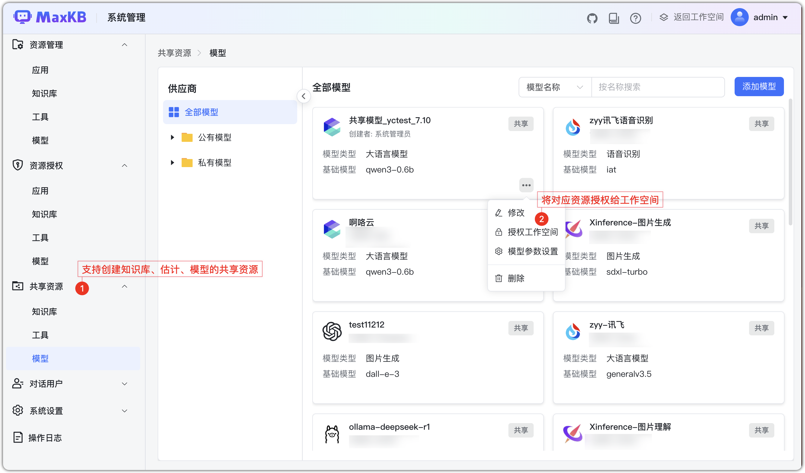
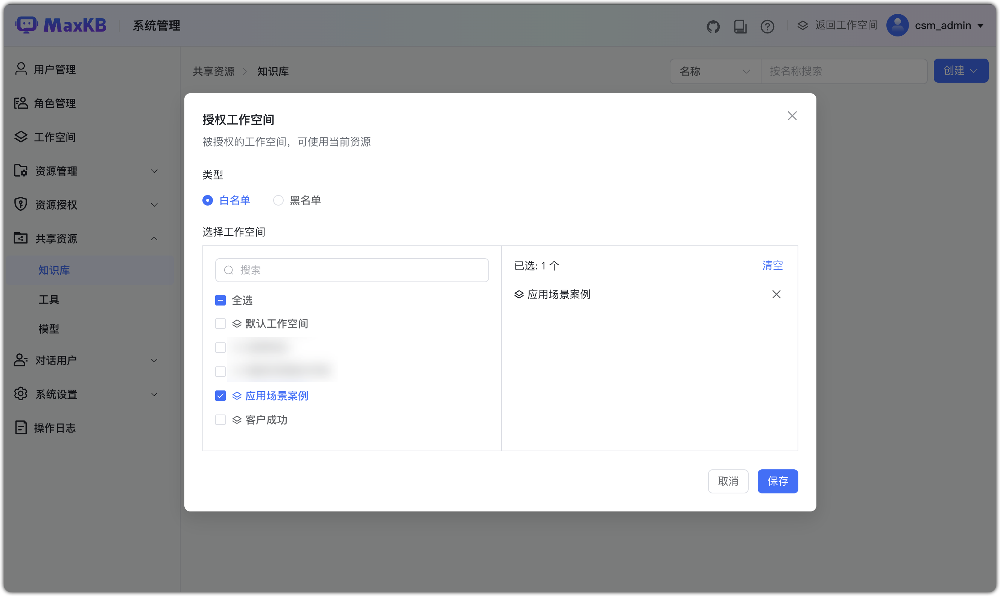
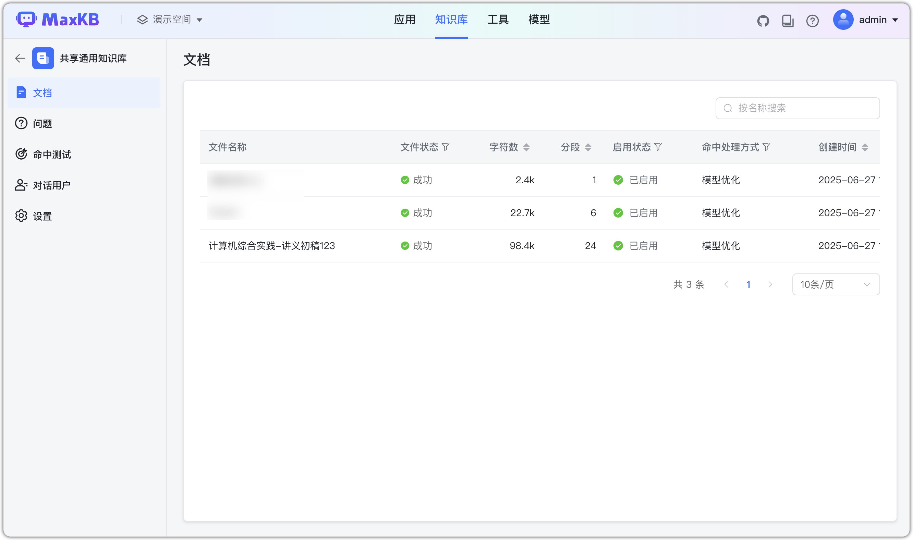
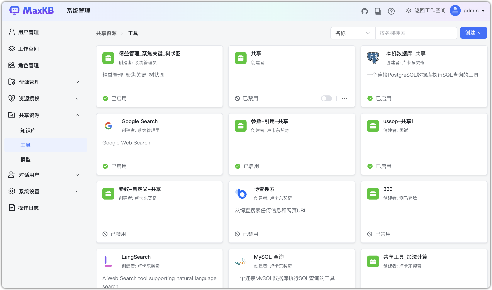
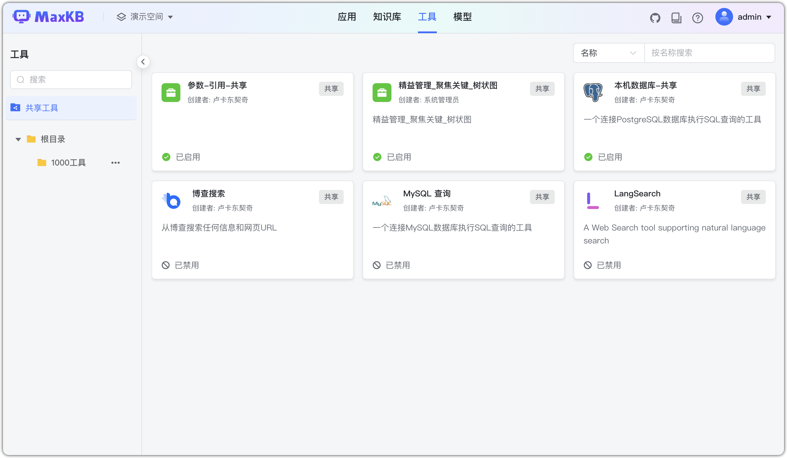
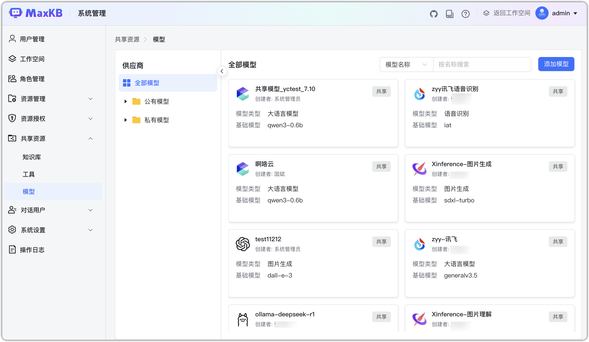
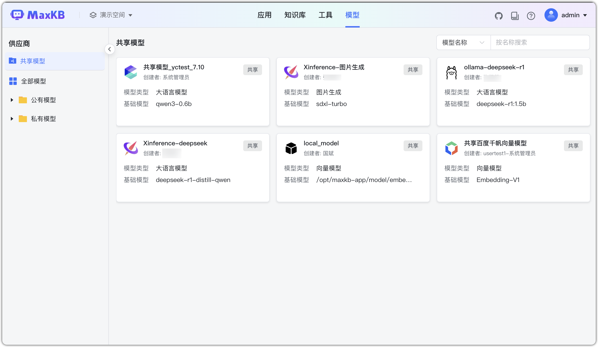

# 共享资源

## 1 概述

!!! Abstract ""
    企业版支持系统管理员创建共享资源（知识库、工具、模型），可授权给指定工作空间查看和使用。

    **注意**：被授权的工作空间可以看到共享资源，但仅能查看和使用，不能编辑和删除。

!!! Abstract ""
    创建资源后授权工作空间:

    - 选择白名单：允许已选择的工作空间使用该共享资源。
    - 选择黑名单：除了已选择的工作空间，其他所有工作空间都可以使用该共享资源。  

    默认选择白名单，授权工作空间为空，则所有工作空间都不能看到这个资源。若用户修改授权类型为黑名单，授权工作空间为空，则所有工作空间都能查看这个资源。

## 2 知识库

!!! Abstract ""
    创建共享知识库操作与工作空间中创建知识库界面功能相同，切换共享知识库列表显示所有的共享知识库名称。  
    **注意**：向量模型仅可以选择共享模型的向量模型。

!!! Abstract ""
    授权工作空间可以查看和使用共享知识库。

!!! Abstract ""
    共享知识库在文档、问题、命中测试、对话以及设置的界面及功能，与在工作空间创建的知识库一致。

## 3 工具
!!! Abstract ""
    创建共享工具操作与工作空间中创建工具功能相同，切换共享工具列表显示所有的共享工具名称。

!!! Abstract ""
    授权工作空间可以查看和使用共享工具。

## 4 模型

!!! Abstract ""
    创建共享模型操作与工作空间中创建模型功能相同，切换共享模型列表显示所有的共享模型名称。

!!! Abstract ""
    授权工作空间可以查看和使用共享模型。

