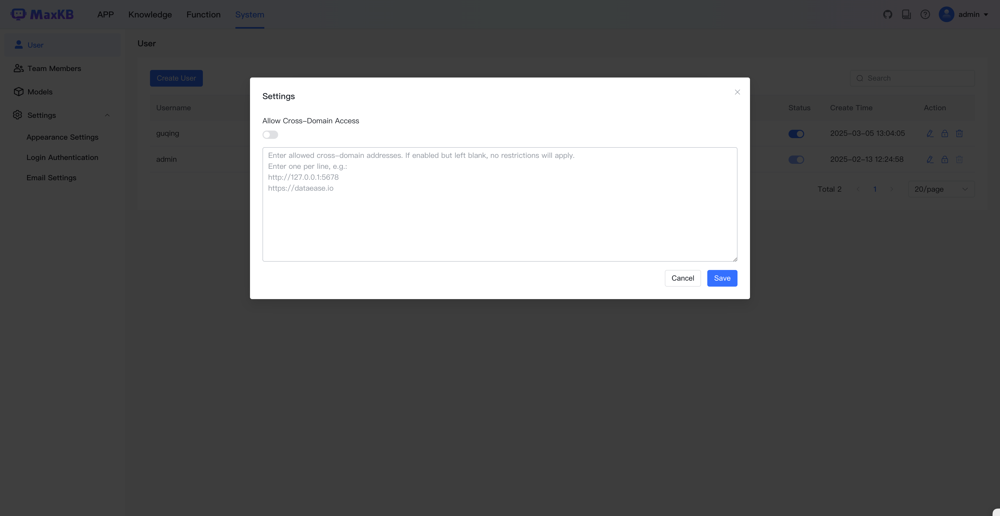
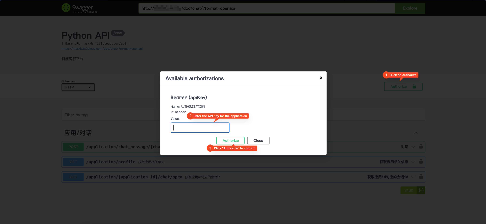

## 1 API Key 

!!! Abstract "" 
    In the user icon dropdown menu at the top right of the page, click "API Key" to enter the API Key management window, where you can create, enable/disable, delete, and configure API Keys.

  

!!! Abstract "" 
    After creating an API Key, you can configure whether to allow cross-origin addresses, which is disabled by default.

  

## 2 API Testing

!!! Abstract "" 
    After opening the API documentation address, enter the API Key for authorization to perform online API testing.

