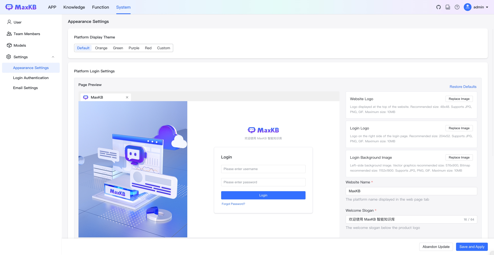

# Appearance Settings

!!! Abstract "" 
    MaxKB Professional Edition allows you to customize the system's theme color, website logo, login logo, login background image, website name, slogan, etc., as well as display settings for platform information such as user manual, forum help, and project URL in the upper right corner of the homepage.

