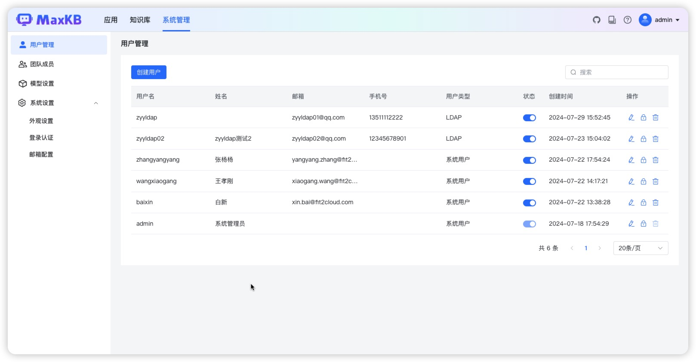
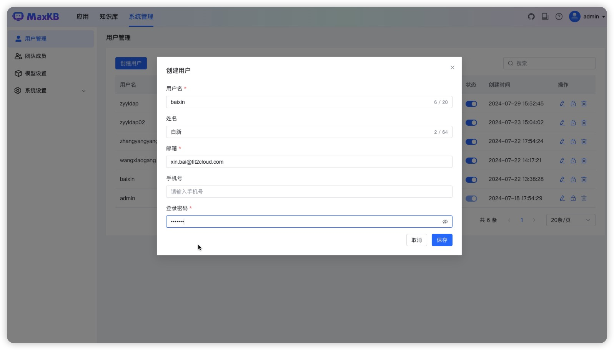

# 用户管理

## 1 创建用户

!!! Abstract ""
    【用户管理】中可以对用户的基本信息进行管理，包括用户的姓名、邮箱、密码、启停用状态等。    
    **注意：该功能为 admin 系统管理员功能。**

!!! Abstract ""
    在用户列表页的上方，点击【创建用户】按钮，在弹出的对话框中输入要新建用户的基本信息，如用户名（登录名，不可修改）、姓名、手机号码、邮箱、密码等。   
    输入完成后， 点击【保存】按钮。

## 2 第三方用户

!!! Abstract ""
    第三方用户如 LDAP 用户登录后，系统会自动创建一个用户类型为LDAP的用户，且用户可以使用普通登录方式进行登录。      
    **注意：该用户创建的资源在删除用户时会一起删除。**

